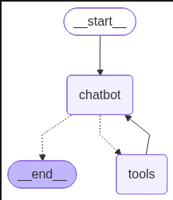
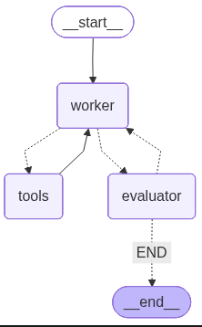

# LangGraph — Complete Guide

## Table of Contents

- [1. Ecosystem & Philosophy](#1-ecosystem--philosophy)
  - [The LangChain Ecosystem](#the-langchain-ecosystem)
  - [LangChain](#langchain)
  - [LangGraph](#langgraph)
  - [LangGraph Sub-Products](#langgraph-sub-products)
  - [LangSmith](#langsmith)
  - [Deep Dive: LangChain vs LangGraph](#deep-dive-langchain-vs-langgraph)
  - [Anthropic's Perspective: Building Effective Agents](#anthropics-perspective-building-effective-agents)
- [2. Core Concepts](#2-core-concepts)
  - [Graph](#graph)
  - [State](#state)
  - [Nodes](#nodes)
  - [Edges](#edges)
  - [Reducers](#reducers)
  - [The Annotated Type Hint](#the-annotated-type-hint)
  - [Immutable State](#immutable-state)
  - [Super Steps](#super-steps)
  - [Pydantic BaseModel vs TypedDict](#pydantic-basemodel-vs-typeddict)
- [3. Building Blocks: The 5 Steps](#3-building-blocks-the-5-steps)
- [4. Environment Configuration](#4-environment-configuration)
- [5. Progressive Examples](#5-progressive-examples)
  - [Example A: Simple Graph (No LLM)](#example-a-simple-graph-no-llm)
  - [Example B: LLM Chatbot (No Memory)](#example-b-llm-chatbot-no-memory)
  - [Example C: Tools + Conditional Edges](#example-c-tools--conditional-edges)
  - [Example D: Checkpointing & Memory](#example-d-checkpointing--memory)
  - [Example E: Multi-Agent Evaluator-Optimizer](#example-e-multi-agent-evaluator-optimizer)
  - [Example F: Production Sidekick](#example-f-production-sidekick)
- [6. Prompt Engineering Lessons](#6-prompt-engineering-lessons)
- [7. Safety & Caution](#7-safety--caution)
- [8. Extension Ideas](#8-extension-ideas)
  - [For LLM Engineers](#for-llm-engineers)
  - [For Java Developers](#for-java-developers)
  - [For Business Analysts Following Tech Trends](#for-business-analysts-following-tech-trends)
  - [Cross-Role: Staying Current with Technology](#cross-role-staying-current-with-technology)

---

## 1. Ecosystem & Philosophy

### The LangChain Ecosystem

LangChain (the company) offers three distinct products. Understanding how they relate is critical before diving into LangGraph.

### LangChain

LangChain is the **original abstraction framework** for building LLM applications. It's been around for years and was one of the earliest abstraction layers. Its core value proposition:

- **Abstraction over LLM providers** — switch from GPT to Claude without rewriting integration code. Its initial raison d'être was eliminating the pain of bespoke API integrations.
- **Chaining** — compose sequential LLM calls into pipelines (the "chain" in LangChain).
- **RAG support** — retrieval-augmented generation with vector stores.
- **Prompt templates** — higher-level constructs for prompt engineering with good practices baked in.
- **Memory models** — in-RAM or persisted-to-database conversation memory, with various memory strategies (similar to what CrewAI offers, but with more abstractions).
- **Tool calling abstractions** — unified interface for function/tool use across providers.
- **LCEL (LangChain Expression Language)** — a declarative language for composing chains.

**Trade-offs:** By adopting LangChain's abstractions, you gain rapid development speed (e.g., a RAG pipeline in ~4 lines of code) but lose visibility into the actual prompts and responses flowing to/from the LLM. Over time, LLM APIs have converged — most follow OpenAI's endpoint structure (Anthropic being somewhat of an odd one out). This makes direct API calls increasingly simple. Memory is fundamentally just a JSON blob of conversation history — you can manage it yourself, persist it however you want, combine it in different ways.

LangChain *can* build agentic workflows (it has tool-calling abstractions), but it **predates the modern agent explosion**. It's more of a **glue layer for any LLM application** rather than a dedicated agent orchestration platform. It's not their main agent offering.

### LangGraph

LangGraph is a **separate product** from the same company, focused specifically on **agentic AI workflows**. It is **independent from LangChain** — you can use LangChain's LLM wrappers with it, but it's entirely optional. You can call LLMs directly or use any framework you prefer.

**Core thesis:** Stability, resiliency, and repeatability for complex interconnected processes (agent systems).

LangGraph represents all workflows as **graphs** — tree-like structures of nodes connected by edges. By abstracting workflows this way and adding checkpointing/monitoring hooks at each point, it brings:

- Human-in-the-loop patterns
- Multi-agent collaboration
- Conversation history & memory
- **Time travel** — checkpoint at any point, step backwards, restore prior states
- Fault-tolerant scalability (anything can go down and it keeps running)

**What problem does it solve?** The world of agentic AI is unpredictable. People have resiliency concerns. LangGraph's approach is to put "belts and braces" around each point in the graph, bringing stability and monitoring to an inherently non-deterministic system.

### LangGraph Sub-Products

LangGraph itself is actually **three things**:

| Product | Description | Analogy |
|---------|-------------|---------|
| **LangGraph (Framework)** | The open-source Python framework for defining graphs | CrewAI framework |
| **LangGraph Studio** | Visual builder / UI tool for hooking things up visually | CrewAI Studio |
| **LangGraph Platform** | Hosted solution for deploying & running graphs at scale | CrewAI Enterprise |

The website heavily promotes LangGraph Platform as if it *is* LangGraph — this is likely because it's the core commercial/monetization play. If you've built everything using LangGraph, it's convenient to deploy on their platform. But **we focus exclusively on LangGraph the framework**.

### LangSmith

LangSmith is the **observability/monitoring** product. It provides visibility into your LLM calls and reasoning chains to quickly debug failures. LangGraph does not do monitoring itself — it connects to LangSmith for that. LangSmith works with both LangChain and LangGraph.

### Deep Dive: LangChain vs LangGraph

Although they come from the same company, LangChain and LangGraph solve fundamentally different problems and operate at different levels of abstraction.

#### Philosophical Difference

| | LangChain | LangGraph |
|---|-----------|-----------|
| **Core metaphor** | A **chain** — linear sequence of operations | A **graph** — directed network of stateful operations |
| **Primary concern** | Simplify *calling* LLMs and composing outputs | Orchestrate *complex workflows* with reliability guarantees |
| **Design era** | Pre-agent (2022–2023): "How do I call an LLM and chain results?" | Agent era (2024+): "How do I run multi-step, multi-agent systems reliably?" |
| **Relationship to LLMs** | Tightly coupled — LLM calls are the core primitive | Loosely coupled — nodes are arbitrary Python functions, LLMs optional |

#### Architectural Comparison

| Dimension | LangChain | LangGraph |
|-----------|-----------|-----------|
| **Execution model** | Sequential chain / DAG via LCEL (see below) | Stateful graph with cycles, conditionals, and parallel execution |
| **State management** | Memory classes (ConversationBufferMemory, etc.) — abstracted away | Explicit immutable State object you define and control |
| **Control flow** | Implicit via chain composition or LCEL pipes | Explicit via edges (simple or conditional) between named nodes |
| **Concurrency** | Limited — chains are inherently sequential | First-class — parallel nodes with reducer-based state merging |
| **Checkpointing** | Not built-in | Native — snapshot state at any point, restore, time-travel |
| **Human-in-the-loop** | Requires custom implementation | Built-in pattern — pause execution, wait for human input, resume |
| **Error recovery** | Try/catch at chain level | Graph-level — retry nodes, branch on failure, resume from checkpoint |
| **Cyclic workflows** | Not supported (DAG only) | Supported — feedback loops, iterative refinement, agent loops |

#### What is "DAG via LCEL"?

**DAG** stands for **Directed Acyclic Graph** — a graph where edges have direction (A → B) and there are **no cycles** (you can never loop back to a previous step). This is a fundamental limitation: once a step is done, you cannot revisit it.

**LCEL** (LangChain Expression Language) is LangChain's declarative syntax for composing chains using the pipe operator (`|`). It lets you wire components together in a DAG structure:

```python
from langchain_openai import ChatOpenAI
from langchain_core.prompts import ChatPromptTemplate
from langchain_core.output_parsers import StrOutputParser

# LCEL chain using pipe operator (|) — data flows left to right
# prompt formats input → llm generates response → output_parser extracts text
chain = prompt | llm | output_parser

# Parallel branches using RunnableParallel (this is the DAG part)
from langchain_core.runnables import RunnableParallel

# Fan-out: two branches run simultaneously, then results merge into combine_results
# This is a DAG — directed (left to right), acyclic (no loops back)
chain = RunnableParallel(
    summary=prompt_summary | llm | parser,       # Branch 1: summarize
    translation=prompt_translate | llm | parser,  # Branch 2: translate
) | combine_results  # Fan-in: merge both branch outputs
```

With `RunnableParallel`, LCEL can express fan-out/fan-in patterns (multiple branches running in parallel, results merged) — this is a DAG. But it **cannot express cycles**: no "if the output is bad, loop back and try again." That's where LangGraph steps in — it supports cyclic graphs, enabling iterative refinement, retry loops, and agent decision loops that revisit earlier nodes.

#### When to Use Which

**Use LangChain when:**
- You need a quick abstraction over multiple LLM providers
- Building a straightforward RAG pipeline or prompt chain
- You want pre-built integrations (vector stores, document loaders, output parsers)
- The workflow is linear and deterministic

**Use LangGraph when:**
- Building multi-agent systems with complex interaction patterns
- You need human-in-the-loop, checkpointing, or fault tolerance
- Workflows have cycles (e.g., evaluator-optimizer loops, retry logic)
- You need parallel execution with safe state merging
- Observability and reproducibility are requirements (production agent systems)
- You want full control over state and execution flow

**Use both together when:**
- LangGraph orchestrates the workflow (nodes, edges, state)
- LangChain provides convenient LLM wrappers inside nodes (e.g., `ChatOpenAI`)

This is the most common pattern in practice — LangGraph for structure, LangChain for LLM calls:

```python
from langchain_openai import ChatOpenAI          # LangChain: LLM wrapper
from langgraph.graph import StateGraph, START, END  # LangGraph: orchestration

# LangChain handles the LLM API call details
llm = ChatOpenAI(model="gpt-4o-mini")

# LangGraph node — a plain function that uses LangChain's llm inside
def my_node(state: State) -> State:
    response = llm.invoke(state.messages)  # LangChain invoke inside LangGraph node
    return State(messages=[response])      # Return new state for the reducer

# LangGraph handles the orchestration: build → compile → invoke
graph_builder = StateGraph(State)
graph_builder.add_node("agent", my_node)   # Register node
graph_builder.add_edge(START, "agent")     # Wire: start → agent
graph_builder.add_edge("agent", END)       # Wire: agent → end
graph = graph_builder.compile()            # Finalize graph
```

#### Conceptual Evolution

Think of it as a maturity progression:

```
Direct API calls → LangChain (abstraction) → LangGraph (orchestration)
     ↑                    ↑                         ↑
 Full control      Convenience layer         Production-grade agent systems
 No guardrails     Linear workflows          Stateful, resilient, observable
```

LangChain answers: *"How do I talk to an LLM cleanly?"*
LangGraph answers: *"How do I build a reliable system where multiple LLMs, tools, and humans collaborate?"*

They're complementary, not competing. But you can use LangGraph without LangChain — just call LLMs directly in your nodes.

---

### Anthropic's Perspective: Building Effective Agents

References Anthropic's blog post [Building Effective Agents](https://www.anthropic.com/engineering/building-effective-agents) — essential reading. It provides a counterpoint to the framework-heavy approach and contains the design patterns referenced throughout this guide.

#### Agents vs Workflows

Anthropic draws an important architectural distinction within "agentic systems":

- **Workflows** — systems where LLMs and tools are orchestrated through **predefined code paths**. The developer controls the flow.
- **Agents** — systems where LLMs **dynamically direct their own processes** and tool usage, maintaining control over how they accomplish tasks.

#### When (and When Not) to Use Agents

Anthropic's key recommendation: **find the simplest solution possible, and only increase complexity when needed.**

- Agentic systems trade **latency and cost** for better task performance. Consider when this tradeoff makes sense.
- **Workflows** offer predictability and consistency for well-defined tasks.
- **Agents** are better when flexibility and model-driven decision-making are needed at scale.
- For many applications, **optimizing single LLM calls with retrieval and in-context examples is usually enough** — no agent needed.

#### On Frameworks

> "These frameworks make it easy to get started by simplifying standard low-level tasks like calling LLMs, defining and parsing tools, and chaining calls together. However, they often create extra layers of abstraction that can obscure the underlying prompts and responses, making them harder to debug. They can also make it tempting to add complexity when a simpler setup would suffice."

> **"We suggest that developers start by using LLM APIs directly: many patterns can be implemented in a few lines of code. If you do use a framework, ensure you understand the underlying code. Incorrect assumptions about what's under the hood are a common source of customer error."**

From Anthropic's perspective: they have an API, it's relatively simple, memory is JSON objects, LLMs can be called directly. Building heavy abstraction layers that take you further from the LLM itself doesn't necessarily resonate with their philosophy. This is a different school of thought from LangGraph's — keep it in mind.

#### The Augmented LLM (Building Block)

The foundational building block of all agentic systems is an **LLM enhanced with augmentations**:
- **Retrieval** — the model generates its own search queries
- **Tools** — the model selects appropriate tools to call
- **Memory** — the model determines what information to retain

Modern models can actively use all these capabilities. Anthropic's [Model Context Protocol (MCP)](https://www.anthropic.com/news/model-context-protocol) is their approach to integrating with third-party tools via a standard protocol.

#### Workflow Patterns

Anthropic identifies **5 workflow patterns** that represent the most common production architectures:

##### 1. Prompt Chaining
Decompose a task into a **sequence of steps**, where each LLM call processes the output of the previous one. Add programmatic checks ("gates") on intermediate steps.

**Use when:** Task can be cleanly decomposed into fixed subtasks. Trade latency for accuracy by making each LLM call easier.

**Examples:**
- Generate marketing copy → translate to another language
- Write document outline → check criteria → write document from outline

##### 2. Routing
Classify an input and **direct it to a specialized followup task**. Enables separation of concerns and specialized prompts.

**Use when:** Distinct categories exist that are better handled separately, and classification can be done accurately.

**Examples:**
- Customer service: general questions vs. refund requests vs. technical support → different processes/prompts/tools
- Easy questions → small cheap model (Haiku); hard questions → capable model (Sonnet)

##### 3. Parallelization
LLMs work **simultaneously** on a task, outputs aggregated programmatically. Two variations:
- **Sectioning** — break task into independent subtasks run in parallel
- **Voting** — run same task multiple times for diverse outputs

**Use when:** Subtasks can be parallelized for speed, or multiple perspectives needed for confidence.

**Examples:**
- *Sectioning:* One model handles user queries while another screens for inappropriate content. Automating evals where each call evaluates a different aspect.
- *Voting:* Multiple prompts review code for vulnerabilities. Multiple prompts evaluate content appropriateness with vote thresholds.

##### 4. Orchestrator-Workers
A **central LLM dynamically breaks down tasks**, delegates to worker LLMs, and synthesizes results. Unlike parallelization, subtasks aren't pre-defined — the orchestrator determines them based on input.

**Use when:** Can't predict subtasks needed (e.g., in coding, the number and nature of file changes depends on the task).

**Examples:**
- Coding products making complex changes to multiple files
- Search tasks gathering/analyzing information from multiple sources

##### 5. Evaluator-Optimizer
One LLM generates a response, another **provides evaluation and feedback in a loop**.

**Use when:** Clear evaluation criteria exist, iterative refinement provides measurable value, and LLM responses demonstrably improve when feedback is articulated.

**Examples:**
- Literary translation with nuance refinement
- Complex search requiring multiple rounds of searching/analysis

#### Autonomous Agents

Full agents emerge as LLMs mature in: understanding complex inputs, reasoning/planning, reliable tool use, and error recovery.

Agent execution pattern:
1. Receive command or have interactive discussion with human
2. Plan and operate independently
3. Gain "ground truth" from environment at each step (tool results, code execution)
4. Pause for human feedback at checkpoints or blockers
5. Terminate on completion or hitting stopping conditions (e.g., max iterations)

**Implementation is often straightforward** — typically just LLMs using tools based on environmental feedback in a loop. The key is designing toolsets and their documentation clearly.

**Trade-offs:** Higher costs, potential for compounding errors. Requires extensive testing in sandboxed environments with appropriate guardrails.

#### Agent-Computer Interface (ACI)

Anthropic emphasizes investing as much effort in the **agent-computer interface** as in human-computer interfaces:

- Put yourself in the model's shoes — is it obvious how to use this tool from the description?
- Include example usage, edge cases, input format requirements, boundaries from other tools
- Optimize parameter names and descriptions (like writing a great docstring for a junior dev)
- Test extensively — run many inputs, observe mistakes, iterate
- **Poka-yoke** (error-proof) your tools — change arguments so mistakes are harder to make

Example: For SWE-bench, they found the model made mistakes with relative filepaths. Changing to always require absolute filepaths fixed it completely. They spent **more time optimizing tools than the overall prompt**.

#### Core Principles

Anthropic's three principles for implementing agents:
1. Maintain **simplicity** in your agent's design
2. Prioritize **transparency** by explicitly showing planning steps
3. Carefully craft your ACI through thorough tool **documentation and testing**

> "Frameworks can help you get started quickly, but don't hesitate to reduce abstraction layers and build with basic components as you move to production."

---

## 2. Core Concepts

### Graph

An agent workflow is represented as a **graph** — a tree-like structure of interconnected components. It's a directed graph where execution flows from one component to the next based on defined connections. This is the core abstraction of LangGraph (as the name gives away).

### State

The **State** is an object representing the **current snapshot** of your entire application at any point in time. It is:

- Shared across the whole application
- Passed into and returned from every node
- **Immutable** — you never mutate it; you create new instances
- **Information, not a function** — it's data, not logic

### Nodes

Nodes are **Python functions**. This can be confusing at first — when you think of graphs, you might think of nodes as data points. But in LangGraph, nodes are operations. Each node:

1. Receives the current state as input
2. Does something (call an LLM, write to a file, perform computation — **anything**)
3. Returns a **new** state (never mutates the old one)

**Critical insight:** Nodes don't need to involve LLMs at all. They're just Python functions. Any computation works.

### Edges

Edges are the **connections between nodes**. They determine execution flow:

- **Simple edges** — unconditional: "after node A, always run node B"
- **Conditional edges** — Python functions that examine the state and decide which node runs next

**Summary:** Nodes do the work. Edges decide what happens next.

### Reducers

A **reducer** is a function associated with a field in your State that tells LangGraph **how to combine** that field when multiple state updates occur.

**Why reducers exist:** LangGraph can run multiple nodes in parallel. If two nodes both return state updates to the same field simultaneously, the reducer defines how to merge them without one overwriting the other. This is the clever trick that enables safe parallel execution.

LangGraph provides a built-in reducer called `add_messages` that:
- Concatenates message lists together
- Packages raw dicts into `HumanMessage`/`AIMessage` objects automatically

**Key distinction:** State fields *with* a reducer accumulate across nodes (concatenation). Fields *without* a reducer are simply **overwritten** by the latest node's output.

### The Annotated Type Hint

Python's `Annotated` type hint lets you attach metadata to a type. Python itself completely ignores the metadata, but other frameworks (like LangGraph) can read it.

```python
from typing import Annotated

# Basic type hint — tells Python (and IDEs) this is a list
my_list: list

# Annotated type hint — adds metadata ("these are a few of mine")
# Python completely ignores the second argument; it's for other frameworks to read
my_list: Annotated[list, "these are a few of mine"]

# Function with annotated parameter
# The Annotated[str, "..."] is invisible to Python — function works identically without it
def shout(text: Annotated[str, "something to be shouted"]) -> str:
    print(text.upper())
    return text.upper()

shout("hello")  # prints: HELLO — annotation has zero effect on execution
```

LangGraph uses `Annotated` to specify **which reducer** to use for each state field:

```python
from typing import Annotated
from langgraph.graph.message import add_messages

class State(BaseModel):
    # Annotated[list, add_messages] means:
    #   - "messages" is a list (the type)
    #   - add_messages is the reducer (the metadata LangGraph reads)
    # LangGraph will call add_messages() to merge old + new messages automatically
    messages: Annotated[list, add_messages]
```

Here, `add_messages` is the reducer function. LangGraph reads this annotation and knows: "whenever a node returns a new state with `messages`, use `add_messages` to combine it with the existing messages."

### Immutable State

State in LangGraph is **immutable** — once created, you never change its contents. This is fundamental to LangGraph's ability to:

- Maintain snapshots for time-travel/checkpointing
- Run nodes in parallel safely
- Reason about state transitions predictably
- Always be able to go back to any prior snapshot

**Pattern:** A node receives an old state, creates a **new** state object with updated values, and returns it.

```python
# CORRECT — create and return a new state
def my_counting_node(old_state: State) -> State:
    count = old_state.count  # Read from old state
    count += 1               # Compute new value
    new_state = State(count=count)  # Create a NEW state object with updated value
    return new_state                # Return the new state (old_state unchanged)

# WRONG — never mutate the old state
def my_counting_node(old_state: State) -> State:
    old_state.count += 1  # ❌ NEVER DO THIS — breaks checkpointing & parallelism
    return old_state      # ❌ Returning the same mutated object
```

### Super Steps

A **super step** is a single complete invocation of the graph — one call to `graph.invoke()`.

This is a crucial concept that's easy to misunderstand:

- Every user interaction = a fresh `graph.invoke()` call = one super step
- The graph describes what happens within ONE super step (agents calling tools, multiple nodes running)
- The **reducer** handles state within a single super step (combining outputs from parallel nodes)
- The reducer does **NOT** handle state between super steps — that's what checkpointing does

```
Define Graph → [Super Step 1: user asks] → [Super Step 2: user follows up] → [Super Step 3: ...]
                     ↑                            ↑                              ↑
              graph.invoke()               graph.invoke()                  graph.invoke()
```

Each super step runs the entire graph from START to END (or until a conditional edge routes to END).

### Pydantic BaseModel vs TypedDict

Both are valid choices for defining State in LangGraph. The difference matters:

| | `Pydantic BaseModel` | `TypedDict` |
|---|---|---|
| **Validation** | Runtime type validation — raises errors if you pass wrong types | No validation — just type hints for static checkers |
| **Defaults** | Supports default values for fields | No defaults (all fields required unless `Optional`) |
| **Access style** | Attribute access: `state.messages` | Dict access: `state["messages"]` |
| **Overhead** | Slight runtime cost for validation | Zero overhead — it's just a dict |
| **Serialization** | Built-in `.model_dump()`, `.model_json_schema()` | Manual — it's a plain dict already |
| **When to use** | When you want safety, validation, complex state with many fields | When you want simplicity, speed, or minimal boilerplate |

```python
# Pydantic approach — validates types, attribute access
from pydantic import BaseModel

class State(BaseModel):
    messages: Annotated[list, add_messages]

# Usage in node: state.messages

# TypedDict approach — no validation, dict access
from typing import TypedDict

class State(TypedDict):
    messages: Annotated[list, add_messages]

# Usage in node: state["messages"]
```

In practice: **TypedDict is more common** in LangGraph examples because it's lighter and nodes often return plain dicts (`{"messages": [...]}`) which map naturally. Pydantic is better when your state grows complex and you want validation guarantees.

---

## 3. Building Blocks: The 5 Steps

When you run a LangGraph application, there are **two phases**:

1. **Graph building phase** — you define the structure (steps 1–5 below). This is a "meta phase" where you describe what you want to do.
2. **Execution phase** — you invoke the compiled graph and it actually runs.

This is unusual compared to normal programming. You don't normally have a phase where you're describing what you want to do and then a separate phase where it does it. But that's how LangGraph works — both phases happen at runtime when you start your application.

| Step | Action | What happens |
|------|--------|--------------|
| 1 | Define the State class | Describe what information will be maintained (includes reducer specification) |
| 2 | Start the Graph Builder | Initialize `StateGraph` with your State **class** (not an instance) |
| 3 | Create Node(s) | Write Python functions, register them with the builder via `add_node()` |
| 4 | Create Edge(s) | Define connections between nodes (and START/END) via `add_edge()` |
| 5 | Compile the Graph | Call `.compile()` — graph is now ready to execute |

After compilation, you **invoke** the graph with an initial state to run it. Steps 3 and 4 may be repeated many times to lay out complex workflows — you're "laying out the story" of what you want your agent system to do before it's actually live.

---

## 4. Environment Configuration

### LangSmith Setup & Tracing

LangSmith provides observability into every graph invocation. Setup:

1. Create a free account at https://langsmith.com
2. Generate an API key via "Setup Tracing"
3. Add to your `.env`:

```bash
LANGCHAIN_TRACING_V2=true
LANGCHAIN_ENDPOINT=https://api.smith.langchain.com
LANGCHAIN_PROJECT=langgraph-course
LANGSMITH_API_KEY=lsv2_pt_your_key_here
```

### OpenRouter & Serper

You'll also need `OPENROUTER_API_KEY`, `OPENROUTER_BASE_URL`, and `SERPER_API_KEY` in the same `.env`:

```bash
OPENROUTER_API_KEY=sk-or-v1-your_key_here
OPENROUTER_BASE_URL=https://openrouter.ai/api/v1
SERPER_API_KEY=your_serper_key_here
```

### Loading Configuration

```python
from dotenv import load_dotenv
load_dotenv(override=True)  # override=True ensures .env values take precedence over existing env vars
```

> **Note:** CrewAI did this automatically; with LangGraph you call it explicitly to load your `.env` file.

**What you see in LangSmith:**
- Every `invoke()` call logged with input/output
- Latency per call
- Cost per call (fractions of a cent for gpt-4o-mini)
- Token counts
- Full trace of node execution (chatbot → tools_condition → tools → chatbot → ...)
- Errors highlighted in red

---

## 5. Progressive Examples

### Example A: Simple Graph (No LLM)

This example demonstrates that **LangGraph nodes are just Python functions** — no LLM required. Follows the 5 steps defined above.

```python
from typing import Annotated
from pydantic import BaseModel
from langgraph.graph import StateGraph, START, END
from langgraph.graph.message import add_messages
import random

# Step 1: Define the State
class State(BaseModel):
    # messages: a list of conversation messages
    # add_messages: the reducer that concatenates new messages onto existing ones
    messages: Annotated[list, add_messages]

# Step 2: Start the Graph Builder
# Pass the State CLASS (not an instance) — tells the builder what shape state takes
graph_builder = StateGraph(State)

# Step 3: Create a Node
nouns = ["Cabbages", "Unicorns", "Toasters", "Penguins", "Bananas",
         "Zombies", "Rainbows", "Eels", "Pickles", "Muffins"]
adjectives = ["outrageous", "smelly", "pedantic", "existential", "moody",
              "sparkly", "untrustworthy", "sarcastic", "squishy", "haunted"]

# A node is just a Python function: takes old state → returns new state
def our_first_node(old_state: State) -> State:
    # Generate a silly random reply (no LLM involved!)
    reply = f"{random.choice(nouns)} are {random.choice(adjectives)}"
    # Wrap in standard OpenAI message format (reducer will convert to AIMessage)
    messages = [{"role": "assistant", "content": reply}]
    # Create a NEW state object (never mutate old_state)
    new_state = State(messages=messages)
    return new_state

# Register the function as a named node in the graph builder
graph_builder.add_node("first_node", our_first_node)

# Step 4: Create Edges
# START and END are special LangGraph constants representing workflow boundaries
graph_builder.add_edge(START, "first_node")   # When graph starts → run first_node
graph_builder.add_edge("first_node", END)     # After first_node → workflow ends

# Step 5: Compile the Graph
graph = graph_builder.compile()
```

Optionally visualize:

```python
from IPython.display import Image, display
# Renders the graph as a visual diagram (uses Mermaid under the hood)
display(Image(graph.get_graph().draw_mermaid_png()))
```

This produces: `__start__` → `first_node` → `__end__`

#### Running It

```python
import gradio as gr

# Gradio chat function: receives user's current input + conversation history
def chat(user_input: str, history):
    # Format user input as standard OpenAI message dict
    message = {"role": "user", "content": user_input}
    messages = [message]
    # Create initial state with the user's message
    state = State(messages=messages)
    # Execute the graph — this runs all nodes/edges and returns final state
    result = graph.invoke(state)
    print(result)  # Debug: see the full state structure returned
    # Extract the last message's text content (the assistant's reply)
    # result['messages'] = list of HumanMessage/AIMessage objects
    # [-1] = last message (the AI response)
    # .content = the actual text string
    return result["messages"][-1].content

# Launch Gradio chat UI, wiring it to our chat function
gr.ChatInterface(chat, type="messages").launch()
```

**`graph.invoke(state)`** — this is the key LangGraph method. You invoke a graph with a state to execute it. `invoke` is also the standard LangChain word for calling things.

**Output structure:** The result from `invoke` contains messages packaged as `HumanMessage` and `AIMessage` objects (LangGraph/LangChain constructs). The `add_messages` reducer does this packaging automatically — it doesn't just concatenate, it also wraps raw dicts into proper message objects:

```python
{'messages': [
    HumanMessage(content='hello', id='ab9e31e0-...'),
    AIMessage(content='Eels are pedantic', id='e09fe6c5-...')
]}
```

**The point:** LangGraph is all about Python functions. Nodes don't need LLMs. The graph machinery (state, nodes, edges, reducers) works independently of what the nodes actually do.

---

### Example B: LLM Chatbot (No Memory)

Now we add an actual LLM call. Same 5 steps, but the node calls an LLM instead of picking random words.

```python
import os
from typing import Annotated
from pydantic import BaseModel
from langgraph.graph import StateGraph, START, END
from langgraph.graph.message import add_messages
from langchain_openai import ChatOpenAI
from dotenv import load_dotenv

# Load environment variables from .env file (OPENROUTER_API_KEY, OPENROUTER_BASE_URL)
# override=True ensures .env values take precedence over existing env vars
load_dotenv(override=True)

# Step 1: Define the State object — same as before
class State(BaseModel):
    messages: Annotated[list, add_messages]

# Step 2: Start the Graph Builder with this State class
graph_builder = StateGraph(State)

# Step 3: Create a Node — this time with a real LLM
# ChatOpenAI is a LangChain wrapper; we point it at OpenRouter
llm = ChatOpenAI(
    model="gpt-4o-mini",                          # Model to use (via OpenRouter)
    base_url=os.environ["OPENROUTER_BASE_URL"],   # OpenRouter API endpoint
    api_key=os.environ["OPENROUTER_API_KEY"]      # OpenRouter API key
)

def chatbot_node(old_state: State) -> State:
    # Pass the full message history to the LLM — it sees the conversation context
    response = llm.invoke(old_state.messages)
    # response is an AIMessage object; wrap in list for the reducer
    new_state = State(messages=[response])
    return new_state

# Register the node with name "chatbot"
graph_builder.add_node("chatbot", chatbot_node)

# Step 4: Create Edges — simple linear flow
graph_builder.add_edge(START, "chatbot")  # Start → chatbot
graph_builder.add_edge("chatbot", END)    # chatbot → End

# Step 5: Compile the Graph — ready to invoke
graph = graph_builder.compile()
```

#### The LLM Integration

```python
# ChatOpenAI: LangChain's wrapper for OpenAI-compatible APIs
# Works with any provider that exposes an OpenAI-compatible endpoint
llm = ChatOpenAI(
    model="gpt-4o-mini",                          # Which model to request
    base_url=os.environ["OPENROUTER_BASE_URL"],   # API endpoint (OpenRouter here)
    api_key=os.environ["OPENROUTER_API_KEY"]      # Auth key from .env
)
```

- `ChatOpenAI` is from **LangChain** (`langchain_openai` package) — the sibling product
- You **don't need** LangChain for this — you could call any LLM directly, use OpenAI SDK, etc.
- LangChain is optional but convenient, and most community examples use it
- Here we route through OpenRouter (any OpenAI-compatible endpoint works)

#### Running with Gradio

```python
import gradio as gr

def chat(user_input: str, history):
    # Create a fresh state with ONLY the current user message
    # (no history carried over — this is the limitation we'll fix with checkpointing)
    initial_state = State(messages=[{"role": "user", "content": user_input}])
    # Invoke the compiled graph — executes START → chatbot → END
    result = graph.invoke(initial_state)
    print(result)  # Debug: shows HumanMessage + AIMessage objects
    # result['messages'][-1] = the last message = AI's response
    # .content = extract the text string from the AIMessage object
    return result['messages'][-1].content

# Launch the Gradio chat UI
gr.ChatInterface(chat, type="messages").launch()
```

#### Current Limitation: No Memory

This implementation has **no conversation history**. Each invocation creates a fresh state with only the current user message:

```
User: My name is Mo
Bot: Nice to meet you, Mo! How can I assist you today?
User: What's my name?
Bot: I'm sorry, but I don't have access to your personal data.
```

The graph is invoked fresh each time — there's nothing persisting the conversation across calls. The state only contains the single message from the current turn. This is addressed in Example D (Checkpointing & Memory).

---

### Example C: Tools + Conditional Edges

When implementing tools, you always need to handle **two concerns**:

1. **Providing tools to the LLM** — building the JSON schema so the model knows what it can call
2. **Handling tool results** — detecting `finish_reason == "tool_calls"`, executing the function, feeding results back

LangGraph/LangChain abstracts both of these.

#### Defining Tools

```python
from langchain_community.utilities import GoogleSerperAPIWrapper
from langchain.agents import Tool

# Off-the-shelf tool: Google Search (uses SERPER_API_KEY from .env)
serper = GoogleSerperAPIWrapper()

tool_search = Tool(
    name="search",                    # Name the LLM will see
    func=serper.run,                  # Function to execute
    description="Useful for when you need more information from an online search"
)

# Custom tool: Push Notification
def push(text: str):
    """Send a push notification to the user"""
    print(f'push notification has been sent with text : {text}')

tool_push = Tool(
    name="send_push_notification",
    func=push,
    description="useful for when you want to send a push notification"
)

# Test via LangChain's invoke
tool_search.invoke("What is the capital of France?")  # "Paris"
tool_push.invoke("Hello, me")  # prints notification

# Combine into a list for the graph
tools = [tool_search, tool_push]
```

#### Full Graph with Tools

```python
from typing import Annotated, TypedDict
from langgraph.graph import StateGraph, START
from langgraph.graph.message import add_messages
from langgraph.prebuilt import ToolNode, tools_condition
from langchain_openai import ChatOpenAI
import os

# Step 1: State — using TypedDict this time (alternative to Pydantic BaseModel)
class State(TypedDict):
    messages: Annotated[list, add_messages]

# Step 2: Graph Builder
graph_builder = StateGraph(State)

# Step 3: Create LLM and bind tools
llm = ChatOpenAI(
    model="gpt-4o-mini",
    base_url=os.environ["OPENROUTER_BASE_URL"],
    api_key=os.environ["OPENROUTER_API_KEY"]
)
# bind_tools creates a version of the LLM that automatically includes
# tool JSON schemas in every request — handles concern #1
llm_with_tools = llm.bind_tools(tools)

# Chatbot node — uses llm_with_tools instead of plain llm
def chatbot(state: State):
    return {"messages": [llm_with_tools.invoke(state["messages"])]}

# Register nodes
graph_builder.add_node("chatbot", chatbot)
# ToolNode is a pre-built node that handles concern #2:
# detects tool_calls in the response, executes the matching function, returns results
graph_builder.add_node("tools", ToolNode(tools=tools))

# Step 4: Edges
# Conditional edge: only go to "tools" if the LLM requested a tool call
graph_builder.add_conditional_edges("chatbot", tools_condition, "tools")
# After tools execute, ALWAYS return to chatbot (it needs to process the results)
graph_builder.add_edge("tools", "chatbot")
# Entry point
graph_builder.add_edge(START, "chatbot")

# Step 5: Compile
graph = graph_builder.compile()
```

#### bind_tools: Providing Tools to the LLM

```python
# This is LangChain magic — creates a wrapped LLM that automatically:
# 1. Inspects each tool's name, description, and function signature
# 2. Builds the JSON schema for each tool
# 3. Includes it in every API request to the LLM
llm_with_tools = llm.bind_tools(tools)
```

The flip side: it hides the implementation, making debugging harder. But it eliminates all the manual JSON construction.

#### ToolNode: Handling Tool Execution

```python
# ToolNode is a pre-built LangGraph node that:
# 1. Reads the AIMessage from state
# 2. Checks if it contains tool_calls
# 3. Executes the matching tool function with the provided arguments
# 4. Returns a ToolMessage with the result
graph_builder.add_node("tools", ToolNode(tools=tools))
```

#### Conditional Edges: tools_condition

```python
# tools_condition is a pre-built function that checks:
# "Did the LLM's response have finish_reason == 'tool_calls'?"
# If yes → route to "tools" node
# If no → route to END (LangGraph adds this automatically)
graph_builder.add_conditional_edges("chatbot", tools_condition, "tools")
```

This is the **if statement** — the same `if finish_reason == "tool_calls"` logic, but abstracted into a reusable conditional edge.

**Why no explicit `add_edge("chatbot", END)`?** When you use `add_conditional_edges`, LangGraph automatically adds an END route for any unresolved condition. Since `tools_condition` only routes to `"tools"` when there's a tool call, the implicit "else" case routes to END. LangGraph handles this — you don't need to declare it manually.

> **Simple edges vs conditional edges:** With simple edges only (Examples A & B), you *must* explicitly add `add_edge("chatbot", END)` because there's no conditional logic — LangGraph has no way to infer when the graph should terminate. The automatic END fallback only exists with `add_conditional_edges`.

#### The Tool Loop: tools → chatbot

```python
# After tools execute, results must go BACK to the chatbot
# The chatbot needs to see the tool output and decide what to do next
# (maybe call another tool, or give a final answer)
graph_builder.add_edge("tools", "chatbot")
```

This creates a **cycle** in the graph: chatbot → tools → chatbot → tools → ... until the LLM stops requesting tools. This is exactly why LangGraph supports cyclic graphs (unlike LCEL).

The resulting graph visualization:
- `__start__` → `chatbot` → (conditional: tools_condition) → `tools` → `chatbot` → ... → `__end__`
- Solid line from tools → chatbot (always)
- Dotted line from chatbot → end (only when no tool call)



---

### Example D: Checkpointing & Memory

#### Why State Alone Isn't Enough

Despite having reducers and state management, the graph has **no memory between super steps**:

```
User: My name is Mo → Bot: Nice to meet you, Mo!
User: What's my name? → Bot: I don't have access to your personal information.
```

Each `graph.invoke()` is a fresh invocation. The reducer manages state *within* one super step (parallel nodes, tool loops), but not *across* super steps. That's what **checkpointing** solves.

#### MemorySaver: In-Memory Checkpointing

```python
from langgraph.checkpoint.memory import MemorySaver

# Create a checkpointer (stores state in RAM)
memory = MemorySaver()

# Same graph code as before, but compile with checkpointer
graph = graph_builder.compile(checkpointer=memory)
```

That's it. One argument to `.compile()`. The graph now automatically saves state after each super step and restores it on the next invocation.

#### Thread IDs & Config

```python
# Config identifies WHICH conversation thread to checkpoint
config = {"configurable": {"thread_id": "1"}}

def chat(user_input: str, history):
    result = graph.invoke(
        {"messages": [{"role": "user", "content": user_input}]},
        config=config  # Pass config to associate with this thread
    )
    return result["messages"][-1].content
```

- `thread_id` = a conversation thread (not a technical thread)
- Different thread IDs = separate memory slots
- Same thread ID = continuous conversation with full history

#### get_state & get_state_history

```python
# Get the current state snapshot for a thread
graph.get_state(config)
# Returns: StateSnapshot with full message history, config, metadata, created_at

# Get ALL historical snapshots (most recent first)
list(graph.get_state_history(config))
# Returns: list of StateSnapshot objects — one per step, going back in time
```

#### Time Travel

You can rewind to any prior checkpoint and replay from there:

```python
# Pick a checkpoint_id from get_state_history
config = {
    "configurable": {
        "thread_id": "1",
        "checkpoint_id": "1f1462f5-7d8d-6a1c-8001-166eed0d778a"  # A prior moment
    }
}
# Invoke from that point — graph resumes as if time-traveled
graph.invoke(None, config=config)
```

This enables:
- **Recovery** — if something fails, restart from any prior checkpoint
- **Reproducibility** — replay exact state at any point in time
- **Branching** — fork a conversation from a prior state

#### SQLite Persistence

Switch from in-memory to persistent storage by changing one import:

```python
import sqlite3
from langgraph.checkpoint.sqlite import SqliteSaver

# Connect to SQLite (persists to disk)
sql_memory = SqliteSaver(sqlite3.connect("memory.db", check_same_thread=False))

# Rebuild graph with SQL checkpointer — everything else identical
graph = graph_builder.compile(checkpointer=sql_memory)
```

Now memory survives kernel restarts. The SQLite database files appear in your working directory. Changing `MemorySaver` → `SqliteSaver` is literally the only code change needed.

---

### Example E: Multi-Agent Evaluator-Optimizer

This example implements the **Evaluator-Optimizer** pattern (from Anthropic's taxonomy) with a cyclic graph. It introduces async execution, Playwright browser automation, structured outputs, and multi-agent coordination.

#### Async LangGraph

LangGraph supports asynchronous execution — essential when working with I/O-heavy tools like browser automation.

```python
# Sync vs Async equivalents:

# Running a tool
tool.run(inputs)           # sync
await tool.arun(inputs)    # async

# Invoking the graph
graph.invoke(state)        # sync
await graph.ainvoke(state) # async
```

For notebooks, you need `nest_asyncio` to allow nested event loops (Jupyter already runs one):

```python
import nest_asyncio
nest_asyncio.apply()  # Patches asyncio to allow event loop within event loop
# Not needed when running as a standalone Python module
```

#### Playwright Browser Automation

[Playwright](https://playwright.dev/) is Microsoft's browser automation framework — the next generation of Selenium. It:

- Launches and controls a real browser (Chromium, Firefox, WebKit)
- Renders JavaScript, paints pages (unlike raw HTTP requests)
- Supports **headless** (invisible) or **headful** (visible window) modes
- Commonly used for testing and web scraping

Installation:
```bash
playwright install  # Windows/macOS
# Linux: see Playwright docs for additional dependencies
```

LangChain provides a pre-built toolkit that wraps Playwright into LangGraph-compatible tools:

```python
from langchain_community.agent_toolkits import PlayWrightBrowserToolkit
from langchain_community.tools.playwright.utils import create_async_playwright_browser

# Launch a visible browser window
async_browser = create_async_playwright_browser(headless=False)
# Build the toolkit from the browser instance
toolkit = PlayWrightBrowserToolkit.from_browser(async_browser=async_browser)
# Extract all available tools
tools = toolkit.get_tools()
```

Available tools in the toolkit:
| Tool | Description |
|------|-------------|
| `click_element` | Click on an element in the page |
| `navigate_browser` | Navigate to a URL |
| `previous_webpage` | Go back (like pressing the back button) |
| `extract_text` | Extract all text from the current page |
| `extract_hyperlinks` | Get all hyperlinks from the page |
| `get_elements` | Get specific DOM elements |
| `current_webpage` | Get the current URL |

Using tools directly (without an LLM):

```python
# Build a dict for easy access by name
tool_dict = {tool.name: tool for tool in tools}
navigate_tool = tool_dict["navigate_browser"]
extract_text_tool = tool_dict["extract_text"]

# Navigate to CNN and extract text — pure Playwright, no LLM involved
await navigate_tool.arun({"url": "https://www.cnn.com"})
text = await extract_text_tool.arun({})
print(text)  # Full rendered page text
```

#### Structured Outputs

Structured outputs force the LLM to respond with JSON conforming to a Pydantic schema. In LangGraph, this is used to get **typed, parseable decisions** from evaluator agents.

```python
from pydantic import BaseModel, Field

# Define the schema the LLM must conform to
class EvaluatorOutput(BaseModel):
    feedback: str = Field(description="Feedback on the assistant's response")
    success_criteria_met: bool = Field(description="Whether the success criteria have been met")
    user_input_needed: bool = Field(
        description="True if more input is needed from the user, or clarifications, or the assistant is stuck"
    )
```

Binding structured output to an LLM:

```python
# with_structured_output wraps the LLM to:
# 1. Include the JSON schema in the request
# 2. Parse the JSON response into the Pydantic object automatically
evaluator_llm = ChatOpenAI(model="gpt-4o-mini", base_url=os.environ["OPENROUTER_BASE_URL"], api_key=os.environ["OPENROUTER_API_KEY"])
evaluator_llm_with_output = evaluator_llm.with_structured_output(EvaluatorOutput)

# When invoked, returns an EvaluatorOutput instance (not raw text)
result = evaluator_llm_with_output.invoke(messages)
result.feedback              # str
result.success_criteria_met  # bool
result.user_input_needed     # bool
```

> **Note:** Not all models support structured outputs. If yours doesn't, fall back to prompting for JSON manually and parsing the response yourself.

#### Architecture Overview

```
START → worker → (tools_condition) → tools → worker → ... → evaluator → (route) → worker OR END
```

Two agents:
1. **Worker** — the assistant that uses browser tools to complete tasks
2. **Evaluator** — assesses the worker's response against success criteria, decides to accept or send back for more work

This creates a true agent loop: the worker keeps trying until the evaluator is satisfied or determines user input is needed.

#### Rich State for Multi-Agent Flows

Unlike earlier examples (just `messages`), the multi-agent Sidekick has a **multi-field state**:

```python
class State(TypedDict):
    messages: Annotated[List[Any], add_messages]  # Conversation history (has reducer)
    success_criteria: str                          # What defines success (set by user)
    feedback_on_work: Optional[str]               # Evaluator's feedback (set by evaluator)
    success_criteria_met: bool                     # Has the task been completed? (set by evaluator)
    user_input_needed: bool                        # Does the user need to intervene? (set by evaluator)
```

Only `messages` has a reducer (`add_messages`). All other fields are **overwritten** when a node returns them — as described in the Core Concepts section.

#### The Worker Node

```python
def worker(state: State) -> Dict[str, Any]:
    # Build system prompt with success criteria from state
    system_message = f"""You are a helpful assistant that can use tools to complete tasks.
You keep working on a task until either you have a question or clarification for the user,
or the success criteria is met.
This is the success criteria:
{state['success_criteria']}
You should reply either with a question for the user about this assignment, or with your final response.
If you have a question for the user, reply by clearly stating your question.
If you've finished, reply with the final answer, and don't ask a question."""

    # If evaluator sent feedback (task was rejected), include it
    if state.get("feedback_on_work"):
        system_message += f"""
Previously you thought you completed the assignment, but your reply was rejected because
the success criteria was not met.
Here is the feedback on why this was rejected:
{state['feedback_on_work']}
With this feedback, please continue the assignment, ensuring that you meet the success criteria."""

    # Insert/replace system message in the message list
    messages = state["messages"]
    found = False
    for msg in messages:
        if isinstance(msg, SystemMessage):
            msg.content = system_message
            found = True
    if not found:
        messages = [SystemMessage(content=system_message)] + messages

    # Invoke LLM with tools — it decides whether to use a tool or give a final answer
    response = worker_llm_with_tools.invoke(messages)
    return {"messages": [response]}
```

#### The Worker Router

Routes the worker's output: if it requested a tool call → tools node; otherwise → evaluator.

```python
def worker_router(state: State) -> str:
    last_message = state["messages"][-1]
    # Check if the LLM wants to call a tool
    if hasattr(last_message, "tool_calls") and last_message.tool_calls:
        return "tools"       # Go execute the tool
    else:
        return "evaluator"   # No tool call → send to evaluator for assessment
```

#### The Evaluator Node

```python
def format_conversation(messages: List[Any]) -> str:
    """Utility: converts message objects to readable 'User: ... / Assistant: ...' format"""
    conversation = "Conversation history:\n\n"
    for message in messages:
        if isinstance(message, HumanMessage):
            conversation += f"User: {message.content}\n"
        elif isinstance(message, AIMessage):
            text = message.content or "[Tools use]"
            conversation += f"Assistant: {text}\n"
    return conversation

def evaluator(state: State) -> State:
    last_response = state["messages"][-1].content

    system_message = """You are an evaluator that determines if a task has been completed successfully.
Assess the Assistant's last response based on the given criteria.
Respond with your feedback, and with your decision on whether the success criteria has been met,
and whether more input is needed from the user."""

    user_message = f"""You are evaluating a conversation between the User and Assistant.
The entire conversation is:
{format_conversation(state['messages'])}

The success criteria for this assignment is:
{state['success_criteria']}

The final response from the Assistant that you are evaluating is:
{last_response}

Respond with your feedback, and decide if the success criteria is met.
Also, decide if more user input is required."""

    # If prior feedback exists, warn about repeated mistakes
    if state["feedback_on_work"]:
        user_message += f"\nAlso, note that in a prior attempt, you provided this feedback: {state['feedback_on_work']}\n"
        user_message += "If the Assistant is repeating the same mistakes, consider responding that user input is required."

    evaluator_messages = [SystemMessage(content=system_message), HumanMessage(content=user_message)]

    # Invoke with structured output — returns EvaluatorOutput Pydantic object
    eval_result = evaluator_llm_with_output.invoke(evaluator_messages)

    # Return new state with evaluator's decisions
    return {
        "messages": [{"role": "assistant", "content": f"Evaluator Feedback on this answer: {eval_result.feedback}"}],
        "feedback_on_work": eval_result.feedback,
        "success_criteria_met": eval_result.success_criteria_met,
        "user_input_needed": eval_result.user_input_needed
    }
```

#### The Evaluation Router

```python
def route_based_on_evaluation(state: State) -> str:
    # Two cases where we return to the user:
    # 1. Success — task is done
    # 2. Stuck — assistant needs user clarification
    if state["success_criteria_met"] or state["user_input_needed"]:
        return "END"
    else:
        return "worker"  # Send back for another attempt with feedback
```

#### Graph Assembly

```python
graph_builder = StateGraph(State)

# Three nodes: worker, tools, evaluator
graph_builder.add_node("worker", worker)
graph_builder.add_node("tools", ToolNode(tools=tools))
graph_builder.add_node("evaluator", evaluator)

# Worker routes to tools OR evaluator
graph_builder.add_conditional_edges("worker", worker_router, {"tools": "tools", "evaluator": "evaluator"})
# Tools always return to worker
graph_builder.add_edge("tools", "worker")
# Evaluator routes to worker (retry) OR END (done/stuck)
graph_builder.add_conditional_edges("evaluator", route_based_on_evaluation, {"worker": "worker", "END": END})
# Entry point
graph_builder.add_edge(START, "worker")

memory = MemorySaver()
graph = graph_builder.compile(checkpointer=memory)
```

The resulting graph: `START → worker ⇄ tools` (loop) `→ evaluator → worker` (retry) or `→ END`



#### The Sidekick UI

```python
def make_thread_id() -> str:
    """Generate unique thread ID per session — separate memory for each user"""
    return str(uuid.uuid4())

async def process_message(message, success_criteria, history, thread):
    config = {"configurable": {"thread_id": thread}}

    # Initial state with user's message and success criteria
    state = {
        "messages": message,
        "success_criteria": success_criteria,
        "feedback_on_work": None,
        "success_criteria_met": False,
        "user_input_needed": False
    }

    # Run the full graph (may loop multiple times internally)
    result = await graph.ainvoke(state, config=config)

    # Package results for Gradio display
    user = {"role": "user", "content": message}
    reply = {"role": "assistant", "content": result["messages"][-2].content}      # Worker's answer
    feedback = {"role": "assistant", "content": result["messages"][-1].content}    # Evaluator's feedback
    return history + [user, reply, feedback]
```

Each Gradio session gets a unique `thread_id` via `uuid.uuid4()` — this means multiple users can use the Sidekick simultaneously with separate conversation memories.

#### LangSmith Trace: Full Flow Example

A real trace from the Sidekick asking "what is the current exchange rate usd/eur" with success criteria "accurate answer":

```json
{
  "inputs": {
    "messages": "what is the current exchange rate usd/eur",
    "success_criteria": "accurate answer",
    "success_criteria_met": false,
    "user_input_needed": false
  },
  "outputs": {
    "success_criteria_met": true,
    "user_input_needed": false,
    "feedback_on_work": "The assistant provided a specific exchange rate for USD to EUR, which meets the expectation for accuracy..."
  }
}
```

**What happened internally (visible in LangSmith):**
1. Worker called `navigate_browser` → navigated to xe.com
2. Worker called `extract_text` → extracted page content
3. Worker provided final answer with the exchange rate
4. Evaluator assessed the response → `success_criteria_met: true`
5. Graph ended, returned to user

**Cost:** ~2,352 tokens total, approximately 0.2 cents (1/5 of a cent) for the entire multi-step flow.

---

### Example F: Production Sidekick

The production Sidekick splits the notebook prototype into three clean Python modules. This follows the pattern: **prototype in notebook → productionize in modules**.

#### Three-Module Architecture

| Module | Responsibility |
|--------|---------------|
| `sidekick_tools.py` | Defines and assembles all tools (browser, search, files, wiki, Python REPL, push) |
| `sidekick.py` | Contains the `Sidekick` class: worker node, evaluator node, graph building, super step execution |
| `app.py` | Gradio UI with session state, lifecycle callbacks (setup/cleanup) |

#### Module 1: sidekick_tools.py — Tool Arsenal

```python
from playwright.async_api import async_playwright
from langchain_community.agent_toolkits import PlayWrightBrowserToolkit, FileManagementToolkit
from langchain_community.tools.wikipedia.tool import WikipediaQueryRun
from langchain_experimental.tools import PythonREPLTool
from langchain_community.utilities import GoogleSerperAPIWrapper, WikipediaAPIWrapper
from langchain.agents import Tool
from dotenv import load_dotenv
import os, requests

load_dotenv(override=True)

# --- Playwright: browser automation tools ---
async def playwright_tools():
    playwright = await async_playwright().start()
    browser = await playwright.chromium.launch(headless=False)
    toolkit = PlayWrightBrowserToolkit.from_browser(async_browser=browser)
    # Returns tools + browser/playwright refs for cleanup later
    return toolkit.get_tools(), browser, playwright

# --- Push notification ---
def push(text: str):
    """Send a push notification to the user"""
    requests.post(pushover_url, data={"token": pushover_token, "user": pushover_user, "message": text})
    return "success"  # Return something so the LLM knows it worked

# --- File management (sandboxed to ./sandbox directory) ---
def get_file_tools():
    toolkit = FileManagementToolkit(root_dir="sandbox")
    return toolkit.get_tools()

# --- All other tools assembled together ---
async def other_tools():
    push_tool = Tool(name="send_push_notification", func=push,
                     description="Use this tool when you want to send a push notification")
    file_tools = get_file_tools()
    tool_search = Tool(name="search", func=serper.run,
                       description="Use this tool when you want to get the results of an online web search")
    wikipedia = WikipediaAPIWrapper()
    wiki_tool = WikipediaQueryRun(api_wrapper=wikipedia)
    python_repl = PythonREPLTool()  # ⚠️ CAUTION: unsandboxed Python execution

    return file_tools + [push_tool, tool_search, python_repl, wiki_tool]
```

**Tools summary:**

| Tool | Source | Sandboxed? |
|------|--------|-----------|
| Browser (navigate, click, extract, etc.) | Playwright via LangChain toolkit | Yes (no cookies/passwords) |
| Push notifications | Custom (Pushover API) | N/A |
| File management (read/write/list) | LangChain `FileManagementToolkit` | Yes (locked to `./sandbox`) |
| Web search | Google Serper API | N/A |
| Wikipedia | LangChain `WikipediaQueryRun` | N/A |
| Python REPL | `PythonREPLTool` | ⚠️ **NO** — runs arbitrary Python |

#### Module 2: sidekick.py — The Sidekick Class

```python
class Sidekick:
    def __init__(self):
        # Instance variables initialized but not populated until setup()
        self.sidekick_id = str(uuid.uuid4())  # Unique thread ID per session
        self.memory = MemorySaver()            # Checkpointer for conversation memory

    async def setup(self):
        # Async initialization (can't be in __init__)
        self.tools, self.browser, self.playwright = await playwright_tools()
        self.tools += await other_tools()

        # Worker LLM with tools bound
        worker_llm = ChatOpenAI(model="gpt-4o-mini", base_url=..., api_key=...)
        self.worker_llm_with_tools = worker_llm.bind_tools(self.tools)

        # Evaluator LLM with structured output
        evaluator_llm = ChatOpenAI(model="gpt-4o-mini", base_url=..., api_key=...)
        self.evaluator_llm_with_output = evaluator_llm.with_structured_output(EvaluatorOutput)

        await self.build_graph()  # The 5 steps happen here
```

**Why separate `__init__` and `setup()`?** Python's `__init__` cannot be async. Since Playwright and graph building require `await`, we split initialization into sync (`__init__`) and async (`setup()`).

#### Module 3: app.py — Gradio Application

```python
import gradio as gr
from sidekick import Sidekick

async def setup():
    """Called on UI load — creates and initializes a Sidekick per session"""
    sidekick = Sidekick()
    await sidekick.setup()  # Async init: tools, LLMs, graph
    return sidekick

async def process_message(sidekick, message, success_criteria, history):
    """Called on Go button — runs one super step"""
    results = await sidekick.run_superstep(message, success_criteria, history)
    return results, sidekick

async def reset():
    """Called on Reset — creates a fresh Sidekick instance"""
    new_sidekick = Sidekick()
    await new_sidekick.setup()
    return "", "", None, new_sidekick

def free_resources(sidekick):
    """Called when session ends — cleans up browser/playwright"""
    if sidekick:
        sidekick.cleanup()

with gr.Blocks(title="Sidekick", theme=gr.themes.Default(primary_hue="emerald")) as ui:
    # gr.State stores per-session data (each user gets their own Sidekick)
    sidekick = gr.State(delete_callback=free_resources)

    # UI layout
    chatbot = gr.Chatbot(label="Sidekick", height=300, type="messages")
    message = gr.Textbox(placeholder="Your request to the Sidekick")
    success_criteria = gr.Textbox(placeholder="What are your success criteria?")
    go_button = gr.Button("Go!", variant="primary")
    reset_button = gr.Button("Reset", variant="stop")

    # Lifecycle: setup on load, process on click, cleanup on session end
    ui.load(setup, [], [sidekick])
    go_button.click(process_message, [sidekick, message, success_criteria, chatbot], [chatbot, sidekick])
    reset_button.click(reset, [], [message, success_criteria, chatbot, sidekick])

ui.launch(inbrowser=True)
```

**Key Gradio patterns:**
- `gr.State(delete_callback=...)` — per-session state with cleanup hook
- `ui.load(setup, ...)` — initializes Sidekick when a user opens the page
- Each user gets their own `Sidekick` instance (own browser, own memory, own thread ID)

#### Running the Application

```bash
cd 4_langgraph
gradio app.py
```

---

## 6. Prompt Engineering Lessons

| Problem | Solution |
|---------|----------|
| Python REPL returns empty strings | Add "include a `print()` statement" to system prompt |
| Agent doesn't know current date | Inject `datetime.now()` directly in prompt (not as a tool) |
| Evaluator too harsh / doesn't trust worker | Add trust hints: "give the benefit of the doubt" |
| Evaluator loops on same feedback | Add: "if repeating same mistakes, request user input" |
| Agent asks "can I help with anything else?" | Explicitly say "don't ask a question; simply reply with the answer" |

Key prompt additions discovered through experimentation:

```python
system_message = f"""You are a helpful assistant that can use tools to complete tasks.
You have a tool to run python code, but note that you would need to include
a print() statement if you wanted to receive output.
The current date and time is {datetime.now().strftime("%Y-%m-%d %H:%M:%S")}
...
"""
```

For the evaluator, trust hints were needed:

```python
user_message += """The Assistant has access to a tool to write files.
If the Assistant says they have written a file, then you can assume they have done so.
Overall you should give the Assistant the benefit of the doubt if they say they've done something.
But you should reject if you feel that more work should go into this."""
```

**Prompt engineering is iterative R&D** — every hint in the prompts was discovered through trial and error. There are no fixed rules.

---

## 7. Safety & Caution

⚠️ **The Sidekick is an experimental app. Use at your own risk.**

- **Python REPL** — unsandboxed, can run any code. Remove from tools list if uncomfortable.
- **Playwright** — uses Chromium without your cookies/passwords/credit cards. Relatively safe.
- **File management** — sandboxed to `./sandbox` directory. Cannot roam your filesystem.
- **Web search/Wikipedia** — read-only, safe.

To disable risky tools, simply remove them from the `other_tools()` return list or have `playwright_tools()` return empty.

---

## 8. Extension Ideas

### For LLM Engineers

- **Model benchmarking agent** — give the Sidekick a tool to call multiple LLM APIs (OpenRouter makes this easy), run the same prompt through different models, and produce a comparison report (latency, cost, quality score)
- **Prompt optimization loop** — add a third "optimizer" node that rewrites prompts based on evaluator feedback, creating an automated prompt engineering pipeline
- **RAG pipeline builder** — add tools for chunking documents, calling embedding APIs, and querying vector stores (FAISS/Chroma). The agent builds and tests RAG pipelines on your data
- **Fine-tuning data curator** — the agent browses documentation, extracts Q&A pairs, formats them as JSONL, and writes training datasets to disk
- **LangSmith analytics tool** — add a tool that queries the LangSmith API to pull trace data, analyze failure patterns, and suggest prompt improvements

### For Java Developers

- **Code migration assistant** — give the agent file tools pointed at your Java project + Python REPL. Ask it to analyze Java code and generate equivalent Python/Kotlin, or modernize Java 8 → Java 21 patterns
- **Spring Boot scaffolder** — the agent searches for best practices, generates boilerplate (controllers, services, DTOs), writes them to the sandbox, and validates structure
- **API documentation generator** — point it at your REST endpoints (via browser or file tools), have it produce OpenAPI specs or markdown docs with examples
- **Dependency vulnerability scanner** — add a tool that reads `pom.xml`/`build.gradle`, searches CVE databases, and produces a risk report with upgrade recommendations
- **Architecture decision records** — the agent researches technology options (via search + Wikipedia), compares trade-offs, and writes ADRs in markdown format

### For Business Analysts Following Tech Trends

- **Weekly tech digest** — schedule the Sidekick to browse Hacker News, TechCrunch, and ArXiv, summarize key AI/cloud/dev trends, and write a markdown report (or send push notifications for breaking news)
- **Competitive intelligence** — give it a list of competitor websites to monitor. It extracts product updates, pricing changes, and new features into a structured comparison table
- **Market research agent** — ask it to research a technology (e.g., "vector databases market 2025"), browse multiple sources, cross-reference Wikipedia, and produce an executive summary with citations
- **Gartner Hype Cycle tracker** — the agent searches for emerging technologies, categorizes them by maturity, and maintains a living document that updates over time
- **Meeting prep assistant** — before a stakeholder meeting, give it the topic. It researches context, prepares talking points, finds relevant statistics, and writes a one-pager to your sandbox

### Cross-Role: Staying Current with Technology

- **Add an RSS/Atom feed tool** — parse feeds from blogs, release notes, and newsletters automatically
- **Add a GitHub API tool** — track trending repos, new releases of frameworks you use, and changelog summaries
- **Add a Slack/Teams webhook tool** — instead of push notifications, post digests directly to your team channel
- **Persistent memory with SQLite** — swap `MemorySaver` for `SqliteSaver` so the agent remembers your interests, past research, and ongoing projects across sessions
- **Scheduled runs** — wrap the Sidekick in a cron job or systemd timer to produce daily/weekly reports without manual interaction
