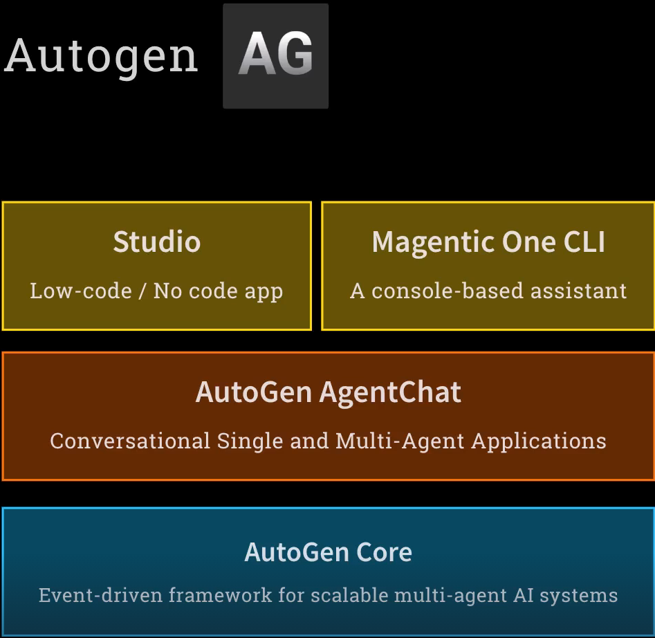

# AutoGen: Microsoft's Multi-Agent Framework — A Deep Dive

## Table of Contents

- [Ecosystem & Philosophy](#ecosystem--philosophy)
  - [What is AutoGen](#what-is-autogen)
  - [The AutoGen / AG2 Fork Drama](#the-autogen--ag2-fork-drama)
  - [Architecture Layers](#architecture-layers)
  - [AutoGen Core vs Semantic Kernel vs LangGraph](#autogen-core-vs-semantic-kernel-vs-langgraph)
- [Core Concepts](#core-concepts)
  - [Model Clients](#model-clients)
  - [Messages](#messages)
  - [Agents (AgentChat)](#agents-agentchat)
  - [Tools](#tools)
  - [Teams](#teams)
  - [AutoGen Core: RoutedAgent and Runtimes](#autogen-core-routedagent-and-runtimes)
  - [Agent IDs and Message Routing](#agent-ids-and-message-routing)
  - [Runtimes: Standalone and Distributed](#runtimes-standalone-and-distributed)
- [Building Blocks](#building-blocks)
  - [Model Client Setup (OpenRouter)](#model-client-setup-openrouter)
  - [Tool Registration Pattern](#tool-registration-pattern)
  - [Structured Outputs with Pydantic](#structured-outputs-with-pydantic)
  - [LangChain Tool Adapter](#langchain-tool-adapter)
  - [MCP Tool Integration](#mcp-tool-integration)
- [Progressive Examples](#progressive-examples)
  - [Single Agent with SQLite Tool](#single-agent-with-sqlite-tool)
  - [Multi-Modal, Teams, and Cross-Framework Interop](#multi-modal-teams-and-cross-framework-interop)
  - [AutoGen Core — Standalone Runtime](#autogen-core--standalone-runtime)
  - [AutoGen Core — Distributed Runtime via gRPC](#autogen-core--distributed-runtime-via-grpc)
  - [Self-Replicating Agent Creator](#self-replicating-agent-creator)
- [Key Takeaways](#key-takeaways)
- [References](#references)

---

## Ecosystem & Philosophy

### What is AutoGen

AutoGen is an **open-source multi-agent framework from Microsoft Research**, released in its current form (v0.4) in January 2026 as a ground-up rewrite adopting an **asynchronous, event-driven architecture**. This course uses **AutoGen v0.5.1**.

> ⚠️ **Documentation Warning**: Distinguish between docs for **v0.4+** (current Microsoft version) and **v0.2** (legacy / AG2 fork). They are incompatible.

### The AutoGen / AG2 Fork Drama

Late 2024: the original co-creator left Microsoft and forked AutoGen 0.2 into **AG2** (AgentOS 2), now at Google.

**The confusing part:**
- AG2 forked from **AutoGen 0.2** (legacy API) — incompatible with Microsoft's 0.4+ rewrite
- The AG2 team controls the **`autogen` PyPI package** — `pip install autogen` gives you AG2, not Microsoft's AutoGen
- The AG2 team controls the **original Discord server**

| | Microsoft AutoGen | AG2 (fork) |
|---|---|---|
| **Version** | 0.5.1+ | 0.8+ |
| **Based on** | 0.4 rewrite (async, event-driven) | 0.2 legacy |
| **PyPI package** | `autogen-agentchat`, `autogen-ext` | `autogen` |
| **GitHub** | [microsoft/autogen](https://github.com/microsoft/autogen) | [ag2ai/ag2](https://github.com/ag2ai/ag2) |
| **Discord** | New Microsoft-managed server | Original (controlled by AG2 team) |

### Architecture Layers

AutoGen is an umbrella encompassing multiple layers:



| Layer | Purpose |
|---|---|
| **AutoGen Core** | Model-agnostic runtime for agent messaging, lifecycle, and discovery. The infrastructure fabric. |
| **AutoGen AgentChat** | High-level framework built on Core. Wraps LLMs in agents with tools. Comparable to CrewAI/OpenAI Agents SDK. |
| **AutoGen Studio** | Low-code/no-code visual interface. Research environment, not production-ready. |
| **Magentic-One** | Pre-built CLI agent system (Orchestrator + WebSurfer + FileSurfer + Coder + Terminal). |

**This course focuses on:** AgentChat (examples 1–2) and Core (examples 3–5).

### AutoGen Core vs Semantic Kernel vs LangGraph

| | AutoGen Core | Semantic Kernel | LangGraph |
|---|---|---|---|
| **Focus** | Agent interaction & messaging across diverse/distributed agents | Glue code for LLM calls (memory, plugins, prompts) | Robustness, repeatability, state replay |
| **Analogy** | Agent messaging fabric | LangChain equivalent | State machine for agent workflows |
| **Agent diversity** | Any language, any framework | Python/C# | LangGraph nodes |
| **Microsoft's positioning** | Autonomous multi-agent applications | Stitching LLM calls for business apps | (Not Microsoft) |

---

## Core Concepts

These concepts are explained once here and referenced throughout the examples.

### Model Clients

AutoGen wraps LLM calls via model clients:

- **`OpenAIChatCompletionClient`** — any OpenAI-compatible API (OpenAI, OpenRouter, Azure, vLLM)
- **`OllamaChatCompletionClient`** — local models via Ollama

Both are drop-in replacements for each other.

### Messages

A first-class concept representing **all communication**:
- **User → Agent** (requests)
- **Agent → Agent** (inter-agent in teams or Core)
- **Internal** (tool calls, function results)

Message types: `TextMessage`, `MultiModalMessage` (text + images), custom `@dataclass` messages (in Core).

### Agents (AgentChat)

`AssistantAgent` is the primary agent class. It wraps:
- A model client
- A system message (persona/instructions)
- Tools (Python functions)
- Configuration (`reflect_on_tool_use`, `output_content_type`, streaming)

Invoked via `await agent.on_messages([messages], cancellation_token)`.

### Tools

AutoGen has the **lightest-weight tool registration** of any framework:

| Framework | Tool Registration |
|---|---|
| **AutoGen AgentChat** | Pass raw Python function — no decorator, no wrapper |
| **OpenAI Agents SDK** | Requires `@function_tool` decorator |
| **LangGraph** | Requires `@tool` decorator or `StructuredTool` |
| **CrewAI** | Requires `@tool` decorator |

AutoGen inspects **type hints** and **docstrings** to auto-generate the tool schema.

### Teams

Groups of agents collaborating. `RoundRobinGroupChat` is the simplest pattern — agents take turns until a termination condition is met. Always set `max_turns` to prevent runaway token consumption.

### AutoGen Core: RoutedAgent and Runtimes

Core is the infrastructure layer beneath AgentChat. Every Core agent:
- Subclasses `RoutedAgent`
- Has methods decorated with `@message_handler`
- Receives and returns typed messages
- Is identified by an `AgentId(type, key)`

Core handles messaging; you handle logic. The agent doesn't know (or care) whether it's in a standalone or distributed runtime.

### Agent IDs and Message Routing

Every agent has a unique `AgentId` with two components:
- `agent.id.type` — the kind of agent (e.g., `"player1"`)
- `agent.id.key` — instance identifier (e.g., `"default"`)

Core routes messages to handlers based on the **Python type annotation** of the `message` parameter. Multiple handlers per agent are supported for different message types.

### Runtimes: Standalone and Distributed

| Runtime | Class | Use Case |
|---|---|---|
| **Standalone** | `SingleThreadedAgentRuntime` | Local development, single process |
| **Distributed** | `GrpcWorkerAgentRuntimeHost` + `GrpcWorkerAgentRuntime` | Cross-process, cross-machine, cross-language via gRPC |

Key insight: agent code is **identical** between standalone and distributed. Only the registration changes.


---

## Building Blocks

Canonical patterns used throughout the examples. Established once here, referenced later.

### Model Client Setup (OpenRouter)

```python
import os
from autogen_ext.models.openai import OpenAIChatCompletionClient
from dotenv import load_dotenv

load_dotenv(dotenv_path="../.env", override=True)

# OpenAIChatCompletionClient works with any OpenAI-compatible API.
# model_info is required when using OpenRouter's prefixed model names
# (e.g., "openai/gpt-4o-mini") because AutoGen can't find them in its built-in registry.
model_client = OpenAIChatCompletionClient(
    model="openai/gpt-4o-mini",
    api_key=os.environ["OPENROUTER_API_KEY"],
    base_url=os.environ["OPENROUTER_BASE_URL"],
    model_info={
        "vision": True,
        "function_calling": True,
        "json_output": True,
        "structured_output": True,
        "family": "unknown",
    }
)
```

**Alternative — local model with Ollama** (drop-in replacement, zero code changes elsewhere):

```python
from autogen_ext.models.ollama import OllamaChatCompletionClient
model_client = OllamaChatCompletionClient(model="llama3.2")
```

### Tool Registration Pattern

Pass a typed Python function with a docstring. AutoGen generates the schema automatically:

```python
def get_city_price(city_name: str) -> float | None:
    """Get the roundtrip ticket price to travel to the city"""
    # Docstring becomes the tool description sent to the LLM
    conn = sqlite3.connect("tickets.db")
    c = conn.cursor()
    c.execute("SELECT round_trip_price FROM cities WHERE city_name = ?", (city_name.lower(),))
    result = c.fetchone()
    conn.close()
    return result[0] if result else None

# Pass directly — no decorator needed
agent = AssistantAgent(
    name="agent",
    model_client=model_client,
    tools=[get_city_price],
    reflect_on_tool_use=True  # LLM generates natural language response incorporating tool result
)
```

### Structured Outputs with Pydantic

```python
from pydantic import BaseModel, Field
from typing import Literal

class ImageDescription(BaseModel):
    scene: str = Field(description="The overall scene")
    message: str = Field(description="The point being conveyed")
    style: str = Field(description="The artistic style")
    orientation: Literal["portrait", "landscape", "square"]

# Just pass output_content_type — response is automatically a typed Pydantic object
agent = AssistantAgent(
    name="describer",
    model_client=model_client,
    output_content_type=ImageDescription,
)
```

### LangChain Tool Adapter

```python
from autogen_ext.tools.langchain import LangChainToolAdapter
from langchain_community.utilities import GoogleSerperAPIWrapper
from langchain.agents import Tool

# Any LangChain tool → AutoGen tool in one line
serper = GoogleSerperAPIWrapper()
langchain_tool = Tool(name="internet_search", func=serper.run, description="Search the internet")
autogen_tool = LangChainToolAdapter(langchain_tool)
```

### MCP Tool Integration

```python
from autogen_ext.tools.mcp import StdioServerParams, mcp_server_tools

fetch_mcp_server = StdioServerParams(
    command="uvx",
    args=["mcp-server-fetch"],
    read_timeout_seconds=30
)
# Connect to MCP server and get tools as AutoGen-compatible objects
tools = await mcp_server_tools(fetch_mcp_server)
```


---

## Progressive Examples

### Single Agent with SQLite Tool

Using the [model client](#model-client-setup-openrouter) and [tool registration](#tool-registration-pattern) patterns established above.

**Setup the database:**

```python
import sqlite3, os

if os.path.exists("tickets.db"):
    os.remove("tickets.db")
conn = sqlite3.connect("tickets.db")
c = conn.cursor()
c.execute("CREATE TABLE cities (city_name TEXT PRIMARY KEY, round_trip_price REAL)")
conn.commit()
conn.close()

def save_city_price(city_name, round_trip_price):
    conn = sqlite3.connect("tickets.db")
    c = conn.cursor()
    c.execute("REPLACE INTO cities (city_name, round_trip_price) VALUES (?, ?)", (city_name.lower(), round_trip_price))
    conn.commit()
    conn.close()

save_city_price("London", 299)
save_city_price("Paris", 399)
save_city_price("Rome", 499)
```

**Create and invoke the tool-equipped agent:**

```python
from autogen_agentchat.agents import AssistantAgent
from autogen_agentchat.messages import TextMessage
from autogen_core import CancellationToken

smart_agent = AssistantAgent(
    name="smart_airline_agent",
    model_client=model_client,
    system_message="You are a helpful airline assistant. Give short, humorous answers with ticket prices.",
    tools=[get_city_price],
    reflect_on_tool_use=True
)

message = TextMessage(content="I'd like to go to London", source="user")
response = await smart_agent.on_messages([message], cancellation_token=CancellationToken())

# Inner messages show the tool-calling trace
for inner_message in response.inner_messages:
    print(inner_message.content)
print(response.chat_message.content)
```

**Output:**
```
[FunctionCall(arguments='{"city_name":"London"}', name='get_city_price')]
[FunctionExecutionResult(content='299.0', name='get_city_price')]
'A roundtrip ticket to London is just $299. Cheerio! 🍵✈️'
```

**What happened internally:**
1. LLM received user message + tool schema (auto-generated from type hints + docstring)
2. LLM decided to call `get_city_price("London")`
3. AutoGen executed the function → `299.0`
4. `reflect_on_tool_use=True` fed the result back to the LLM
5. LLM generated a human-friendly response

---

### Multi-Modal, Teams, and Cross-Framework Interop

#### Multi-Modal Conversations

```python
from autogen_agentchat.messages import MultiModalMessage
from autogen_core import Image as AGImage
from PIL import Image
from io import BytesIO
import requests

url = "https://raw.githubusercontent.com/mkejeiri/LLM-Projects/master/Agentic%20AI/05-Autogen/pic/autogen-bloc.png"
pil_image = Image.open(BytesIO(requests.get(url).content))
img = AGImage(pil_image)

# Mix text and images in a single message
multi_modal_message = MultiModalMessage(
    content=["Describe the content of this image in detail", img],
    source="User"
)

describer = AssistantAgent(name="description_agent", model_client=model_client, system_message="You are good at describing images")
response = await describer.on_messages([multi_modal_message], cancellation_token=CancellationToken())
```

No special config needed beyond `model_info["vision"]=True` in the [model client setup](#model-client-setup-openrouter).

#### Structured Outputs

Using the [Pydantic pattern](#structured-outputs-with-pydantic) established above:

```python
describer = AssistantAgent(
    name="description_agent",
    model_client=model_client,
    output_content_type=ImageDescription,  # Response is a typed Pydantic object
)
response = await describer.on_messages([multi_modal_message], cancellation_token=CancellationToken())
reply = response.chat_message.content  # ImageDescription instance
print(reply.scene, reply.style, reply.orientation)
```

#### LangChain Tools in Action

Using the [LangChain adapter](#langchain-tool-adapter) + FileManagementToolkit:

```python
from langchain_community.agent_toolkits import FileManagementToolkit

autogen_tools = [autogen_serper]  # Web search from Building Blocks
langchain_file_tools = FileManagementToolkit(root_dir="sandbox").get_tools()
for tool in langchain_file_tools:
    autogen_tools.append(LangChainToolAdapter(tool))

agent = AssistantAgent(name="searcher", model_client=model_client, tools=autogen_tools, reflect_on_tool_use=True)
result = await agent.on_messages([TextMessage(content="Find flights JFK→LHR June 2026, write to flights.md", source="user")], cancellation_token=CancellationToken())
```

#### Teams: Multi-Agent Collaboration

```python
from autogen_agentchat.conditions import TextMentionTermination
from autogen_agentchat.teams import RoundRobinGroupChat

primary_agent = AssistantAgent("primary", model_client=model_client, tools=[autogen_serper],
    system_message="You are a research assistant. Incorporate feedback.")
evaluation_agent = AssistantAgent("evaluator", model_client=model_client,
    system_message="Provide feedback. Respond 'APPROVE' when satisfied.")

text_termination = TextMentionTermination("APPROVE")
team = RoundRobinGroupChat([primary_agent, evaluation_agent], termination_condition=text_termination, max_turns=20)
result = await team.run(task="Find a non-stop flight JFK to LHR in June 2026.")
```

**⚠️ Caveats:** Always set `max_turns`. String-based termination ("APPROVE") is brittle — prefer structured outputs in production.

#### MCP Tools

Using the [MCP pattern](#mcp-tool-integration) established above:

```python
agent = AssistantAgent(name="fetcher", model_client=model_client, tools=fetcher, reflect_on_tool_use=True)
result = await agent.run(task="Review https://example.com and summarize. Reply in Markdown.")
```

> ⚠️ MCP servers have known issues on Windows. Use WSL as a workaround.


---

### AutoGen Core — Standalone Runtime

Moving beneath AgentChat to the infrastructure layer. Using concepts from [Core Concepts](#autogen-core-routedagent-and-runtimes).

**Define a message and a simple agent:**

```python
from dataclasses import dataclass
from autogen_core import AgentId, MessageContext, RoutedAgent, message_handler, SingleThreadedAgentRuntime

@dataclass
class Message:
    content: str

class SimpleAgent(RoutedAgent):
    def __init__(self) -> None:
        super().__init__("Simple")

    @message_handler
    async def on_my_message(self, message: Message, ctx: MessageContext) -> Message:
        return Message(content=f"This is {self.id.type}-{self.id.key}. You said '{message.content}' and I disagree.")
```

**Register, start, and message:**

```python
runtime = SingleThreadedAgentRuntime()
await SimpleAgent.register(runtime, "simple_agent", lambda: SimpleAgent())
runtime.start()

response = await runtime.send_message(Message("Well hi there!"), AgentId("simple_agent", "default"))
print(">>>", response.content)
# >>> This is simple_agent-default. You said 'Well hi there!' and I disagree.

await runtime.stop()
await runtime.close()
```

**Delegating to an LLM (Core + AgentChat integration):**

```python
from autogen_agentchat.agents import AssistantAgent
from autogen_agentchat.messages import TextMessage

class MyLLMAgent(RoutedAgent):
    def __init__(self) -> None:
        super().__init__("LLMAgent")
        # Using the model client pattern from Building Blocks
        model_client = OpenAIChatCompletionClient(
            model="openai/gpt-4o-mini",
            api_key=os.environ["OPENROUTER_API_KEY"],
            base_url=os.environ["OPENROUTER_BASE_URL"],
            model_info={"vision": True, "function_calling": True, "json_output": True, "structured_output": True, "family": "unknown"}
        )
        self._delegate = AssistantAgent("LLMAgent", model_client=model_client)

    @message_handler
    async def handle_my_message_type(self, message: Message, ctx: MessageContext) -> Message:
        # Convert Core Message → AgentChat TextMessage → delegate → wrap response back
        text_message = TextMessage(content=message.content, source="user")
        response = await self._delegate.on_messages([text_message], ctx.cancellation_token)
        return Message(content=response.chat_message.content)
```

**Multi-agent interaction — Rock Paper Scissors:**

```python
from autogen_ext.models.ollama import OllamaChatCompletionClient

class Player1Agent(RoutedAgent):
    def __init__(self, name: str) -> None:
        super().__init__(name)
        model_client = OpenAIChatCompletionClient(
            model="openai/gpt-4o-mini", api_key=os.environ["OPENROUTER_API_KEY"],
            base_url=os.environ["OPENROUTER_BASE_URL"],
            model_info={"vision": True, "function_calling": True, "json_output": True, "structured_output": True, "family": "unknown"},
            temperature=1.0
        )
        self._delegate = AssistantAgent(name, model_client=model_client)

    @message_handler
    async def handle_my_message_type(self, message: Message, ctx: MessageContext) -> Message:
        text_message = TextMessage(content=message.content, source="user")
        response = await self._delegate.on_messages([text_message], ctx.cancellation_token)
        return Message(content=response.chat_message.content)

class Player2Agent(RoutedAgent):
    def __init__(self, name: str) -> None:
        super().__init__(name)
        model_client = OllamaChatCompletionClient(model="llama3.2", temperature=1.0)
        self._delegate = AssistantAgent(name, model_client=model_client)

    @message_handler
    async def handle_my_message_type(self, message: Message, ctx: MessageContext) -> Message:
        text_message = TextMessage(content=message.content, source="user")
        response = await self._delegate.on_messages([text_message], ctx.cancellation_token)
        return Message(content=response.chat_message.content)

class RockPaperScissorsAgent(RoutedAgent):
    def __init__(self, name: str) -> None:
        super().__init__(name)
        model_client = OpenAIChatCompletionClient(
            model="openai/gpt-4o-mini", api_key=os.environ["OPENROUTER_API_KEY"],
            base_url=os.environ["OPENROUTER_BASE_URL"],
            model_info={"vision": True, "function_calling": True, "json_output": True, "structured_output": True, "family": "unknown"},
            temperature=1.0
        )
        self._delegate = AssistantAgent(name, model_client=model_client)

    @message_handler
    async def handle_my_message_type(self, message: Message, ctx: MessageContext) -> Message:
        instruction = "You are playing rock, paper, scissors. Respond only with one word: rock, paper, or scissors."
        msg = Message(content=instruction)
        response1 = await self.send_message(msg, AgentId("player1", "default"))
        response2 = await self.send_message(msg, AgentId("player2", "default"))
        result = f"Player 1: {response1.content}\nPlayer 2: {response2.content}\n"
        judgement = f"You are judging rock, paper, scissors. Choices:\n{result}Who wins?"
        response = await self._delegate.on_messages([TextMessage(content=judgement, source="user")], ctx.cancellation_token)
        return Message(content=result + response.chat_message.content)

# Register and run
runtime = SingleThreadedAgentRuntime()
await Player1Agent.register(runtime, "player1", lambda: Player1Agent("player1"))
await Player2Agent.register(runtime, "player2", lambda: Player2Agent("player2"))
await RockPaperScissorsAgent.register(runtime, "rock_paper_scissors", lambda: RockPaperScissorsAgent("rock_paper_scissors"))
runtime.start()

response = await runtime.send_message(Message(content="go"), AgentId("rock_paper_scissors", "default"))
print(response.content)
# Player 1: rock
# Player 2: paper
# Player 2 wins because paper covers rock.
```

**Demonstrates:** Agent discovery by ID, heterogeneous backends (cloud + local), intra-agent messaging via `self.send_message()`, orchestration pattern.

---

### AutoGen Core — Distributed Runtime via gRPC

Same agent code as the standalone example — only the runtime registration changes. See [Runtimes](#runtimes-standalone-and-distributed) for the architecture.

> ⚠️ **Experimental**: Microsoft states distributed runtime APIs are liable to change.

**Host + Workers setup:**

```python
from autogen_ext.runtimes.grpc import GrpcWorkerAgentRuntimeHost, GrpcWorkerAgentRuntime

host = GrpcWorkerAgentRuntimeHost(address="localhost:50051")
host.start()

ALL_IN_ONE_WORKER = False
```

**Agents (identical to standalone — that's the point):**

```python
class Player1Agent(RoutedAgent):
    # ... identical to standalone example — armed with web search tool
    pass

class Player2Agent(RoutedAgent):
    # ... identical structure, researches cons
    pass

class Judge(RoutedAgent):
    # ... orchestrates: dispatches to players, collects results, decides
    pass
```

**Mode 1 — All-in-one worker:**

```python
if ALL_IN_ONE_WORKER:
    worker = GrpcWorkerAgentRuntime(host_address="localhost:50051")
    await worker.start()
    await Player1Agent.register(worker, "player1", lambda: Player1Agent("player1"))
    await Player2Agent.register(worker, "player2", lambda: Player2Agent("player2"))
    await Judge.register(worker, "judge", lambda: Judge("judge"))
    agent_id = AgentId("judge", "default")
```

**Mode 2 — Truly distributed (each agent in its own worker):**

```python
else:
    worker1 = GrpcWorkerAgentRuntime(host_address="localhost:50051")
    await worker1.start()
    await Player1Agent.register(worker1, "player1", lambda: Player1Agent("player1"))

    worker2 = GrpcWorkerAgentRuntime(host_address="localhost:50051")
    await worker2.start()
    await Player2Agent.register(worker2, "player2", lambda: Player2Agent("player2"))

    worker = GrpcWorkerAgentRuntime(host_address="localhost:50051")
    await worker.start()
    await Judge.register(worker, "judge", lambda: Judge("judge"))
    agent_id = AgentId("judge", "default")
```

**Run and cleanup:**

```python
response = await worker.send_message(Message(content="Go!"), agent_id)
display(Markdown(response.content))

await worker.stop()
if not ALL_IN_ONE_WORKER:
    await worker1.stop()
    await worker2.stop()
await host.stop()
```

**The key insight:** Zero code changes between standalone and distributed. `self.send_message()` is transparent — local function call or gRPC network call, same API. Configuration, not code.


---

### Self-Replicating Agent Creator

Capstone project: an agent that **writes, imports, registers, and messages new agents** at runtime. Demonstrates dynamic agent lifecycle management in a distributed runtime.

> ⚠️ **Safety**: Generates and executes Python code without guardrails. Run at your own risk. Cost: ~$0.02 for 20 agents.

**Architecture:**

```
world.py (orchestrator script, not an agent)
  └── Creator agent (writes + registers new agents)
        ├── agent1.py (spawned, unique personality)
        ├── agent2.py (spawned, different interests)
        ├── agent3.py (may message agent1 for refinement)
        └── ... up to agentN.py
```

All source files: [`code/`](code/)

**messages.py — shared transport + peer discovery:**

```python
from dataclasses import dataclass
from autogen_core import AgentId
import glob, os, random

@dataclass
class Message:
    content: str

def find_recipient() -> AgentId:
    """Scan directory for agentN.py files, return a random peer."""
    agent_files = glob.glob("agent*.py")
    agent_names = [os.path.splitext(f)[0] for f in agent_files]
    agent_names.remove("agent")
    return AgentId(random.choice(agent_names), "default")
```

**agent.py — the clone template:**

```python
class Agent(RoutedAgent):
    system_message = """You are a creative entrepreneur..."""
    CHANCES_THAT_I_BOUNCE_IDEA_OFF_ANOTHER = 0.5

    def __init__(self, name) -> None:
        super().__init__(name)
        model_client = OpenAIChatCompletionClient(...)  # OpenRouter pattern
        self._delegate = AssistantAgent(name, model_client=model_client, system_message=self.system_message)

    @message_handler
    async def handle_message(self, message: messages.Message, ctx: MessageContext) -> messages.Message:
        text_message = TextMessage(content=message.content, source="user")
        response = await self._delegate.on_messages([text_message], ctx.cancellation_token)
        idea = response.chat_message.content
        # With some probability, forward to a random peer for refinement
        if random.random() < self.CHANCES_THAT_I_BOUNCE_IDEA_OFF_ANOTHER:
            recipient = messages.find_recipient()
            response = await self.send_message(messages.Message(content=f"Refine this: {idea}"), recipient)
            idea = response.content
        return messages.Message(content=idea)
```

**creator.py — the agent that creates agents:**

```python
class Creator(RoutedAgent):
    system_message = """You create new AI Agents from a template. Respond only with Python code."""

    @message_handler
    async def handle_my_message_type(self, message: messages.Message, ctx: MessageContext) -> messages.Message:
        filename = message.content  # e.g. "agent1.py"
        agent_name = filename.split(".")[0]
        # Ask LLM to generate a variation of agent.py
        text_message = TextMessage(content=self.get_user_prompt(), source="user")
        response = await self._delegate.on_messages([text_message], ctx.cancellation_token)
        # Save generated code
        with open(filename, "w") as f:
            f.write(response.chat_message.content)
        # Dynamically import and register with the runtime
        module = importlib.import_module(agent_name)
        await module.Agent.register(self.runtime, agent_name, lambda: module.Agent(agent_name))
        # Send first message to the new agent
        result = await self.send_message(messages.Message(content="Give me an idea"), AgentId(agent_name, "default"))
        return messages.Message(content=result.content)
```

**world.py — parallel orchestration with asyncio:**

```python
import asyncio
from autogen_ext.runtimes.grpc import GrpcWorkerAgentRuntimeHost, GrpcWorkerAgentRuntime

HOW_MANY_AGENTS = 20

async def create_and_message(worker, creator_id, i):
    result = await worker.send_message(messages.Message(content=f"agent{i}.py"), creator_id)
    with open(f"idea{i}.md", "w") as f:
        f.write(result.content)

async def main():
    host = GrpcWorkerAgentRuntimeHost(address="localhost:50051")
    host.start()
    worker = GrpcWorkerAgentRuntime(host_address="localhost:50051")
    await worker.start()
    await Creator.register(worker, "Creator", lambda: Creator("Creator"))
    creator_id = AgentId("Creator", "default")
    # All 20 creations fire concurrently — event loop concurrency, not threads
    coroutines = [create_and_message(worker, creator_id, i) for i in range(1, HOW_MANY_AGENTS + 1)]
    await asyncio.gather(*coroutines)
    await worker.stop()
    await host.stop()

if __name__ == "__main__":
    asyncio.run(main())
```

**Run:** `uv run world.py` — produces 20 `agentN.py` files + 20 `ideaN.md` files with business ideas.

**Challenge:** Make the Creator write a new version of *itself* — a self-replicating creator that spawns creators that spawn agents.

---

## Key Takeaways

1. **Lightest-weight tool registration** — pass a typed Python function with a docstring. No decorators.
2. **OpenAI-compatible** — `OpenAIChatCompletionClient` works with any compatible API via `base_url`.
3. **Unified message model** — everything is a message: user inputs, agent responses, tool calls, tool results.
4. **Cross-framework interop** — `LangChainToolAdapter` + `mcp_server_tools()` give access to both ecosystems.
5. **Structured outputs are trivial** — pass a Pydantic model as `output_content_type`.
6. **Teams need guardrails** — always set `max_turns` on `RoundRobinGroupChat`.
7. **Async-first** — all invocations are coroutines. Event-driven from the ground up.
8. **Core decouples logic from messaging** — handles lifecycle, routing, discovery. Agents can use any LLM or none.
9. **Type-based message dispatch** — Core routes to handlers based on Python type annotations.
10. **Transparent distribution** — agent code is identical between standalone and distributed. Only registration changes.
11. **Heterogeneous ecosystems** — one runtime can host agents backed by different LLMs, frameworks, or languages.
12. **Microsoft-backed open source** — no monetization pressure on the framework itself.

---

## References

- **Microsoft AutoGen GitHub**: https://github.com/microsoft/autogen
- **AutoGen Documentation (v0.4+)**: https://microsoft.github.io/autogen/
- **AG2 Fork GitHub**: https://github.com/ag2ai/ag2
- **AG2 Documentation**: https://docs.ag2.ai/
- **AutoGen v0.4 Announcement Blog**: https://www.microsoft.com/en-us/research/blog/autogen-update/
- **Magentic-One**: https://github.com/microsoft/autogen/tree/main/python/packages/magentic-one
- **OpenRouter**: https://openrouter.ai/
- **MCP (Model Context Protocol)**: https://modelcontextprotocol.io/
- **MCP Server Fetch**: https://github.com/modelcontextprotocol/servers/tree/main/src/fetch
- **LangChain Tools**: https://python.langchain.com/docs/integrations/tools/
- **Google Serper API**: https://serper.dev/
