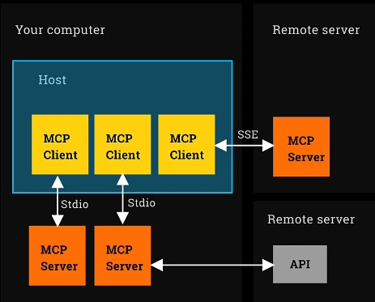

# Model Context Protocol (MCP)

## Introduction: The "USB-C of Agentic AI"

The Model Context Protocol (MCP), introduced by Anthropic, represents a standardization breakthrough in the AI agent ecosystem. Often described as the "USB-C of Agentic AI," MCP provides a universal protocol for connecting AI agents with external tools, resources, and capabilities.

## What MCP Is NOT

Before diving into MCP's capabilities, it's crucial to understand common misconceptions:

❌ **Not an agent framework**: MCP doesn't help you build agents

❌ **Not a fundamental paradigm shift**: It's an evolution, not a revolution

❌ **Not a coding framework**: It doesn't change how you write agent logic

❌ **Not primarily about creating your own tools**: It's about using tools created by others


## What MCP Actually Is

MCP is a **protocol** - a standardized way to integrate agents with external capabilities. It enables:

✅ **Tool Sharing**: Easy integration with tools built by the community

✅ **Resource Access**: Connection to external data sources and RAG systems

✅ **Prompt Templates**: Sharing of reusable prompt patterns

✅ **Ecosystem Growth**: A marketplace of thousands of ready-to-use capabilities


The excitement around MCP stems from its **adoption** - thousands of tools are now available through this standardized interface.

## Core Architecture Components



### 1. MCP Host
The **host** is your main application that runs agents. Examples include:
- Claude Desktop application
- Your custom agent application using OpenAI Agents SDK
- Any software that manages AI agents

### 2. MCP Client
The **client** is a small plugin that runs inside the host. Key characteristics:
- One client per MCP server connection
- Handles communication between host and server
- Manages the protocol translation

### 3. MCP Server
The **server** provides the actual capabilities:
- **Tools**: Functions the agent can execute
- **Resources**: Data sources and context
- **Prompts**: Template patterns

## Deployment Patterns

### Pattern 1: Local MCP Servers (Most Common)
```
[Your Computer]
├── Host (OpenAI Agents SDK)
│   ├── MCP Client 1 ──→ MCP Server (File System)
│   └── MCP Client 2 ──→ MCP Server (Web Browser)
```

**Key Point**: Despite the name "server," most MCP servers run locally on your machine. You download them from repositories but execute them locally.

### Pattern 2: Remote MCP Servers (Rare)
```
[Your Computer]          [Remote Server]
├── Host                 ├── MCP Server
│   └── MCP Client ──────→   (Hosted/Managed)
```

This configuration is uncommon and typically called "hosted" or "managed" MCP servers.

### Pattern 3: Local Server with Remote Services (Very Common)
```
[Your Computer]                    [Internet]
├── MCP Server (Fetch) ──────────→ Web Services
│   └── Uses web browser          └── Websites, APIs
```

Most MCP servers run locally but access remote services (web scraping, APIs, etc.).

## Transport Mechanisms

### STDIO (Standard Input/Output)
- **Most common approach**
- Client spawns a separate process
- Communication via standard input/output streams
- Used for local MCP servers
- Simpler to implement and debug

### SSE (Server-Sent Events)
- Uses HTTPS connections
- Streams results (similar to LLM streaming)
- **Required** for remote MCP servers
- **Optional** for local servers
- More complex but supports remote connections

## Practical Implementation with OpenAI Agents SDK

### Basic MCP Server Integration

#### Step 1: Define Server Parameters
```python
# Python-based MCP server (using uvx)
fetch_params = {
    "command": "uvx", 
    "args": ["mcp-server-fetch"]
}

# JavaScript-based MCP server (using npx)
playwright_params = {
    "command": "npx",
    "args": ["@playwright/mcp@latest"]
}
```

#### Step 2: Create MCP Client and Query Tools
```python
from agents.mcp import MCPServerStdio

async with MCPServerStdio(params=fetch_params, client_session_timeout_seconds=60) as server:
    fetch_tools = await server.list_tools()
```

**Critical Implementation Notes**:
- Always specify a timeout (default 5 seconds often fails)
- Use 30-60 second timeouts for reliability
- Handle potential OpenAI SDK breaking changes (see version compatibility notes)

#### Step 3: Integrate with Agent
```python
from agents import Agent, Runner, trace

sandbox_path = os.path.abspath(os.path.join(os.getcwd(), "[Your Folder Name]"))
files_params = {"command": "npx", "args": ["-y", "@modelcontextprotocol/server-filesystem", sandbox_path]}

async with MCPServerStdio(params=files_params, client_session_timeout_seconds=60) as mcp_server_files:
    async with MCPServerStdio(params=playwright_params, client_session_timeout_seconds=60) as mcp_server_browser:
        agent = Agent(
            name="investigator", 
            instructions=instructions, 
            model="gpt-4.1-mini",
            mcp_servers=[mcp_server_files, mcp_server_browser]
        )
        with trace("investigate"):
            result = await Runner.run(agent, "Your task here")
```

## Detailed Code Analysis

### Import Structure
```python
from dotenv import load_dotenv
from agents import Agent, Runner, trace
from agents.mcp import MCPServerStdio
import os
```

The `agents.mcp` module provides the MCP integration layer for OpenAI Agents SDK.

### Fetch MCP Server Example
The fetch server demonstrates a Python-based MCP server:

```python
fetch_params = {"command": "uvx", "args": ["mcp-server-fetch"]}
```

This server:
- Runs a headless browser using Playwright
- Fetches web pages and converts to markdown
- Includes intelligent prompting: "Although originally you did not have internet access... this tool now grants you internet access"

### Playwright MCP Server Example
The Playwright server provides granular browser control:

```python
playwright_params = {"command": "npx", "args": ["@playwright/mcp@latest"]}
```

Unlike the simple fetch server, Playwright offers:
- Fine-grained browser control (click, hover, type, screenshot)
- Multiple tools for different browser actions
- Professional browser automation capabilities

### File System MCP Server Example
```python
sandbox_path = os.path.abspath(os.path.join(os.getcwd(), "sandbox"))
files_params = {"command": "npx", "args": ["-y", "@modelcontextprotocol/server-filesystem", sandbox_path]}
```

This server provides:
- Sandboxed file system access
- Read/write capabilities within specified directory
- Security through path restriction

### Agent Instructions Pattern
```python
instructions = """
You browse the internet to accomplish your instructions.
You are highly capable at browsing the internet independently to accomplish your task, 
including accepting all cookies and clicking 'not now' as
appropriate to get to the content you need. If one website isn't fruitful, try another. 
Be persistent until you have solved your assignment,
trying different options and sites as needed.
"""
```

These instructions demonstrate:
- Clear capability communication to the LLM
- Behavioral guidance for web interaction
- Persistence and problem-solving direction

## MCP Ecosystem and Marketplaces

### Major MCP Marketplaces

1. **MCP.so**: 
   - 4,000+ research and data tools
   - 7,344+ developer tools
   - Comprehensive categorization

2. **Glama.ai/mcp**:
   - Security ratings (A/B/C grades)
   - Quality assessments
   - Licensing information

3. **Smithery.ai**:
   - Popular community marketplace
   - Direct command-line integration examples
   - Tool documentation and parameters

### Security Considerations

**Risk Assessment**: Running MCP servers is equivalent to `pip install` or `npm install` - you're executing third-party code locally.

**Security Best Practices**:
- Verify publisher reputation (Microsoft, Anthropic = safer)
- Check GitHub stars and community activity
- Review security ratings on marketplaces
- Consider Docker containerization for additional isolation
- Perform due diligence similar to any open-source package

**Special Concern**: Non-technical users adding MCP servers to applications like Claude Desktop without proper vetting capabilities.

## Platform-Specific Considerations

### Windows PC Compatibility Issue
**Critical Issue**: MCP servers have known compatibility problems on Windows PCs as of May 2025.

**Solution**: Windows Subsystem for Linux (WSL)
- Install WSL following setup instructions
- Run MCP servers within Linux environment
- Use `ubuntu` command (safer than `wsl`) to access Linux home directory
- Ensure project files are in Linux home directory, not Windows

### Mac and Linux
- Full native compatibility
- No additional setup required
- Standard installation procedures work

## Advanced Implementation Patterns

### Multiple MCP Server Integration
```python
async with MCPServerStdio(params=files_params, client_session_timeout_seconds=60) as mcp_server_files:
    async with MCPServerStdio(params=playwright_params, client_session_timeout_seconds=60) as mcp_server_browser:
        agent = Agent(
            name="investigator",
            instructions=instructions,
            model="gpt-4.1-mini",
            mcp_servers=[mcp_server_files, mcp_server_browser]
        )
```

This pattern demonstrates:
- Nested context managers for multiple servers
- Clean resource management
- Agent configuration with multiple capability sources

### Error Handling and Timeouts
```python
client_session_timeout_seconds=60  # Critical for reliability
```

Common issues:
- Default 5-second timeout frequently fails
- Network latency affects server startup
- Always use 30-60 second timeouts in production

## Tracing and Debugging

### OpenAI Platform Integration
```python
with trace("investigate"):
    result = await Runner.run(agent, "Your task")
```

Tracing provides:
- Tool usage visibility at https://platform.openai.com/traces
- MCP server interaction logs
- Agent decision-making transparency
- Performance monitoring

## Future Directions and Ecosystem Growth

### Why MCP Matters
1. **Standardization**: Like HTML for the web, MCP provides universal connectivity
2. **Ecosystem Effect**: Network effects drive tool creation and sharing
3. **Reduced Friction**: Easy integration encourages experimentation
4. **Community Growth**: Thousands of contributors building tools

### Comparison to Existing Approaches
- **OpenAI Agents SDK native tools**: Easy for your own functions, harder for sharing
- **Framework-specific tools**: Limited to specific agent frameworks
- **MCP advantage**: Universal compatibility and massive ecosystem

## Conclusion

MCP represents a maturation of the AI agent ecosystem, moving from isolated tool development to standardized, shareable capabilities. For LLM Engineers, MCP offers:

1. **Immediate Value**: Access to thousands of pre-built tools
2. **Reduced Development Time**: No need to rebuild common functionality
3. **Community Benefits**: Contribute to and benefit from shared ecosystem
4. **Future-Proofing**: Standard protocol likely to persist and grow

The key insight is that MCP's value lies not in the protocol itself, but in the **adoption and ecosystem** it has enabled. With thousands of tools available and major companies contributing, MCP has achieved the network effects necessary for a successful standard.

For practical implementation:
- Understanding the local vs. remote server distinction
- Proper timeout configuration
- Security vetting of third-party tools
- Integration patterns with your chosen agent framework

MCP transforms agent development from "building everything yourself" to "composing capabilities from a rich ecosystem" - a fundamental shift toward more powerful and capable AI agents.
