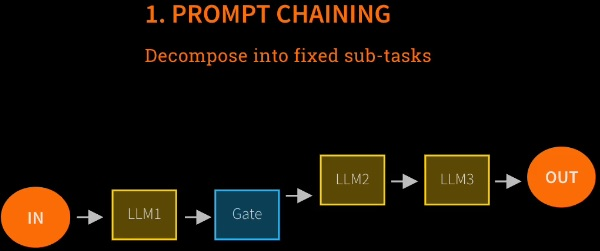
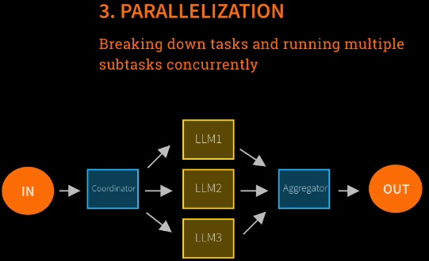

# Agentic AI Systems Introduction

  

## Table of Contents

1.  [Core Concepts & Definitions](#core-concepts--definitions)

2.  [Agentic System Architecture](#agentic-system-architecture)

3.  [Workflow Design Patterns](#workflow-design-patterns)

4.  [Agent Design Patterns](#agent-design-patterns)

5.  [Multi-Model API Integration](#multi-model-api-integration)

6.  [Production Considerations](#production-considerations)

7.  [Code Examples & Implementation](#code-examples--implementation)

  

---

  

## Core Concepts & Definitions

  

### What is an AI Agent?

  

**Primary Definition (Hugging Face)**: AI agents are programs where LLM outputs control the workflow.

  

### Five Hallmarks of Agentic AI

  

1.  **Multiple LLM Calls**: Solutions involving sequential or parallel LLM interactions

2.  **Tool Use**: LLMs with ability to interact with external tools and APIs

3.  **Multi-Agent Coordination**: Environment allowing different LLMs to exchange information

4.  **Planning & Orchestration**: LLM-based coordination of activities and task sequencing

5.  **Autonomy**: LLMs controlling execution order and decision-making processes

  

### Anthropic's Classification Framework

  

**Agentic Systems** (umbrella term) contain two categories:

  

-  **Workflows**: Systems where models and tools are orchestrated through predefined paths

-  **Agents**: Models dynamically direct their own processes and tools, maintaining control over task accomplishment

  

---

  

## Agentic System Architecture

  

### Workflow vs Agent Distinction

  

| Aspect | Workflows | Agents |

|--------|-----------|---------|

|  **Path**  | Predefined, fixed sequence | Dynamic, self-directed |

|  **Control**  | External orchestration | Internal model control |

|  **Predictability**  | High | Variable |

|  **Flexibility**  | Limited | High |

|  **Complexity**  | Lower | Higher |

  

---

  

## Workflow Design Patterns

  

### 1. Prompt Chaining



  

**Architecture**: Sequential LLM calls with optional code processing between steps

  

**Use Cases**:

- Multi-step reasoning tasks

- Content generation pipelines

- Business analysis workflows

  

**Implementation Pattern**:

```python

# Step 1: Generate business sector

messages_1 =  [{"role":  "user",  "content":  "Pick a business sector for analysis"}]

response_1 = openai.chat.completions.create(model="gpt-4.1-mini",  messages=messages_1)

sector = response_1.choices[0].message.content

  

# Step 2: Identify pain points

messages_2 =  [{"role":  "user",  "content":  f"Identify pain points in {sector}"}]

response_2 = openai.chat.completions.create(model="gpt-4.1-mini",  messages=messages_2)

pain_points = response_2.choices[0].message.content

  

# Step 3: Propose solutions

messages_3 =  [{"role":  "user",  "content":  f"Propose AI solutions for {pain_points}"}]

response_3 = openai.chat.completions.create(model="gpt-4.1-mini",  messages=messages_3)

```

  

**Benefits**:

- Precise prompt framing for each step

- Maintained workflow guardrails

- Decomposed complex tasks into manageable subtasks

  

### 2. Routing


  

**Architecture**: Router LLM classifies tasks and directs to specialist models

  

**Implementation Concept**:

```python

def  route_request(user_input):

router_prompt =  f"Classify this request and route to appropriate specialist: {user_input}"

routing_decision = openai.chat.completions.create(

model="gpt-4.1-mini",

messages=[{"role":  "user",  "content": router_prompt}]

)

specialist = routing_decision.choices[0].message.content

return specialist_models[specialist].process(user_input)

```

  

**Benefits**:

- Separation of concerns

- Specialized model expertise

- Efficient resource utilization

  

### 3. Parallelization



  

**Architecture**: Code-driven task decomposition with concurrent LLM processing

  

**Implementation Pattern**:

```python

import asyncio

  

async  def  parallel_processing(task):

# Code decomposes task

subtasks = decompose_task(task)

# Parallel LLM calls

tasks =  [

openai.chat.completions.create(model="gpt-4.1-mini",  messages=[{"role":  "user",  "content": subtask}])

for subtask in subtasks

]

results =  await asyncio.gather(*tasks)

# Code aggregates results

return aggregate_results([r.choices[0].message.content for r in results])

```

  

### 4. Orchestrator-Worker


  

**Architecture**: LLM orchestrator dynamically manages task breakdown and result synthesis

  

**Key Difference from Parallelization**: LLM (not code) handles orchestration decisions

  

**Implementation Concept**:

```python

def  orchestrator_worker_pattern(complex_task):

# LLM orchestrator breaks down task

orchestrator_prompt =  f"Break down this complex task into subtasks: {complex_task}"

breakdown = openai.chat.completions.create(

model="gpt-4.1-mini",

messages=[{"role":  "user",  "content": orchestrator_prompt}]

)

subtasks = parse_subtasks(breakdown.choices[0].message.content)

# Worker LLMs process subtasks

worker_results =  []

for subtask in subtasks:

result = openai.chat.completions.create(

model="gpt-4.1-mini",

messages=[{"role":  "user",  "content": subtask}]

)

worker_results.append(result.choices[0].message.content)

# LLM orchestrator synthesizes results

synthesis_prompt =  f"Synthesize these results: {worker_results}"

final_result = openai.chat.completions.create(

model="gpt-4.1-mini",

messages=[{"role":  "user",  "content": synthesis_prompt}]

)

return final_result.choices[0].message.content

```

  

### 5. Evaluator-Optimizer


  

**Architecture**: Generator-Evaluator feedback loop with iterative improvement

  

**Implementation Pattern**:

```python

def  evaluator_optimizer_pattern(task,  max_iterations=3):

for iteration in  range(max_iterations):

# Generator LLM creates solution

generator_response = openai.chat.completions.create(

model="gpt-4.1-mini",

messages=[{"role":  "user",  "content": task}]

)

solution = generator_response.choices[0].message.content

# Evaluator LLM checks quality

evaluator_prompt =  f"Evaluate this solution and provide feedback: {solution}"

evaluator_response = openai.chat.completions.create(

model="gpt-4.1-mini",

messages=[{"role":  "user",  "content": evaluator_prompt}]

)

evaluation = evaluator_response.choices[0].message.content

if  "acceptable"  in evaluation.lower():

return solution

else:

# Incorporate feedback for next iteration

task =  f"{task}\n\nPrevious attempt: {solution}\nFeedback: {evaluation}\nImprove the solution."

return solution # Return best attempt after max iterations

```

  

**Benefits**:

- Improved accuracy and robustness

- Quality assurance through validation

- Iterative refinement capabilities

  

---

  

## Agent Design Patterns

  

### Core Characteristics


  

**Key Features**:

-  **Open-ended processes**: No fixed termination point

-  **Feedback loops**: Continuous information exchange

-  **Dynamic paths**: No predetermined execution sequence

-  **Environment interaction**: Bidirectional communication with external systems

  

**Generic Agent Loop**:

```python

def  agent_loop(initial_request,  environment):

current_state = initial_request

while  not should_terminate(current_state):

# LLM decides next action

action_decision = openai.chat.completions.create(

model="gpt-4.1-mini",

messages=[{"role":  "user",  "content":  f"Given state: {current_state}, what action should I take?"}]

)

action = action_decision.choices[0].message.content

# Execute action on environment

result = environment.execute(action)

# Update state based on result

current_state = update_state(current_state, result)

return current_state

```

  

### Challenges with Agent Patterns

  

1.  **Unpredictable execution paths**

2.  **Variable output quality**

3.  **Unknown completion times**

4.  **Unpredictable costs**

5.  **Potential infinite loops**

  

### Mitigation Strategies

  

**Monitoring**: Comprehensive visibility into agent interactions and decision-making processes

  

**Guardrails**: Software protections ensuring agents operate within defined boundaries

  

---

  

## Multi-Model API Integration

  

### Supported Models and APIs

  

#### OpenAI Integration

```python

from openai import OpenAI

import os

from dotenv import load_dotenv

  

load_dotenv(override=True)

openai = OpenAI()

  

response = openai.chat.completions.create(

model="gpt-4.1-mini",  # or "gpt-5-nano", "gpt-5-mini"

messages=[{"role":  "user",  "content":  "Your prompt here"}]

)

```

  

#### Anthropic Claude Integration

```python

from anthropic import Anthropic

  

claude = Anthropic()

response = claude.messages.create(

model="claude-sonnet-4-5",

messages=[{"role":  "user",  "content":  "Your prompt here"}],

max_tokens=1000  # Required parameter

)

answer = response.content[0].text

```

  

#### Google Gemini Integration

```python

gemini = OpenAI(

api_key=os.getenv('GOOGLE_API_KEY'),

base_url="https://generativelanguage.googleapis.com/v1beta/openai/"

)

response = gemini.chat.completions.create(

model="gemini-2.5-flash",

messages=[{"role":  "user",  "content":  "Your prompt here"}]

)

```

  

#### DeepSeek Integration

```python

deepseek = OpenAI(

api_key=os.getenv('DEEPSEEK_API_KEY'),

base_url="https://api.deepseek.com/v1"

)

response = deepseek.chat.completions.create(

model="deepseek-chat",

messages=[{"role":  "user",  "content":  "Your prompt here"}]

)

```

  

#### Groq Integration

```python

groq = OpenAI(

api_key=os.getenv('GROQ_API_KEY'),

base_url="https://api.groq.com/openai/v1"

)

response = groq.chat.completions.create(

model="openai/gpt-oss-120b",

messages=[{"role":  "user",  "content":  "Your prompt here"}]

)

```

  

#### Local Ollama Integration

```python

# Requires Ollama running locally on http://localhost:11434

ollama = OpenAI(

base_url="http://localhost:11434/v1",

api_key="ollama"  # Required but not used

)

response = ollama.chat.completions.create(

model="llama2",  # or any locally installed model

messages=[{"role":  "user",  "content":  "Your prompt here"}]

)

```

  

### Multi-Model Comparison Framework

  

```python

def  compare_models(question,  models_config):

competitors =  []

answers =  []

messages =  [{"role":  "user",  "content": question}]

for model_name, client in models_config.items():

try:

if  "claude"  in model_name:

response = client.messages.create(

model=model_name,

messages=messages,

max_tokens=1000

)

answer = response.content[0].text

else:

response = client.chat.completions.create(

model=model_name,

messages=messages

)

answer = response.choices[0].message.content

competitors.append(model_name)

answers.append(answer)

except  Exception  as e:

print(f"Error with {model_name}: {e}")

return competitors, answers

```

  

---

  

## Production Considerations

  

### Environment Setup Best Practices

  

```python

# Essential imports for production systems

import os

import json

from dotenv import load_dotenv

from openai import OpenAI

from anthropic import Anthropic

from IPython.display import Markdown, display

  

# Always load environment variables

load_dotenv(override=True)

  

# Validate API keys

def  validate_api_keys():

keys =  {

'OPENAI_API_KEY': os.getenv('OPENAI_API_KEY'),

'ANTHROPIC_API_KEY': os.getenv('ANTHROPIC_API_KEY'),

'GOOGLE_API_KEY': os.getenv('GOOGLE_API_KEY'),

'DEEPSEEK_API_KEY': os.getenv('DEEPSEEK_API_KEY'),

'GROQ_API_KEY': os.getenv('GROQ_API_KEY')

}

for key_name, key_value in keys.items():

if key_value:

print(f"{key_name} exists and begins {key_value[:8]}")

else:

print(f"{key_name} not set")

```

  

### Error Handling and Robustness

  

```python

def  robust_llm_call(client,  model,  messages,  max_retries=3):

for attempt in  range(max_retries):

try:

response = client.chat.completions.create(

model=model,

messages=messages

)

return response.choices[0].message.content

except  Exception  as e:

if attempt == max_retries -  1:

raise e

print(f"Attempt {attempt +  1} failed: {e}. Retrying...")

time.sleep(2  ** attempt)  # Exponential backoff

```

  

### Cost Management

  

```python

def  estimate_token_cost(text,  model="gpt-4.1-mini"):

# Rough estimation: ~4 characters per token

estimated_tokens =  len(text)  /  4

# Model pricing (example rates)

pricing =  {

"gpt-4.1-mini":  {"input":  0.00015,  "output":  0.0006},  # per 1K tokens

"gpt-5-nano":  {"input":  0.0001,  "output":  0.0004},

"claude-sonnet-4-5":  {"input":  0.003,  "output":  0.015}

}

if model in pricing:

cost =  (estimated_tokens /  1000)  * pricing[model]["input"]

return cost, estimated_tokens

return  None, estimated_tokens

```

  

---

  

## Code Examples & Implementation

  

### Complete Agentic Workflow Example

  

```python

class  AgenticWorkflow:

def  __init__(self,  openai_client):

self.client = openai_client

self.conversation_history =  []

def  prompt_chaining_example(self):

"""Demonstrates the commercial application exercise from Lab 1"""

# Step 1: Business sector selection

sector_prompt =  "Please propose a business area that might be worth exploring for an Agentic AI opportunity. Respond only with the business area."

sector_response =  self.client.chat.completions.create(

model="gpt-4.1-mini",

messages=[{"role":  "user",  "content": sector_prompt}]

)

business_sector = sector_response.choices[0].message.content

# Step 2: Pain point identification

pain_point_prompt =  f"Present a specific pain-point in the {business_sector} industry - something challenging that might be ripe for an Agentic AI solution. Respond only with the pain point description."

pain_response =  self.client.chat.completions.create(

model="gpt-4.1-mini",

messages=[{"role":  "user",  "content": pain_point_prompt}]

)

pain_point = pain_response.choices[0].message.content

# Step 3: Solution proposal

solution_prompt =  f"Given this pain point in {business_sector}: '{pain_point}', propose a specific Agentic AI solution that could address this challenge."

solution_response =  self.client.chat.completions.create(

model="gpt-4.1-mini",

messages=[{"role":  "user",  "content": solution_prompt}]

)

solution = solution_response.choices[0].message.content

return  {

"business_sector": business_sector,

"pain_point": pain_point,

"solution": solution

}

def  evaluator_optimizer_example(self,  initial_task):

"""Implements the evaluator-optimizer pattern"""

max_iterations =  3

current_solution =  None

for iteration in  range(max_iterations):

# Generator phase

if iteration ==  0:

generator_prompt = initial_task

else:

generator_prompt =  f"{initial_task}\n\nPrevious solution: {current_solution}\nFeedback: {feedback}\nPlease improve the solution based on this feedback."

generator_response =  self.client.chat.completions.create(

model="gpt-4.1-mini",

messages=[{"role":  "user",  "content": generator_prompt}]

)

current_solution = generator_response.choices[0].message.content

# Evaluator phase

evaluator_prompt =  f"Evaluate this solution for the task '{initial_task}':\n\nSolution: {current_solution}\n\nProvide specific feedback on quality, completeness, and areas for improvement. If the solution is satisfactory, start your response with 'ACCEPTABLE:'."

evaluator_response =  self.client.chat.completions.create(

model="gpt-4.1-mini",

messages=[{"role":  "user",  "content": evaluator_prompt}]

)

feedback = evaluator_response.choices[0].message.content

if feedback.startswith("ACCEPTABLE:"):

break

return  {

"final_solution": current_solution,

"iterations": iteration +  1,

"final_feedback": feedback

}

  

# Usage example

def  main():

load_dotenv(override=True)

openai_client = OpenAI()

workflow = AgenticWorkflow(openai_client)

# Run prompt chaining example

business_analysis = workflow.prompt_chaining_example()

print("Business Analysis Results:")

for key, value in business_analysis.items():

print(f"{key.title()}: {value}\n")

# Run evaluator-optimizer example

task =  "Write a Python function that efficiently finds the longest common subsequence between two strings."

optimized_result = workflow.evaluator_optimizer_example(task)

print("Optimized Solution:")

print(f"Final Solution: {optimized_result['final_solution']}")

print(f"Iterations: {optimized_result['iterations']}")

  

if __name__ ==  "__main__":

main()

```

  

### Advanced Multi-Model Orchestration

  

```python

class  MultiModelOrchestrator:

def  __init__(self):

self.models =  self._initialize_models()

def  _initialize_models(self):

load_dotenv(override=True)

models =  {}

# OpenAI

if os.getenv('OPENAI_API_KEY'):

models['openai']  = OpenAI()

# Anthropic

if os.getenv('ANTHROPIC_API_KEY'):

models['anthropic']  = Anthropic()

# Gemini

if os.getenv('GOOGLE_API_KEY'):

models['gemini']  = OpenAI(

api_key=os.getenv('GOOGLE_API_KEY'),

base_url="https://generativelanguage.googleapis.com/v1beta/openai/"

)

return models

def  route_to_best_model(self,  task_type,  content):

"""Route tasks to most appropriate model based on task type"""

routing_map =  {

"creative_writing":  "openai",

"analysis":  "anthropic",

"coding":  "openai",

"reasoning":  "anthropic",

"general":  "gemini"

}

preferred_model = routing_map.get(task_type,  "openai")

if preferred_model in  self.models:

return  self._call_model(preferred_model, content)

else:

# Fallback to first available model

return  self._call_model(list(self.models.keys())[0], content)

def  _call_model(self,  model_name,  content):

client =  self.models[model_name]

messages =  [{"role":  "user",  "content": content}]

try:

if model_name ==  "anthropic":

response = client.messages.create(

model="claude-sonnet-4-5",

messages=messages,

max_tokens=1000

)

return response.content[0].text

else:

response = client.chat.completions.create(

model="gpt-4.1-mini"  if model_name ==  "openai"  else  "gemini-2.5-flash",

messages=messages

)

return response.choices[0].message.content

except  Exception  as e:

print(f"Error calling {model_name}: {e}")

return  None

```

  

---

  

## Key Takeaways for LLM Engineers

  

1.  **Architecture Matters**: Choose between workflow and agent patterns based on predictability requirements

2.  **Pattern Selection**: Match design patterns to specific use cases and complexity levels

3.  **Multi-Model Strategy**: Leverage different models' strengths through intelligent routing

4.  **Production Readiness**: Implement robust error handling, monitoring, and cost management

5.  **Iterative Improvement**: Use evaluator-optimizer patterns for quality assurance

6.  **Guardrails**: Essential for agent patterns to prevent unpredictable behavior

  
---


## Core Concepts : Tools, Resources, and Autonomy

### 1. Agentic AI Framework Hierarchy

There is a clear complexity hierarchy for agentic AI frameworks:

**Bottom Tier (Simplest):**
- **No Framework**: Direct LLM API calls - maximum control, minimal abstraction
- **MCP (Model Context Protocol)**: Anthropic's open-source protocol for connecting models to data/tools

**Mid Tier (Balanced):**
- **OpenAI Agents SDK**: Lightweight, clean, flexible - feels like direct LLM interaction
- **CrewAI**: Easy-to-use with low-code YAML configuration approach

**Top Tier (Most Complex):**
- **LangGraph**: Computational graph approach - steep learning curve, high power
- **AutoGen**: Microsoft's framework - ecosystem-heavy, requires full buy-in

### 2. Resources vs Tools: Two Enhancement Approaches

**Resources:**
- Enhance LLM capabilities by providing additional context/information
- Implementation: "Grab relevant data and shove it in the prompt"
- Advanced techniques use RAG (Retrieval Augmented Generation) for smart context selection
- Example: Adding company ticket prices to airline support agent prompts

**Tools:**
- Give LLMs autonomy to perform actions at their discretion
- Reality: JSON responses + if statements in your code
- LLM decides when to use tools, your code executes the actions
- Example: LLM responds "use tool to fetch ticket price for Paris"

## Implementation: Building a Professional Avatar Chatbot

### Core Architecture

building an agentic workflow without frameworks, using direct LLM API calls to create a professional avatar chatbot.

### Essential Dependencies

```python
# If you don't know what any of these packages do - you can always ask ChatGPT for a guide!

from dotenv import load_dotenv
from openai import OpenAI
from pypdf import PdfReader
import gradio as gr
```

### 1. PDF Processing and Resource Loading

```python
# Load environment and initialize OpenAI client
load_dotenv(override=True)
openai = OpenAI()

# Extract text from LinkedIn PDF profile
reader = PdfReader("profile.pdf")
linkedin = ""
for page in reader.pages:
    text = page.extract_text()
    if text:
        linkedin += text

# Load additional summary information
with open("summary.txt", "r", encoding="utf-8") as f:
    summary = f.read()

name = "Your Name"  # Replace with actual name
```

**Key Engineering Insights:**
- PyPDF library provides reliable PDF text extraction
- Concatenating all pages ensures complete profile data capture
- UTF-8 encoding prevents character issues across platforms

### 2. System Prompt Engineering

```python
system_prompt = f"""You are acting as {name}. You're answering questions on that person's website, 
particularly questions related to their career, background, skills and experience.

Your responsibility is to represent {name} for interactions on the website as faithfully as possible.

You're given a summary of {name}'s background and LinkedIn profile. Be professional and engaging.
If you don't know the answer, say so.

## Summary
{summary}

## LinkedIn Profile
{linkedin}

With this context, please chat with the user, always staying in character as {name}."""
```

**Engineering Best Practices:**
- Separate system and user prompts for clear role definition
- Explicit instructions for tone and behavior
- Fallback behavior for unknown information
- Markdown formatting for structured context

### 3. Basic Chat Implementation

```python
def chat(message, history):
    # Build OpenAI message format
    messages = [{"role": "system", "content": system_prompt}]
    
    # Add conversation history
    for human, assistant in history:
        messages.append({"role": "user", "content": human})
        messages.append({"role": "assistant", "content": assistant})
    
    # Add current message
    messages.append({"role": "user", "content": message})
    
    # Call OpenAI API
    response = openai.chat.completions.create(
        model="gpt-4o-mini",
        messages=messages
    )
    
    return response.choices[0].message.content

# Launch Gradio interface
gr.ChatInterface(fn=chat).launch()
```

**Technical Implementation Notes:**
- OpenAI message format: list of dictionaries with role/content
- History management preserves conversation context
- Gradio ChatInterface provides production-ready UI with minimal code

### 4. Advanced: Multi-LLM Evaluator-Optimizer Pattern

#### Structured Output Schema

```python
from pydantic import BaseModel

class Evaluation(BaseModel):
    is_acceptable: bool
    feedback: str
```

**Why Pydantic:**
- Type safety for LLM responses
- Automatic JSON validation and parsing
- Clear data contracts between LLM calls

#### Evaluator System Implementation

```python
# Configure Gemini for evaluation
genai.configure(api_key=os.getenv("GOOGLE_API_KEY"))
gemini = genai.GenerativeModel("gemini-1.5-flash")

evaluator_system_prompt = f"""You are an evaluator that decides whether a response to a question is acceptable.

You're provided with a conversation and you have to decide whether the latest response is acceptable.

The agent has been instructed to be professional and engaging. The agent has been provided with context about {name}.

## Context
{summary}
{linkedin}

Please evaluate the response."""

def user_prompt_for_evaluation(reply, message, history):
    return f"""Here's the conversation:
{history}

Here's the latest message from the user: {message}
Here's the response from the agent: {reply}

Please evaluate."""
```

#### Structured Output Evaluation

```python
def evaluate(reply, message, history):
    messages = [
        {"role": "system", "content": evaluator_system_prompt},
        {"role": "user", "content": user_prompt_for_evaluation(reply, message, history)}
    ]
    
    # Use structured outputs to get Evaluation object
    response = gemini.generate_content(
        messages,
        generation_config=genai.GenerationConfig(
            response_mime_type="application/json",
            response_schema=Evaluation
        )
    )
    
    return Evaluation.model_validate_json(response.text)
```

**Critical Engineering Concepts:**
- **Structured Outputs**: Force LLM responses into predefined schemas
- **Multi-LLM Pipeline**: GPT-4 for generation, Gemini for evaluation
- **JSON Behind the Scenes**: Structured outputs are JSON with automatic parsing

#### Rerun Logic for Failed Evaluations

```python
def rerun(message, history, original_reply, evaluation_feedback):
    # Enhanced system prompt with failure context
    enhanced_system = system_prompt + f"""

IMPORTANT: The previous answer was rejected for the following reason:
{evaluation_feedback}

Original rejected answer: {original_reply}

Please provide a better response."""
    
    messages = [{"role": "system", "content": enhanced_system}]
    
    # Add history and current message
    for human, assistant in history:
        messages.append({"role": "user", "content": human})
        messages.append({"role": "assistant", "content": assistant})
    
    messages.append({"role": "user", "content": message})
    
    response = openai.chat.completions.create(
        model="gpt-4o-mini",
        messages=messages
    )
    
    return response.choices[0].message.content
```

### 5. Complete Agentic Workflow Implementation

```python
def chat_with_evaluation(message, history):
    # Step 1: Generate initial response
    system = system_prompt
    
    # Conditional system prompt modification (for testing)
    if "patent" in message.lower():
        system += "\n\nIMPORTANT: Everything in your reply needs to be in pig Latin."
    
    messages = [{"role": "system", "content": system}]
    
    for human, assistant in history:
        messages.append({"role": "user", "content": human})
        messages.append({"role": "assistant", "content": assistant})
    
    messages.append({"role": "user", "content": message})
    
    response = openai.chat.completions.create(
        model="gpt-4o-mini",
        messages=messages
    )
    
    reply = response.choices[0].message.content
    
    # Step 2: Evaluate the response
    evaluation = evaluate(reply, message, history)
    print(f"Evaluation: {evaluation.is_acceptable} - {evaluation.feedback}")
    
    # Step 3: Rerun if not acceptable
    if not evaluation.is_acceptable:
        print("Response failed evaluation, retrying...")
        reply = rerun(message, history, reply, evaluation.feedback)
        print("Rerun completed")
    
    return reply

# Launch enhanced interface
gr.ChatInterface(fn=chat_with_evaluation).launch()
```

## Key Engineering Patterns and Insights

### 1. The Evaluator-Optimizer Pattern

**Implementation Strategy:**
- Primary LLM generates content
- Secondary LLM evaluates quality
- Feedback loop enables self-correction
- Structured outputs ensure reliable evaluation

**Real-World Applications:**
- Content quality assurance
- Professional communication validation
- Brand voice consistency
- Compliance checking

### 2. Multi-LLM Orchestration

**Design Principles:**
- Each LLM optimized for specific tasks
- Clear data contracts between components
- Fallback strategies for failures
- Logging and monitoring at each step

**Technical Benefits:**
- Cost optimization (different models for different tasks)
- Performance optimization (specialized models)
- Risk mitigation (model diversity)
- Scalability (independent scaling)

### 3. Framework-Free Agentic Development

**Advantages:**
- Complete control over prompts and logic
- No framework lock-in
- Easier debugging and monitoring
- Custom optimization opportunities

**Implementation Requirements:**
- Manual message format management
- Custom error handling
- State management
- Tool integration logic

### 4. Structured Outputs as Tool Precursor

**Connection to Tools:**
- Both use JSON for LLM-to-code communication
- Both require schema definition
- Both enable programmatic LLM responses
- Tools add action execution layer

**Evolution Path:**
```
Structured Outputs → Tool Calling → Full Autonomy
(Data Exchange) → (Action Requests) → (Independent Operation)
```

## Production Considerations

### 1. Error Handling and Resilience

```python
def robust_chat(message, history, max_retries=3):
    for attempt in range(max_retries):
        try:
            return chat_with_evaluation(message, history)
        except Exception as e:
            print(f"Attempt {attempt + 1} failed: {e}")
            if attempt == max_retries - 1:
                return "I apologize, but I'm experiencing technical difficulties. Please try again later."
    
    return "Service temporarily unavailable."
```

### 2. Cost Optimization

```python
# Model selection based on complexity
def select_model(message_length, requires_evaluation=False):
    if message_length < 100 and not requires_evaluation:
        return "gpt-4o-mini"  # Cost-effective for simple queries
    elif requires_evaluation:
        return "gpt-4o"  # Higher accuracy for evaluation tasks
    else:
        return "gpt-4o-mini"  # Default balance
```

### 3. Performance Monitoring

```python
import time
import logging

def monitored_chat(message, history):
    start_time = time.time()
    
    try:
        result = chat_with_evaluation(message, history)
        duration = time.time() - start_time
        
        logging.info(f"Chat completed in {duration:.2f}s")
        return result
        
    except Exception as e:
        logging.error(f"Chat failed after {time.time() - start_time:.2f}s: {e}")
        raise
```

## Advanced Patterns and Extensions

### 1. Context Window Management

```python
def manage_context_window(messages, max_tokens=4000):
    """Truncate history to fit within context window"""
    total_tokens = sum(len(msg["content"]) for msg in messages)
    
    while total_tokens > max_tokens and len(messages) > 2:
        # Remove oldest user/assistant pair, keep system prompt
        messages.pop(1)  # Remove oldest user message
        if len(messages) > 2:
            messages.pop(1)  # Remove corresponding assistant message
        total_tokens = sum(len(msg["content"]) for msg in messages)
    
    return messages
```

### 2. Dynamic Resource Loading

```python
def load_relevant_context(query, knowledge_base):
    """Load only relevant context based on query"""
    # Simple keyword matching (production would use embeddings)
    relevant_docs = []
    query_words = set(query.lower().split())
    
    for doc in knowledge_base:
        doc_words = set(doc.lower().split())
        if query_words.intersection(doc_words):
            relevant_docs.append(doc)
    
    return "\n".join(relevant_docs[:3])  # Limit context size
```

### 3. Evaluation Criteria Customization

```python
class DetailedEvaluation(BaseModel):
    is_acceptable: bool
    professionalism_score: int  # 1-10
    accuracy_score: int  # 1-10
    engagement_score: int  # 1-10
    feedback: str
    suggested_improvements: list[str]

def detailed_evaluate(reply, message, history, criteria="professional,accurate,engaging"):
    criteria_prompt = f"""Evaluate the response based on these criteria: {criteria}
    
    Rate each criterion from 1-10 and provide specific feedback."""
    
    # Implementation similar to basic evaluate but with enhanced schema
```

## Deployment and Scaling

### 1. Gradio Production Deployment

```python
# Production-ready Gradio configuration
interface = gr.ChatInterface(
    fn=robust_chat,
    title="Professional AI Avatar",
    description="Ask questions about my professional background",
    theme=gr.themes.Soft(),
    analytics_enabled=True,
    show_api=False  # Hide API docs in production
)

interface.launch(
    server_name="0.0.0.0",
    server_port=7860,
    auth=("username", "password"),  # Add authentication
    ssl_verify=False,
    share=False  # Don't create public link
)
```

### 2. API Integration

```python
from fastapi import FastAPI
from pydantic import BaseModel

app = FastAPI()

class ChatRequest(BaseModel):
    message: str
    history: list = []

@app.post("/chat")
async def api_chat(request: ChatRequest):
    try:
        response = chat_with_evaluation(request.message, request.history)
        return {"response": response, "status": "success"}
    except Exception as e:
        return {"error": str(e), "status": "error"}
```

## Summary: Key Takeaways for LLM Engineers

1. **Framework-Free Development**: Direct API calls provide maximum control and transparency
2. **Multi-LLM Orchestration**: Different models excel at different tasks - use this to your advantage
3. **Structured Outputs**: Essential for reliable LLM-to-code communication
4. **Evaluator-Optimizer Pattern**: Self-correcting systems improve output quality
5. **Resource Management**: Context is king - load relevant information strategically
6. **Production Readiness**: Error handling, monitoring, and cost optimization are crucial

a sophisticated agentic AI systems can be built with simple, understandable code patterns. The key is understanding the underlying mechanics rather than relying on framework abstractions.

The progression from basic chat → resource-enhanced chat → multi-LLM evaluation → tool integration represents the natural evolution of agentic AI systems, with each layer adding capability while maintaining transparency and control.


