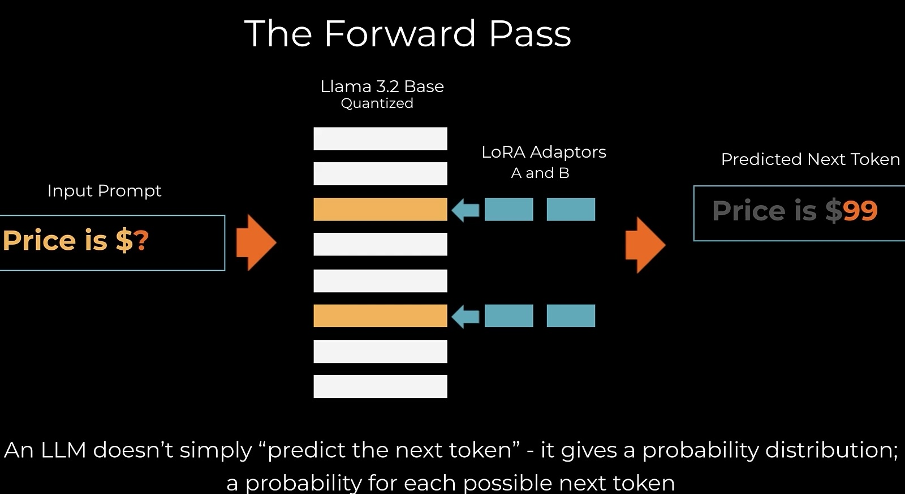

# Fine-Tuning Large Language Models: Complete Technical Course


---

## Learning Objectives
- Understand LoRA (Low-Rank Adaptation) fundamentals
- Master QLoRA (Quantization + LoRA) for efficient training
- Implement fine-tuning for Llama 3.2 on custom datasets
- Build production-ready price prediction models
- Evaluate and deploy fine-tuned models

---

## Part 1: LoRA Fundamentals

### The Problem: Training Large Models is Expensive

**Llama 3.2 Specifications:**
- **3 billion parameters**
- **13GB GPU memory** (just to load!)
- **28 decoder layers** stacked together

Each decoder layer contains:
- Self-attention layers (learn which input parts matter most)
- Multi-layer perceptron (MLP) layers
- Activation functions (SiLU)
- Layer normalization

**Traditional Training Requirements:**
```
Forward Pass → Calculate Loss → Backward Pass → Update Parameters
```

For 3 billion parameters, this is computationally prohibitive on consumer hardware.

---

### The LoRA Solution: Train Smaller, Adapt Larger

#### Core Concept

Instead of training all 3 billion parameters:
1. **Freeze** all original model weights
2. **Select** target modules (most impactful layers)
3. **Create** small low-rank adapter matrices
4. **Train** only these adapters
5. **Add** adapters to frozen weights during inference

#### Why "Low-Rank"?

**Rank** = dimensionality of a matrix

LoRA uses matrices with **fewer dimensions** than the original model layers, dramatically reducing trainable parameters.

---

### LoRA Architecture Details

#### Target Modules

Not all layers are equally important. LoRA focuses on:
- Query/Key/Value projection matrices in attention layers
- Output projection layers
- Feed-forward network layers

These are the **target modules** - the layers we'll adapt.

#### The LoRA Trick: Matrix Decomposition

Instead of one large adapter matrix, LoRA uses **two smaller matrices**:

```
LoRA_A × LoRA_B = Adapter Matrix
```

**Mathematical Formula:**
```
Output = Original_Weight × Input + α × (LoRA_A × LoRA_B) × Input
```

Where:
- `Original_Weight`: Frozen pretrained weights
- `LoRA_A`: First low-rank matrix (shape: d × r)
- `LoRA_B`: Second low-rank matrix (shape: r × k)
- `α`: Scaling factor (alpha)
- `r`: Rank (typically 8, 16, 32, or 64)

#### Why Two Matrices?

**Dimension Compatibility:**
- Original layer: `d × k` (e.g., 4096 × 4096)
- LoRA_A: `d × r` (e.g., 4096 × 16)
- LoRA_B: `r × k` (e.g., 16 × 4096)
- Result: `d × k` ✓ (matches original!)

**Parameter Reduction:**
- Original: 4096 × 4096 = **16,777,216 parameters**
- LoRA (r=16): (4096 × 16) + (16 × 4096) = **131,072 parameters**
- **Reduction: 99.2%!**

---

### LoRA Hyperparameters


#### 1. Rank (r)
- **Lower rank** (4-8): Fewer parameters, faster training, less expressive
- **Higher rank** (32-64): More parameters, slower training, more expressive
- **Typical choice**: 16 or 32

#### 2. Alpha (α)
- Scaling factor for adapter contribution
- **Common practice**: α = 2 × r
- Controls how much the adapters influence the model

#### 3. Target Modules
- **Attention only**: `["q_proj", "v_proj"]`
- **All linear layers**: `["q_proj", "k_proj", "v_proj", "o_proj", "gate_proj", "up_proj", "down_proj"]`
- More modules = more parameters but better adaptation

---

## Part 2: Quantization - The "Q" in QLoRA

### What is Quantization?

**Quantization** reduces memory by using lower precision numbers:

- **FP32** (Full Precision): 32 bits per parameter → 13GB for Llama 3.2
- **FP16** (Half Precision): 16 bits per parameter → 6.5GB
- **INT8** (8-bit): 8 bits per parameter → 3.25GB
- **INT4** (4-bit): 4 bits per parameter → **1.6GB** ✓

### QLoRA = 4-bit Quantization + LoRA

**Key Innovation:**
1. Load base model in 4-bit precision (saves memory)
2. Train LoRA adapters in higher precision (maintains quality)
3. Combine for inference

**Result:** Fine-tune 3B parameter models on consumer GPUs!

---

## Part 3: Llama 3.2 Architecture

### Model Overview

**Llama 3.2 3B**: 3 billion parameters, 28 decoder layers
- **Memory**: 13GB (FP32)
- **Model dimension**: 3,072

### Decoder Layer Structure (28 layers)

Each layer contains:

#### 1. Self-Attention (Target Modules for LoRA)

```python
(self_attn): LlamaAttention(
  (q_proj): Linear(3072 → 3072)  # Query projection - PRIMARY LoRA TARGET
  (k_proj): Linear(3072 → 1024)  # Key projection - LoRA TARGET
  (v_proj): Linear(3072 → 1024)  # Value projection - PRIMARY LoRA TARGET
  (o_proj): Linear(3072 → 3072)  # Output projection - LoRA TARGET
)
```

**These attention layers are the primary target modules for LoRA.**

Typical LoRA targeting:
- **Start with**: `q_proj`, `v_proj` (most common)
- **Add if needed**: `k_proj`, `o_proj` (full attention)

#### 2. MLP Layers (Optional LoRA Targets)

```python
(mlp): LlamaMLP(
  (gate_proj): Linear(3072 → 8192)  # Optional LoRA target
  (up_proj): Linear(3072 → 8192)    # Optional LoRA target
  (down_proj): Linear(8192 → 3072)  # Optional LoRA target
  (act_fn): SiLUActivation()
)
```

**Add MLP layers to LoRA targets for:**
- More flexibility in fine-tuning
- Better absorption of training data
- Slightly better results (but slower training)

#### SiLU Activation Function

**SiLU** (Sigmoid Linear Unit), also called **Swish**

**Formula**: `SiLU(x) = x × sigmoid(x) = x × (1 / (1 + e^(-x)))`

**Formula breakdown**:
- `sigmoid(x) = 1 / (1 + e^(-x))` - Sigmoid function outputs values between 0 and 1
- `SiLU(x) = x × sigmoid(x)` - Multiply input by its sigmoid
- When x is large positive: sigmoid(x) ≈ 1, so SiLU(x) ≈ x (nearly linear)
- When x is large negative: sigmoid(x) ≈ 0, so SiLU(x) ≈ 0 (smoothly suppressed)
- When x = 0: sigmoid(0) = 0.5, so SiLU(0) = 0

**Example values**:
- SiLU(-2) = -2 × 0.12 = -0.24
- SiLU(-1) = -1 × 0.27 = -0.27
- SiLU(0) = 0 × 0.5 = 0
- SiLU(1) = 1 × 0.73 = 0.73
- SiLU(2) = 2 × 0.88 = 1.76

**Why use SiLU?**
- Smooth, non-monotonic function
- Better gradient flow than ReLU
- Performs well in deep networks like Llama

---

## Part 4: Training Loop - The Four Steps



### Step 1: Forward Pass

**What Actually Happens**:
- **Common Misconception**: "Forward pass predicts the next token"
- **Reality**: Forward pass outputs a **probability distribution over ALL 128,000 tokens in vocabulary**

**Technical Details**:
```
Input: Prompt tokens → Neural Network Layers → LM Head (final layer)
Output: 128,000-dimensional vector where each element = probability of that token being next
```

**Key Properties**:
- All probabilities sum to 1.0 (normalized distribution)
- Each token gets assigned a probability (0.0 to 1.0)
- Model doesn't "pick" a token yet—it just calculates probabilities

**Example**:
```
Prompt: "The price is"
Model Output (simplified):
  Token 99 ("$45"): 15% probability ← Highest
  Token 89 ("$39"): 8% probability  ← Actual correct answer
  Token 42 ("high"): 3% probability
  ... (128,000 total tokens)
```

**Temperature Sampling** (how we extract prediction):
- **Temperature = 0**: Pick token with maximum probability (deterministic)
- **Temperature > 0**: Sample from probability distribution (stochastic)

---

### Step 2: Loss Calculation (Cross-Entropy Loss)


**The "Aha Moment"**:

> "We actually don't consider that 99 token at all. It doesn't have any bearing in the loss calculation... Rather we say what probability did the model give to the token that we actually wanted?"

**Formula**: `Loss = -log(P(correct_token))`


**How It Works**:
1. Ignore the predicted token (token 99 with 15%)
2. Look ONLY at probability assigned to **actual correct token** (token 89)
3. Calculate: `-log(P(token_89))`

**Mathematical Properties**:
- If P(correct_token) = 100% (1.0) → Loss = -log(1.0) = 0 ✓ Perfect!
- If P(correct_token) = 50% (0.5) → Loss = -log(0.5) = 0.69
- If P(correct_token) = 10% (0.1) → Loss = -log(0.1) = 2.30
- If P(correct_token) = 1% (0.01) → Loss = -log(0.01) = 4.61

**Why Negative Log?**:
- "It just sort of works out really nicely with the maths"
- Elegant for backpropagation calculations (chain rule)
- Meets all required properties:
  - Perfect prediction (100%) → Zero loss
  - Lower probability → Higher loss
  - Differentiable (smooth gradient)

**Why Not Simple Difference?**
- LLMs predict tokens, not numbers
- Cross-entropy works for ANY output: prices, text, code, etc.
- "Standard way of calculating loss for a classification problem"
- We're classifying the most likely next token from 128,000 options

---

### Step 3: Backpropagation (Backward Pass)


**Purpose**: Calculate how to adjust model parameters to reduce loss

**The Chain Rule Magic**:
- Works backwards from output to input layers
- Calculates gradients as a function of gradients that came before
- "Repeatedly applying the chain rule working backwards"

**Technical Process**:
```
1. Start at output: ∂Loss/∂output
2. Layer N: ∂Loss/∂weights_N = ∂Loss/∂output_N × ∂output_N/∂weights_N
3. Layer N-1: ∂Loss/∂weights_(N-1) = ∂Loss/∂output_(N-1) × ∂output_(N-1)/∂weights_(N-1)
4. Continue backwards through all layers to input
```

**Why It's Revolutionary**:
- **Efficiency**: "Operation that would have been very time consuming can happen rapidly"
- **Parallelization**: Calculations happen efficiently in parallel on GPUs
- **Scalability**: Enables training billion-parameter models

**Historical Context**:
- Algorithm invented in 1970s
- **1986 Paper**: Geoff Hinton ("godfather of modern AI") popularized for neural networks
- "One of the secrets that has made training neural networks so effective"

---

### Step 4: Optimization


**Purpose**: Update model parameters using calculated gradients

**Update Formula** (simplified):
```
new_weight = old_weight - (learning_rate × gradient)
```

**Key Concepts**:

1. **Learning Rate**: Controls step size
   - Too large: Overshoot optimal values (unstable training)
   - Too small: Training too slow (may never converge)
   - Typical: 1e-4 to 1e-5 for fine-tuning

2. **LoRA/PEFT Context**:
   - Only adapter weights updated (1-2% of parameters)
   - Base model frozen (saves computation)
   - "All of the adapters" = LoRA matrices

**The Loop Continues**:
```
Iteration 1: Forward → Loss=2.30 → Backprop → Optimize
Iteration 2: Forward → Loss=2.15 → Backprop → Optimize
Iteration 3: Forward → Loss=2.01 → Backprop → Optimize
...
Iteration 1000: Forward → Loss=0.45 → Backprop → Optimize
```

---

## Part 5: Practical Implementation

### Setup Requirements

```python
# Required libraries
!pip install -q --upgrade bitsandbytes trl
```

### Basic QLoRA Configuration

```python
from peft import LoraConfig, get_peft_model
from transformers import AutoModelForCausalLM, BitsAndBytesConfig
import torch

# 4-bit quantization config
bnb_config = BitsAndBytesConfig(
    load_in_4bit=True,
    bnb_4bit_quant_type="nf4",
    bnb_4bit_compute_dtype=torch.bfloat16,
    bnb_4bit_use_double_quant=True
)

# LoRA config
lora_config = LoraConfig(
    r=16,                              # Rank
    lora_alpha=32,                     # Alpha (2 × r)
    target_modules=["q_proj", "v_proj"], # Target modules
    lora_dropout=0.05,                 # Dropout for regularization
    bias="none",
    task_type="CAUSAL_LM"
)

# Load model with quantization
model = AutoModelForCausalLM.from_pretrained(
    "meta-llama/Llama-3.2-3B",
    quantization_config=bnb_config,
    device_map="auto"
)

# Apply LoRA
model = get_peft_model(model, lora_config)
model.print_trainable_parameters()
# Output: trainable params: 8,388,608 || all params: 3,008,388,608 || trainable%: 0.28%
```

---

## Part 6: Data Preparation Strategy

### Token Truncation (Critical Decision)

- **Cutoff at 110 tokens** for input summaries (affects 5.7% of data)
- **Rationale**: GPU memory is proportional to max sequence length
- Padding unused tokens wastes memory and slows training
- **Final max sequence length: 128 tokens** (power of 2 - industry best practice)
- Includes: question (16 tokens) + summary (110 tokens) + prefix

### Prompt Engineering

```python
# Structure
Question: "What does this cost to the nearest dollar?"
Summary: [Title, Category, Brand, Description, Details]
Prefix: "Price is $"
Completion: [rounded price for training, exact for testing]
```

### Why Round Training Prices?

- Focus model on predicting **dollars, not cents**
- LLMs treat each token equally during loss calculation
- Predicting cents would waste training effort on less important digits
- **Llama advantage**: All 3-digit numbers = 1 token (0-999)
- Test data keeps exact prices for fair evaluation

---

## Part 7: Training Workflow

### Step 1: Prepare Dataset

```python
from datasets import load_dataset

dataset = load_dataset("your_dataset")

def format_prompt(example):
    return {
        "text": f"### Instruction:\n{example['instruction']}\n\n### Response:\n{example['response']}"
    }

dataset = dataset.map(format_prompt)
```

### Step 2: Configure Training

```python
from transformers import TrainingArguments

training_args = TrainingArguments(
    output_dir="./qlora-llama-3.2",
    num_train_epochs=3,
    per_device_train_batch_size=4,
    gradient_accumulation_steps=4,
    learning_rate=2e-4,
    fp16=True,
    logging_steps=10,
    save_strategy="epoch"
)
```

### Step 3: Train

```python
from transformers import Trainer

trainer = Trainer(
    model=model,
    args=training_args,
    train_dataset=dataset["train"],
    eval_dataset=dataset["test"]
)

trainer.train()
```

### Step 4: Save and Load

```python
# Save only LoRA adapters (small!)
model.save_pretrained("./qlora-adapters")

# Load later
from peft import PeftModel

base_model = AutoModelForCausalLM.from_pretrained("meta-llama/Llama-3.2-3B")
model = PeftModel.from_pretrained(base_model, "./qlora-adapters")
```

---

## Part 8: Testing and Evaluation

### Training vs Testing: Critical Distinction

**Training Loop** (4 steps):
```
1. Forward Pass → Probability distribution
2. Loss Calculation → -log(P(correct_token))
3. Backpropagation → Calculate gradients
4. Optimization → Update weights
↓
Repeat thousands of times
```

**Testing/Inference** (1 step only):
```
1. Forward Pass → Probability distribution → Sample token
↓
Done! No loss, no backprop, no optimization
```

**Why Testing is Different**:
- **No ground truth needed**: We don't know correct answer yet
- **No gradients**: `torch.no_grad()` disables gradient tracking
- **No weight updates**: Model frozen in final state
- **Memory efficient**: No gradient storage (saves ~2x memory)
- **Faster**: Skip backprop and optimization steps

### Inference Function

```python
def model_predict(item):
    inputs = tokenizer(item["prompt"], return_tensors="pt").to("cuda")
    with torch.no_grad():
        output_ids = fine_tuned_model.generate(**inputs, max_new_tokens=8)
    prompt_len = inputs["input_ids"].shape[1]
    generated_ids = output_ids[0, prompt_len:]
    return tokenizer.decode(generated_ids)
```

### Evaluation Metrics

**1. Mean Absolute Error (MAE)**:
- Formula: `(Σ |predicted - actual|) / n`
- Interpretation: Average dollar amount off
- Example: $62.51 means predictions off by ~$62 on average

**2. MSE (Mean Squared Error)**:
- Formula: `(Σ (predicted - actual)²) / n`
- Penalizes large errors more heavily (squared term)
- Example: MSE=5000 means typical error ~$70 (sqrt(5000))

**3. R² Score (Coefficient of Determination)**:
- Formula: `1 - (SS_res / SS_tot)`
- Range: -∞ to 100%
- Interpretation:
  - 100%: Perfect predictions
  - 0%: Model no better than predicting mean
  - <0%: Model worse than predicting mean

**Benchmark Comparison**:
- Human performance: $87.62 average error
- GPT-4o-mini: $62.51 average error
- Goal: Match or beat GPT-4o-mini

---

## Part 9: Key Takeaways

1. **LoRA freezes base model weights** and trains small adapter matrices
2. **Low-rank decomposition** (A × B) enables massive parameter reduction
3. **QLoRA adds 4-bit quantization** for memory efficiency
4. **Target modules** determine which layers to adapt
5. **Rank and alpha** control adapter capacity and influence
6. **Training only adapters** means fast iteration and small checkpoints
7. **Data preparation is 80% of the work** - get it right before training
8. **Testing ≠ Training**: No loss calculation, backpropagation, or optimization during inference

---

## Part 10: Practical Tips

### Choosing Rank
- Start with **r=16** for most tasks
- Increase to **r=32** if underfitting
- Decrease to **r=8** for very specific tasks

### Choosing Target Modules
- **Minimum**: `["q_proj", "v_proj"]` (attention only)
- **Recommended**: Add `["k_proj", "o_proj"]` (full attention)
- **Maximum**: All linear layers (most parameters)

### Memory Optimization
- Use **gradient_accumulation_steps** to simulate larger batches
- Enable **gradient_checkpointing** for even lower memory
- Use **bfloat16** instead of fp16 on supported hardware

---

## Part 11: Common Questions

**Q: Can I use LoRA with any model?**  
A: Yes! LoRA works with any transformer-based model (GPT, BERT, T5, etc.)

**Q: How much GPU memory do I need?**  
A: With QLoRA, you can fine-tune Llama 3.2-3B on a 16GB GPU (e.g., RTX 4080)

**Q: Are LoRA adapters portable?**  
A: Yes! Adapters are tiny (MBs) and can be shared/loaded independently

**Q: Does LoRA hurt performance?**  
A: Minimal impact! Often matches full fine-tuning with <1% of parameters

**Q: Can I train multiple adapters?**  
A: Absolutely! Train different adapters for different tasks, swap at inference

---

## Part 12: Further Reading

- [LoRA Paper](https://arxiv.org/abs/2106.09685) - Original LoRA research
- [QLoRA Paper](https://arxiv.org/abs/2305.14314) - QLoRA methodology
- [PEFT Documentation](https://huggingface.co/docs/peft) - Hugging Face PEFT library
- [Llama 3.2 Model Card](https://huggingface.co/meta-llama/Llama-3.2-3B) - Model details

---

## Part 13: Success Criteria

You've mastered QLoRA when you can:
- ✅ Explain why LoRA uses matrix decomposition
- ✅ Configure QLoRA for different model sizes
- ✅ Fine-tune a model on custom data
- ✅ Optimize hyperparameters for your use case
- ✅ Debug memory and training issues
- ✅ Evaluate model performance with proper metrics
- ✅ Deploy fine-tuned models to production

---

## End of Course
