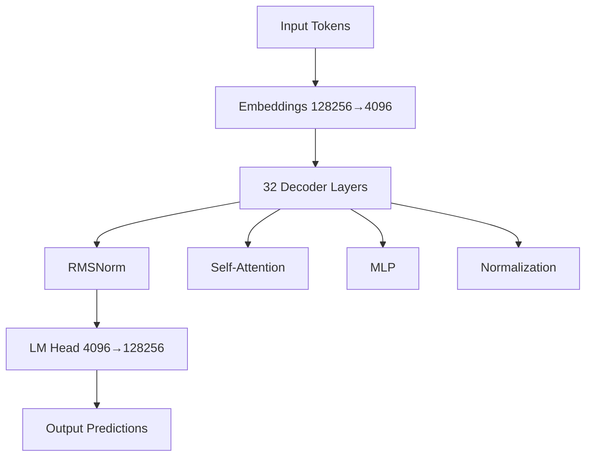

# Tutorial: Understanding the Llama 3.1 Transformer Architecture (Detailed)


## Part 1: Introduction - The Llama Architecture


**Llama 3.1** is an advanced Transformer-based neural network, designed for tasks like **language modeling**—predicting the next word in a sentence. Transformers like Llama are famous for their effectiveness in handling sequences (like words in sentences), primarily thanks to their unique ability to weigh the importance of each word contextually using **self-attention**.

### Llama Architecture Overview

Llama specifically has a **decoder-only architecture**:

- **Embedding layer**: Encodes tokens (words or subwords)
- **32 decoder layers**: Repeatedly refine understanding
- **LM Head**: Predicts the next word from embeddings

```
Input Tokens → Embeddings → 32 Decoder Layers → LM Head → Output Predictions
```

---

## Part 2: Embeddings - Token Encoding

The first layer you'll notice is:

```python
(embed_tokens): Embedding(128256, 4096)
```

### What is an Embedding?

**Embedding** converts discrete tokens (like words) into dense vectors (numbers), allowing the model to learn meaning and relationships.

| Parameter | Value | Description |
|-----------|-------|-------------|
| Vocabulary Size | 128,256 | Total number of unique tokens |
| Embedding Dimension | 4,096 | Vector size for each token |

### Rotary Embedding (RoPE)

**LlamaRotaryEmbedding** is a technique that helps the model capture the positions of words more effectively, improving attention computations, especially for longer contexts.

**Key Benefits**:
- ✅ Better position encoding
- ✅ Improved long-context understanding
- ✅ Relative position awareness

---

## Part 3: The 32 Decoder Layers - A Quick Overview

Next, you have **32 identical decoder layers**:

```python
(0-31): 32 x LlamaDecoderLayer(...)
```

### What Each Decoder Layer Does

Each decoder layer refines the embeddings by:

1. **Performing self-attention** (to relate tokens to each other)
2. **Passing results through an MLP** (multi-layer perceptron) to add non-linear transformations
3. **Using normalization layers** to stabilize training and improve generalization

> 💡 **Think of each layer** as progressively adding clarity and context to the embeddings, refining predictions step-by-step.

---

## Part 4: Self-Attention – Core Concept and PyTorch Layers

Within each decoder layer is a **self-attention mechanism**:

```python
(self_attn): LlamaAttention(
  (q_proj): Linear4bit(4096→4096)
  (k_proj): Linear4bit(4096→1024)
  (v_proj): Linear4bit(4096→1024)
  (o_proj): Linear4bit(4096→4096)
)
```

### How Self-Attention Works

Self-attention allows each word in a sentence to **attend to all other words** to better understand context. This happens through:

| Component | Projection | Purpose |
|-----------|------------|---------|
| **Queries** (q_proj) | 4096→4096 | Determines what information the token seeks |
| **Keys** (k_proj) | 4096→1024 | Identifies what each token contains |
| **Values** (v_proj) | 4096→1024 | Holds the content or meaning |
| **Output** (o_proj) | 4096→4096 | Projects attention results back to embeddings |

### 4-bit Quantization

PyTorch layers like `Linear4bit` indicate that parameters have been **quantized to 4 bits**, greatly reducing model size and memory needs while retaining good performance.

**Memory Savings**: 
- FP32: 4 bytes/parameter
- INT4: 0.5 bytes/parameter
- **Reduction**: 8× smaller! 🎉

---

## Part 5: The MLP Layers – Adding Non-Linearity

Each decoder layer also has an **MLP** (Multi-Layer Perceptron):

```python
(mlp): LlamaMLP(
  (gate_proj): Linear4bit(4096→14336)
  (up_proj): Linear4bit(4096→14336)
  (down_proj): Linear4bit(14336→4096)
  (act_fn): SiLU()
)
```

### MLP Architecture

The MLP layers transform data through three projections:

```
Input (4096) → Gate/Up Projections (14336) → Down Projection (4096) → Output
```

**Purpose**: Transform the data into a **higher-dimensional space** (14,336 dimensions) for richer interactions and then back down to 4,096 dimensions.

### SiLU Activation Function

**SiLU** (Sigmoid Linear Unit) activation function introduces non-linearities that help the network learn complex relationships.

**Formula**: `SiLU(x) = x · σ(x) = x / (1 + e^(-x))`

---

## Part 6: Norm Layers – Stability and Generalization

Normalization layers stabilize training by keeping values within a consistent range:

```python
(input_layernorm): LlamaRMSNorm(4096)
(post_attention_layernorm): LlamaRMSNorm(4096)
(norm): LlamaRMSNorm(4096)
```

### RMSNorm (Root Mean Square Normalization)

**RMSNorm** ensures smoother training and improves generalization.

**Applied**:
- ✓ Before self-attention
- ✓ After self-attention
- ✓ Before MLP operations

**Benefits**:
- Keeps embeddings stable
- Faster than LayerNorm (~40% speedup)
- Simpler computation (no mean subtraction)

---

## Part 7: The LM Head – Generating Predictions

Finally, the **LM Head** generates predictions:

```python
(lm_head): Linear(in_features=4096, out_features=128256)
```

### How Predictions Work

1. Takes refined embeddings (4096-dimensional)
2. Converts them back into probabilities for each token in the vocabulary (128,256 tokens)
3. The **highest probability** indicates the model's prediction for the next word

```
Hidden States (4096) → LM Head → Logits (128256) → Softmax → Probabilities
```

---

## Part 8: Dimensions and 4-bit Quantization

### Dimension Flow

Notice the dimensions throughout the architecture:

| Layer | Input → Output | Notes |
|-------|----------------|-------|
| **Embeddings** | 128,256 → 4,096 | Vocab to embedding space |
| **Attention** | 4,096 ↔ 1,024 | K/V projections (GQA) |
| **MLP** | 4,096 ↔ 14,336 ↔ 4,096 | Expansion and contraction |
| **LM Head** | 4,096 → 128,256 | Embedding to vocab space |

### Why Matching Dimensions Matter

**Matching embedding dimensions** at input and output (4,096) is crucial because embeddings flow through the entire model. This symmetry helps the network efficiently learn context.

### 4-bit Quantization Impact

The **4-bit quantization** significantly reduces:
- ⚡ Memory requirements
- ⚡ Computational costs

**Result**: Enables powerful models like Llama to run on smaller hardware without drastically losing performance.

---

## Part 9: Summary and Wrap-up

### You've Now Seen Under the Hood! 🎉

Here's what you learned about the **Llama 3.1 transformer**:

| Component | Function |
|-----------|----------|
| 🔤 **Embeddings** | Convert words into vectors |
| 🔄 **Decoder Layers** | Refine meaning via self-attention and MLP |
| 📊 **Normalization** | Stabilize learning |
| 🎯 **LM Head** | Make predictions based on refined embeddings |
| 💾 **Quantization** | Make large models practical |

### Key Architectural Features



### What Makes Llama Special?

1. **Decoder-only architecture** - Optimized for generation
2. **Grouped-Query Attention (GQA)** - Memory efficient (1024 vs 4096 for K/V)
3. **RoPE** - Better position encoding
4. **RMSNorm** - Faster normalization
5. **SwiGLU** - Enhanced MLP with gating
6. **4-bit quantization** - Practical deployment

---

## Next Steps 🎓
- 🚀 Explore deeper into Transformer models
- 🔧 Fine-tune Llama for your tasks
- 💡 Understand other LLM architectures
- 🎯 Build applications with Llama


-------------------
# Llama 3.1 Transformer Architecture: Technical Deep Dive for LLM Engineers

## Overview

Llama 3.1 is a decoder-only transformer architecture optimized for autoregressive language modeling. This document provides a layer-by-layer technical analysis of the architecture, with emphasis on implementation details relevant to LLM engineering.

---

## Architecture Summary

```
Input Tokens (vocab_size=128256)
    ↓
Embedding Layer (128256 → 4096)
    ↓
32 × Decoder Layers (4096 → 4096)
    ├── RMSNorm
    ├── Self-Attention (with RoPE)
    ├── RMSNorm
    └── MLP (4096 → 14336 → 4096)
    ↓
Final RMSNorm (4096)
    ↓
LM Head (4096 → 128256)
    ↓
Output Logits
```

**Key Specifications**:
- **Model Dimension** (d_model): 4096
- **Vocabulary Size**: 128,256 tokens
- **Number of Layers**: 32
- **MLP Hidden Dimension**: 14,336 (3.5× expansion ratio)
- **Attention Heads**: Inferred from k/v projection dimensions
- **Quantization**: 4-bit (Linear4bit layers)

---

## 1. Token Embedding Layer

```python
(embed_tokens): Embedding(128256, 4096)
```

### Technical Details

**Purpose**: Maps discrete token IDs to continuous vector representations in d_model=4096 dimensional space.

**Implementation**:
```python
# Conceptual implementation
embedding_matrix = torch.nn.Embedding(
    num_embeddings=128256,  # Vocabulary size
    embedding_dim=4096       # Model dimension
)
# Input: [batch_size, seq_len] of token IDs
# Output: [batch_size, seq_len, 4096] of embeddings
```

**Memory Footprint**:
- Full precision (FP32): 128,256 × 4,096 × 4 bytes = ~2.1 GB
- With quantization: Significantly reduced

**Engineering Considerations**:
- **Vocabulary size** (128,256) is larger than GPT-3 (50,257), enabling better multilingual support
- **Tied embeddings**: Often, `embed_tokens` and `lm_head` share weights (weight tying) to reduce parameters
- **Initialization**: Typically Xavier/Glorot initialization with small variance

---

## 2. Rotary Position Embeddings (RoPE)

```python
(rotary_emb): LlamaRotaryEmbedding()
```

### Technical Details

**Purpose**: Encodes absolute position information while maintaining relative position awareness through rotation matrices.

**Mathematical Foundation**:

For position `m` and dimension `d`, RoPE applies rotation:

```
RoPE(x, m) = [
    x₀ cos(mθ₀) - x₁ sin(mθ₀),
    x₀ sin(mθ₀) + x₁ cos(mθ₀),
    x₂ cos(mθ₁) - x₃ sin(mθ₁),
    x₂ sin(mθ₁) + x₃ cos(mθ₁),
    ...
]

where θᵢ = 10000^(-2i/d)
```

**Advantages over Sinusoidal/Learned Embeddings**:
1. **Relative position encoding**: Attention scores naturally depend on relative distances
2. **Extrapolation**: Better generalization to longer sequences than seen during training
3. **No parameter overhead**: Computed on-the-fly, no learned parameters
4. **Efficiency**: Applied only to Q and K, not V

**Implementation Note**:
```python
# Applied in attention computation
q_rotated = apply_rotary_pos_emb(q, cos, sin, position_ids)
k_rotated = apply_rotary_pos_emb(k, cos, sin, position_ids)
```

---

## 3. Decoder Layer Architecture (32 Layers)

```python
(layers): ModuleList(
  (0-31): 32 x LlamaDecoderLayer(...)
)
```

Each decoder layer follows the **Pre-LN (Pre-LayerNorm)** architecture:

```
x → RMSNorm → Self-Attention → Residual Add
  ↓
  → RMSNorm → MLP → Residual Add
  ↓
  output
```

### Why 32 Layers?

**Depth vs Width Trade-off**:
- **Deeper networks** (more layers): Better at hierarchical feature learning
- **Wider networks** (larger d_model): Better at capturing complex patterns per layer

Llama 3.1 balances:
- 32 layers for hierarchical reasoning
- 4096 dimensions for representational capacity
- Total parameters: ~8B (for 8B variant)

**Layer-wise Learning Dynamics**:
- **Early layers**: Learn syntax, grammar, basic patterns
- **Middle layers**: Semantic understanding, entity relationships
- **Late layers**: Task-specific reasoning, coherence

---

## 4. Self-Attention Mechanism

```python
(self_attn): LlamaAttention(
  (q_proj): Linear4bit(in_features=4096, out_features=4096, bias=False)
  (k_proj): Linear4bit(in_features=4096, out_features=1024, bias=False)
  (v_proj): Linear4bit(in_features=4096, out_features=1024, bias=False)
  (o_proj): Linear4bit(in_features=4096, out_features=4096, bias=False)
  (rotary_emb): LlamaRotaryEmbedding()
)
```

### Multi-Query Attention (MQA) Architecture

**Key Observation**: `k_proj` and `v_proj` output 1024 dimensions, not 4096.

**Interpretation**:
- **Query heads**: 4096 / 128 = 32 heads (assuming head_dim=128)
- **Key/Value heads**: 1024 / 128 = 8 heads
- **Ratio**: 32:8 = 4:1 (Grouped-Query Attention with 4 queries per K/V head)

### Grouped-Query Attention (GQA)

**Standard Multi-Head Attention (MHA)**:
```
Q: [batch, seq_len, num_heads, head_dim]  # 32 heads
K: [batch, seq_len, num_heads, head_dim]  # 32 heads
V: [batch, seq_len, num_heads, head_dim]  # 32 heads
```

**Grouped-Query Attention (GQA)**:
```
Q: [batch, seq_len, 32, 128]  # 32 query heads
K: [batch, seq_len, 8, 128]   # 8 key heads (shared across 4 Q heads)
V: [batch, seq_len, 8, 128]   # 8 value heads (shared across 4 Q heads)
```

**Benefits**:
1. **Memory efficiency**: 75% reduction in KV cache size (8 vs 32 heads)
2. **Inference speed**: Faster decoding due to smaller KV cache
3. **Minimal quality loss**: Empirically performs close to full MHA

**Attention Computation**:
```python
# Conceptual implementation
Q = q_proj(x)  # [B, L, 4096] → [B, L, 32, 128]
K = k_proj(x)  # [B, L, 4096] → [B, L, 8, 128]
V = v_proj(x)  # [B, L, 4096] → [B, L, 8, 128]

# Apply RoPE to Q and K
Q_rot = apply_rope(Q, position_ids)
K_rot = apply_rope(K, position_ids)

# Expand K, V to match Q heads (each K/V head used by 4 Q heads)
K_expanded = K_rot.repeat_interleave(4, dim=2)  # [B, L, 32, 128]
V_expanded = V_rot.repeat_interleave(4, dim=2)  # [B, L, 32, 128]

# Scaled dot-product attention
scores = (Q_rot @ K_expanded.transpose(-2, -1)) / sqrt(128)
attn_weights = softmax(scores + causal_mask)
attn_output = attn_weights @ V_expanded  # [B, L, 32, 128]

# Output projection
output = o_proj(attn_output.reshape(B, L, 4096))  # [B, L, 4096]
```

### Causal Masking

**Purpose**: Ensures autoregressive property—token at position `i` can only attend to positions ≤ `i`.

**Implementation**:
```python
# Lower triangular mask
mask = torch.tril(torch.ones(seq_len, seq_len))
# Apply as additive mask: scores + (1 - mask) * -inf
```

### Linear4bit Quantization

**Quantization Details**:
- **Precision**: 4-bit integers (16 possible values)
- **Method**: Likely NF4 (Normal Float 4) or similar asymmetric quantization
- **Calibration**: Per-channel or per-tensor quantization scales

**Memory Savings**:
- FP32: 4 bytes/parameter
- FP16: 2 bytes/parameter
- INT4: 0.5 bytes/parameter
- **Reduction**: 8× smaller than FP32, 4× smaller than FP16

**Trade-offs**:
- **Pros**: Massive memory reduction, faster inference on compatible hardware
- **Cons**: Slight accuracy degradation (~1-2% perplexity increase), requires dequantization during computation

---

## 5. RMSNorm (Root Mean Square Normalization)

```python
(input_layernorm): LlamaRMSNorm((4096,), eps=1e-05)
(post_attention_layernorm): LlamaRMSNorm((4096,), eps=1e-05)
```

### Technical Details

**Formula**:
```
RMSNorm(x) = (x / RMS(x)) * γ

where RMS(x) = sqrt(mean(x²) + ε)
```

**Comparison to LayerNorm**:

| Feature | LayerNorm | RMSNorm |
|---------|-----------|---------|
| Centering | Yes (subtracts mean) | No |
| Scaling | Yes (divides by std) | Yes (divides by RMS) |
| Parameters | γ (gain), β (bias) | γ (gain) only |
| Computation | More expensive | ~40% faster |
| Stability | Excellent | Excellent |

**Why RMSNorm in Llama?**
1. **Efficiency**: Fewer operations (no mean subtraction, no bias)
2. **Performance**: Empirically equivalent to LayerNorm for LLMs
3. **Simplicity**: Easier to implement and optimize

**Implementation**:
```python
class LlamaRMSNorm(nn.Module):
    def __init__(self, hidden_size, eps=1e-5):
        super().__init__()
        self.weight = nn.Parameter(torch.ones(hidden_size))
        self.eps = eps
    
    def forward(self, x):
        variance = x.pow(2).mean(-1, keepdim=True)
        x = x * torch.rsqrt(variance + self.eps)
        return self.weight * x
```

**Placement**:
- **Pre-norm architecture**: Normalization before attention and MLP
- **Benefits**: Stabilizes gradients, enables training of very deep networks

---

## 6. MLP (Feed-Forward Network)

```python
(mlp): LlamaMLP(
  (gate_proj): Linear4bit(in_features=4096, out_features=14336, bias=False)
  (up_proj): Linear4bit(in_features=4096, out_features=14336, bias=False)
  (down_proj): Linear4bit(in_features=14336, out_features=4096, bias=False)
  (act_fn): SiLU()
)
```

### SwiGLU Architecture

Llama uses **SwiGLU** (Swish-Gated Linear Unit), a variant of GLU (Gated Linear Unit).

**Standard FFN**:
```python
FFN(x) = W₂ · ReLU(W₁ · x)
```

**SwiGLU**:
```python
SwiGLU(x) = (SiLU(gate_proj(x)) ⊙ up_proj(x)) · down_proj
```

Where `⊙` denotes element-wise multiplication.

**Implementation**:
```python
def forward(self, x):
    gate = self.act_fn(self.gate_proj(x))  # [B, L, 14336]
    up = self.up_proj(x)                    # [B, L, 14336]
    hidden = gate * up                      # Element-wise product
    output = self.down_proj(hidden)         # [B, L, 4096]
    return output
```

### SiLU Activation Function

**Formula**:
```
SiLU(x) = x · σ(x) = x / (1 + e^(-x))
```

Also known as **Swish** activation.

**Properties**:
- **Smooth**: Differentiable everywhere (unlike ReLU)
- **Non-monotonic**: Can produce negative values
- **Self-gated**: Output depends on input magnitude
- **Empirically superior**: Outperforms ReLU in deep networks

**Comparison**:

| Activation | Formula | Range | Smoothness |
|------------|---------|-------|------------|
| ReLU | max(0, x) | [0, ∞) | Non-smooth at 0 |
| GELU | x·Φ(x) | (-∞, ∞) | Smooth |
| SiLU | x·σ(x) | (-∞, ∞) | Smooth |

### Expansion Ratio

**Hidden dimension**: 14,336 = 4,096 × 3.5

**Why 3.5× expansion?**
- **Standard transformers**: 4× expansion (e.g., BERT uses 4×768=3072)
- **Llama optimization**: 3.5× balances capacity and efficiency
- **SwiGLU compensation**: Gating mechanism requires larger hidden dimension for equivalent capacity

**Parameter count per MLP**:
- gate_proj: 4096 × 14336 = 58.7M parameters
- up_proj: 4096 × 14336 = 58.7M parameters
- down_proj: 14336 × 4096 = 58.7M parameters
- **Total**: ~176M parameters per layer (with 4-bit quantization: ~22MB)

---

## 7. Residual Connections

**Architecture**:
```python
# Attention block
x = x + self_attn(input_layernorm(x))

# MLP block
x = x + mlp(post_attention_layernorm(x))
```

### Why Residual Connections?

1. **Gradient flow**: Enables training of very deep networks (32 layers)
2. **Identity mapping**: Allows layers to learn refinements rather than full transformations
3. **Ensemble effect**: Each layer can be viewed as an ensemble of shallower networks

**Mathematical Insight**:

Without residuals:
```
x₃₂ = f₃₂(f₃₁(...f₁(x₀)))  # Composition of 32 functions
```

With residuals:
```
x₃₂ = x₀ + Σᵢ Δfᵢ(xᵢ)  # Sum of residual updates
```

This additive structure prevents vanishing gradients:
```
∂L/∂x₀ = ∂L/∂x₃₂ · (1 + ∂Δf/∂x₀)  # Gradient always has identity component
```

---

## 8. Final Normalization and LM Head

```python
(norm): LlamaRMSNorm((4096,), eps=1e-05)
(lm_head): Linear(in_features=4096, out_features=128256, bias=False)
```

### Final RMSNorm

**Purpose**: Normalizes final hidden states before projection to vocabulary.

**Benefits**:
- Stabilizes logit magnitudes
- Improves training stability
- Reduces sensitivity to initialization

### Language Modeling Head

**Transformation**: 4096 → 128,256

**Output**: Logits for each token in vocabulary

**Inference Process**:
```python
# Forward pass
hidden_states = model(input_ids)  # [B, L, 4096]
logits = lm_head(norm(hidden_states))  # [B, L, 128256]

# Next token prediction
next_token_logits = logits[:, -1, :]  # [B, 128256]
probs = softmax(next_token_logits / temperature)
next_token = sample(probs)  # Greedy, top-k, nucleus, etc.
```

### Weight Tying

**Common practice**: Share weights between `embed_tokens` and `lm_head`.

**Benefits**:
- **Parameter reduction**: Saves 128,256 × 4,096 = ~2.1GB
- **Regularization**: Forces consistency between input and output representations
- **Theoretical justification**: Input and output embeddings should live in same semantic space

**Implementation**:
```python
lm_head.weight = embed_tokens.weight  # Share parameters
```

---

## 9. Memory and Computational Analysis

### Parameter Count (8B Model)

| Component | Parameters | Percentage |
|-----------|------------|------------|
| Embeddings | 525M | 6.6% |
| 32 × Attention | 1,344M | 16.8% |
| 32 × MLP | 5,632M | 70.4% |
| Normalization | ~0.5M | <0.1% |
| LM Head (if not tied) | 525M | 6.6% |
| **Total** | **~8B** | **100%** |

### KV Cache Analysis

**Problem**: During autoregressive generation, recomputing K and V for all previous tokens is wasteful.

**Solution**: Cache K and V tensors.

**Memory per token**:
```
KV_cache_size = 2 × num_layers × num_kv_heads × head_dim × precision

For Llama 3.1:
= 2 × 32 × 8 × 128 × 2 bytes (FP16)
= 131,072 bytes
≈ 128 KB per token
```

**For 8K context**:
```
8,192 tokens × 128 KB = 1 GB KV cache
```

**Optimization**: GQA reduces KV cache by 4× compared to full MHA (8 heads vs 32 heads).

### FLOPs Analysis (per token)

**Attention**:
```
FLOPs = 2 × seq_len × d_model × (d_q + d_k + d_v + d_model)
      ≈ 2 × L × 4096 × (4096 + 1024 + 1024 + 4096)
      ≈ 84B FLOPs per token (for seq_len=1 during generation)
```

**MLP**:
```
FLOPs = 2 × d_model × d_ff × 3  # gate, up, down projections
      = 2 × 4096 × 14336 × 3
      ≈ 352B FLOPs per token
```

**Total per layer**: ~436B FLOPs
**Total for 32 layers**: ~14 TFLOPs per token

---

## 10. Training and Inference Considerations

### Training Optimizations

1. **Mixed Precision Training**: FP16/BF16 for activations, FP32 for optimizer states
2. **Gradient Checkpointing**: Recompute activations during backward pass to save memory
3. **Sequence Packing**: Concatenate multiple sequences to maximize GPU utilization
4. **Flash Attention**: Fused attention kernel for 2-4× speedup

### Inference Optimizations

1. **4-bit Quantization**: Reduces model size from ~16GB to ~4GB
2. **KV Cache**: Avoids recomputation during autoregressive generation
3. **Speculative Decoding**: Use smaller model to draft, larger model to verify
4. **Continuous Batching**: Dynamic batching for variable-length sequences

### Scaling Laws

**Llama 3.1 variants**:
- **8B**: 32 layers, 4096 dim, 8 KV heads
- **70B**: 80 layers, 8192 dim, 8 KV heads
- **405B**: 126 layers, 16384 dim, 8 KV heads (estimated)

**Scaling dimensions**:
- Depth (num_layers): Linear scaling
- Width (d_model): Quadratic parameter growth
- KV heads: Kept constant (8) for memory efficiency

---

## 11. Comparison to Other Architectures

| Feature | GPT-3 | GPT-4 | Llama 3.1 | Claude 3 |
|---------|-------|-------|-----------|----------|
| Architecture | Decoder-only | Decoder-only | Decoder-only | Decoder-only |
| Attention | MHA | MHA (likely) | GQA | Unknown |
| Position Encoding | Learned | Learned | RoPE | Unknown |
| Normalization | LayerNorm | LayerNorm | RMSNorm | Unknown |
| Activation | GELU | GELU | SiLU | Unknown |
| FFN | Standard | Standard | SwiGLU | Unknown |
| Vocab Size | 50,257 | ~100K | 128,256 | ~100K |
| Open Source | No | No | Yes | No |

---

## 12. Key Takeaways for LLM Engineers

1. **GQA is critical**: 4× reduction in KV cache enables longer contexts and faster inference
2. **RoPE enables extrapolation**: Can handle sequences longer than training length
3. **RMSNorm is efficient**: 40% faster than LayerNorm with equivalent performance
4. **SwiGLU improves quality**: Gating mechanism enhances representational capacity
5. **4-bit quantization is practical**: 8× memory reduction with minimal quality loss
6. **Pre-norm architecture**: Essential for training stability in deep networks
7. **Weight tying**: Reduces parameters and improves generalization

---

## 13. Further Reading

**Papers**:
- [Attention Is All You Need](https://arxiv.org/abs/1706.03762) - Original Transformer
- [RoFormer: Enhanced Transformer with Rotary Position Embedding](https://arxiv.org/abs/2104.09864) - RoPE
- [Root Mean Square Layer Normalization](https://arxiv.org/abs/1910.07467) - RMSNorm
- [GLU Variants Improve Transformer](https://arxiv.org/abs/2002.05202) - SwiGLU
- [GQA: Training Generalized Multi-Query Transformer](https://arxiv.org/abs/2305.13245) - Grouped-Query Attention

**Implementation Resources**:
- [Llama 3.1 Model Card](https://github.com/meta-llama/llama-models)
- [HuggingFace Transformers](https://github.com/huggingface/transformers)
- [Flash Attention](https://github.com/Dao-AILab/flash-attention)

---

## Conclusion

Llama 3.1 represents the state-of-the-art in open-source LLM architecture, incorporating numerous optimizations:
- **GQA** for memory efficiency
- **RoPE** for position encoding
- **RMSNorm** for computational efficiency
- **SwiGLU** for representational capacity
- **4-bit quantization** for deployment

Understanding these architectural choices is essential for:
- Fine-tuning and adaptation
- Inference optimization
- Building custom LLM applications
- Designing next-generation architectures

The decoder-only transformer with these enhancements has become the de facto standard for large language models, balancing performance, efficiency, and scalability.
