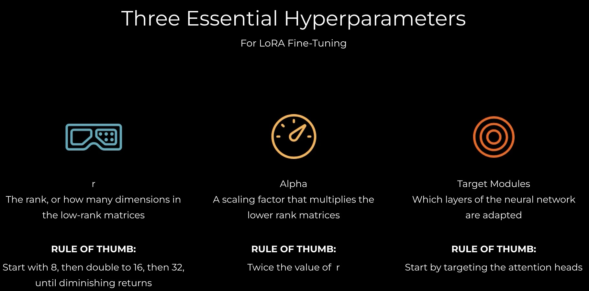

# QLoRA: Efficient Fine-Tuning for Large Language Models


---

## 🎯 Learning Objectives
- Understand the fundamental concepts of LoRA (Low-Rank Adaptation)
- Learn how QLoRA combines quantization with LoRA for efficient training
- Master the practical implementation of QLoRA for fine-tuning LLMs
- Apply QLoRA to fine-tune Llama 3.2 on custom datasets

---

## 📚 Module Overview

**QLoRA = Q + LoRA**

QLoRA combines two powerful techniques:
1. **LoRA** (Low-Rank Adaptation) - Efficient parameter training
2. **Q** (Quantization) - Memory-efficient model loading

---

## Part 1: Understanding LoRA

### The Problem: Training Large Models is Expensive

**Llama 3.2 Specifications:**
- **3 billion parameters**
- **13GB GPU memory** (just to load!)
- **28 decoder layers** stacked together

Each decoder layer contains:
- Self-attention layers (learn which input parts matter most)
- Multi-layer perceptron (MLP) layers
- Activation functions (SiLU)
- Layer normalization

**Traditional Training Requirements:**
```
Forward Pass → Calculate Loss → Backward Pass → Update Parameters
```

For 3 billion parameters, this is computationally prohibitive on consumer hardware.

---

### The LoRA Solution: Train Smaller, Adapt Larger

#### Core Concept

Instead of training all 3 billion parameters:
1. **Freeze** all original model weights
2. **Select** target modules (most impactful layers)
3. **Create** small low-rank adapter matrices
4. **Train** only these adapters
5. **Add** adapters to frozen weights during inference

#### Why "Low-Rank"?

**Rank** = dimensionality of a matrix

LoRA uses matrices with **fewer dimensions** than the original model layers, dramatically reducing trainable parameters.

---

### LoRA Architecture Details

#### Target Modules


Not all layers are equally important. LoRA focuses on:
- Query/Key/Value projection matrices in attention layers
- Output projection layers
- Feed-forward network layers

These are the **target modules** - the layers we'll adapt.

#### The LoRA Trick: Matrix Decomposition

Instead of one large adapter matrix, LoRA uses **two smaller matrices**:

```
LoRA_A × LoRA_B = Adapter Matrix
```

**Mathematical Formula:**
```
Output = Original_Weight × Input + α × (LoRA_A × LoRA_B) × Input
```

Where:
- `Original_Weight`: Frozen pretrained weights
- `LoRA_A`: First low-rank matrix (shape: d × r)
- `LoRA_B`: Second low-rank matrix (shape: r × k)
- `α`: Scaling factor (alpha)
- `r`: Rank (typically 8, 16, 32, or 64)

#### Why Two Matrices?

**Dimension Compatibility:**
- Original layer: `d × k` (e.g., 4096 × 4096)
- LoRA_A: `d × r` (e.g., 4096 × 16)
- LoRA_B: `r × k` (e.g., 16 × 4096)
- Result: `d × k` ✓ (matches original!)

**Parameter Reduction:**
- Original: 4096 × 4096 = **16,777,216 parameters**
- LoRA (r=16): (4096 × 16) + (16 × 4096) = **131,072 parameters**
- **Reduction: 99.2%!**

---

### LoRA Hyperparameters



#### 1. Rank (r)
- **Lower rank** (4-8): Fewer parameters, faster training, less expressive
- **Higher rank** (32-64): More parameters, slower training, more expressive
- **Typical choice**: 16 or 32

#### 2. Alpha (α)
- Scaling factor for adapter contribution
- **Common practice**: α = 2 × r
- Controls how much the adapters influence the model

#### 3. Target Modules
- **Attention only**: `["q_proj", "v_proj"]`
- **All linear layers**: `["q_proj", "k_proj", "v_proj", "o_proj", "gate_proj", "up_proj", "down_proj"]`
- More modules = more parameters but better adaptation

---

## Part 2: Adding the "Q" - Quantization

### What is Quantization?

**Quantization** reduces memory by using lower precision numbers:

- **FP32** (Full Precision): 32 bits per parameter → 13GB for Llama 3.2
- **FP16** (Half Precision): 16 bits per parameter → 6.5GB
- **INT8** (8-bit): 8 bits per parameter → 3.25GB
- **INT4** (4-bit): 4 bits per parameter → **1.6GB** ✓

### QLoRA = 4-bit Quantization + LoRA

**Key Innovation:**
1. Load base model in 4-bit precision (saves memory)
2. Train LoRA adapters in higher precision (maintains quality)
3. Combine for inference

**Result:** Fine-tune 3B parameter models on consumer GPUs!

---

## Part 3: Practical Implementation

### Setup Requirements

```python
# Required libraries
pip install transformers peft bitsandbytes accelerate datasets
```

### Basic QLoRA Configuration

```python
from peft import LoraConfig, get_peft_model
from transformers import AutoModelForCausalLM, BitsAndBytesConfig
import torch

# 4-bit quantization config
bnb_config = BitsAndBytesConfig(
    load_in_4bit=True,
    bnb_4bit_quant_type="nf4",
    bnb_4bit_compute_dtype=torch.bfloat16,
    bnb_4bit_use_double_quant=True
)

# LoRA config
lora_config = LoraConfig(
    r=16,                              # Rank
    lora_alpha=32,                     # Alpha (2 × r)
    target_modules=["q_proj", "v_proj"], # Target modules
    lora_dropout=0.05,                 # Dropout for regularization
    bias="none",
    task_type="CAUSAL_LM"
)

# Load model with quantization
model = AutoModelForCausalLM.from_pretrained(
    "meta-llama/Llama-3.2-3B",
    quantization_config=bnb_config,
    device_map="auto"
)

# Apply LoRA
model = get_peft_model(model, lora_config)
model.print_trainable_parameters()
# Output: trainable params: 8,388,608 || all params: 3,008,388,608 || trainable%: 0.28%
```

---

## Part 4: Training Workflow

### Step 1: Prepare Dataset

```python
from datasets import load_dataset

dataset = load_dataset("your_dataset")

def format_prompt(example):
    return {
        "text": f"### Instruction:\n{example['instruction']}\n\n### Response:\n{example['response']}"
    }

dataset = dataset.map(format_prompt)
```

### Step 2: Configure Training

```python
from transformers import TrainingArguments

training_args = TrainingArguments(
    output_dir="./qlora-llama-3.2",
    num_train_epochs=3,
    per_device_train_batch_size=4,
    gradient_accumulation_steps=4,
    learning_rate=2e-4,
    fp16=True,
    logging_steps=10,
    save_strategy="epoch"
)
```

### Step 3: Train

```python
from transformers import Trainer

trainer = Trainer(
    model=model,
    args=training_args,
    train_dataset=dataset["train"],
    eval_dataset=dataset["test"]
)

trainer.train()
```

### Step 4: Save and Load

```python
# Save only LoRA adapters (small!)
model.save_pretrained("./qlora-adapters")

# Load later
from peft import PeftModel

base_model = AutoModelForCausalLM.from_pretrained("meta-llama/Llama-3.2-3B")
model = PeftModel.from_pretrained(base_model, "./qlora-adapters")
```

---

## 🎓 Key Takeaways

1. **LoRA freezes base model weights** and trains small adapter matrices
2. **Low-rank decomposition** (A × B) enables massive parameter reduction
3. **QLoRA adds 4-bit quantization** for memory efficiency
4. **Target modules** determine which layers to adapt
5. **Rank and alpha** control adapter capacity and influence
6. **Training only adapters** means fast iteration and small checkpoints

---

## 💡 Practical Tips

### Choosing Rank
- Start with **r=16** for most tasks
- Increase to **r=32** if underfitting
- Decrease to **r=8** for very specific tasks

### Choosing Target Modules
- **Minimum**: `["q_proj", "v_proj"]` (attention only)
- **Recommended**: Add `["k_proj", "o_proj"]` (full attention)
- **Maximum**: All linear layers (most parameters)

### Memory Optimization
- Use **gradient_accumulation_steps** to simulate larger batches
- Enable **gradient_checkpointing** for even lower memory
- Use **bfloat16** instead of fp16 on supported hardware

---

## 🔬 Hands-On Exercise

### Challenge: Fine-tune Llama 3.2 for Your Domain

**Task:** Fine-tune Llama 3.2-3B on a domain-specific dataset using QLoRA

**Steps:**
1. Choose a dataset (e.g., medical, legal, code, customer support)
2. Configure QLoRA with appropriate hyperparameters
3. Train for 3 epochs
4. Evaluate on held-out test set
5. Compare with base model performance

**Deliverables:**
- Training script
- LoRA adapter weights
- Performance comparison report

---

## 📖 Further Reading

- [LoRA Paper](https://arxiv.org/abs/2106.09685) - Original LoRA research
- [QLoRA Paper](https://arxiv.org/abs/2305.14314) - QLoRA methodology
- [PEFT Documentation](https://huggingface.co/docs/peft) - Hugging Face PEFT library
- [Llama 3.2 Model Card](https://huggingface.co/meta-llama/Llama-3.2-3B) - Model details

---

## 🚀 Next Steps

After mastering QLoRA, explore:
- **Multi-adapter inference** - Use different adapters for different tasks
- **Adapter merging** - Combine multiple trained adapters
- **DoRA** - Weight-decomposed LoRA for better performance
- **Full fine-tuning** - When you have the compute budget

---

## ❓ Common Questions

**Q: Can I use LoRA with any model?**  
A: Yes! LoRA works with any transformer-based model (GPT, BERT, T5, etc.)

**Q: How much GPU memory do I need?**  
A: With QLoRA, you can fine-tune Llama 3.2-3B on a 16GB GPU (e.g., RTX 4080)

**Q: Are LoRA adapters portable?**  
A: Yes! Adapters are tiny (MBs) and can be shared/loaded independently

**Q: Does LoRA hurt performance?**  
A: Minimal impact! Often matches full fine-tuning with <1% of parameters

**Q: Can I train multiple adapters?**  
A: Absolutely! Train different adapters for different tasks, swap at inference

---

## 🎯 Success Criteria

You've mastered QLoRA when you can:
- ✅ Explain why LoRA uses matrix decomposition
- ✅ Configure QLoRA for different model sizes
- ✅ Fine-tune a model on custom data
- ✅ Optimize hyperparameters for your use case
- ✅ Debug memory and training issues

---


# Llama 3.2 3B Architecture - LoRA Target Modules

## Model Overview

**Llama 3.2 3B**: 3 billion parameters, 28 decoder layers
- **Memory**: 13GB (FP32)
- **Model dimension**: 3,072

---

## Decoder Layer Structure (28 layers)

Each layer contains:

### 1. Self-Attention (Target Modules for LoRA)

```python
(self_attn): LlamaAttention(
  (q_proj): Linear(3072 → 3072)  # Query projection - PRIMARY LoRA TARGET
  (k_proj): Linear(3072 → 1024)  # Key projection - LoRA TARGET
  (v_proj): Linear(3072 → 1024)  # Value projection - PRIMARY LoRA TARGET
  (o_proj): Linear(3072 → 3072)  # Output projection - LoRA TARGET
)
```

**These attention layers are the primary target modules for LoRA.**


Typical LoRA targeting:
- **Start with**: `q_proj`, `v_proj` (most common)
- **Add if needed**: `k_proj`, `o_proj` (full attention)

---

### 2. MLP Layers (Optional LoRA Targets)

```python
(mlp): LlamaMLP(
  (gate_proj): Linear(3072 → 8192)  # Optional LoRA target
  (up_proj): Linear(3072 → 8192)    # Optional LoRA target
  (down_proj): Linear(8192 → 3072)  # Optional LoRA target
  (act_fn): SiLUActivation()
)
```

**Add MLP layers to LoRA targets for:**
- More flexibility in fine-tuning
- Better absorption of training data
- Slightly better results (but slower training)

---

## LoRA Hyperparameters

### 1. Rank (r)

**Common values**: 8, 16, 32 (powers of 2)
- **r = 8**: Fewer parameters, faster training
- **r = 16**: Balanced (recommended starting point)
- **r = 32**: More parameters, more expressive

**Note**: Powers of 2 are traditional but not required. You could use r = 11, though it feels unconventional.

### 2. Alpha (α)

**Rule of thumb**: α = 2 × r
- If r = 32, then α = 64
- This is the standard practice
- Other values work but typically perform slightly worse

### 3. Target Modules

**Typical progression**:
1. **Start with**: Attention heads only (`q_proj`, `v_proj`)
2. **Add if needed**: Full attention (`k_proj`, `o_proj`)
3. **Add if needed**: MLP layers (`gate_proj`, `up_proj`, `down_proj`)

**Trade-off**: More target modules = more parameters = longer training but potentially better results

---

## QLoRA: Quantization

### What Gets Quantized

**The base model is quantized** (not the LoRA adapters)
- 32-bit (FP32) → 4-bit quantization
- 13GB → ~3.25GB memory

### How Quantization Works

Each parameter is like a dimmer switch:
- **32-bit**: Extremely fine-grained control
- **4-bit**: Only 16 possible positions (coarse-grained)

**Key insight**: 4-bit quantization reduces performance only slightly, not proportionally to the precision loss.

### Quantization Details

1. **Not integers**: 16 positions map to floating-point values using normal distribution
2. **Base model only**: LoRA matrices remain higher precision
3. **Memory savings**: 75% reduction (32-bit → 4-bit)
4. **Performance impact**: Minimal (like MP3 vs WAV)

---

## LoRA Formula

**For each target module**:

```
Output = Frozen_Weight × Input + α × (LoRA_A × LoRA_B) × Input
```

Where:
- **Frozen_Weight**: Original 3B parameters (frozen, quantized to 4-bit)
- **LoRA_A**: Small matrix (d × r)
- **LoRA_B**: Small matrix (r × k)
- **α**: Scaling factor (typically 2 × r)

---

## Summary for LoRA Implementation

**Target modules to adapt**:
- Primary: `q_proj`, `v_proj` (attention)
- Secondary: `k_proj`, `o_proj` (full attention)
- Optional: `gate_proj`, `up_proj`, `down_proj` (MLP)

**Hyperparameters**:
- **r**: Start with 16
- **α**: Use 2 × r
- **Target modules**: Start with attention, add MLP if needed
