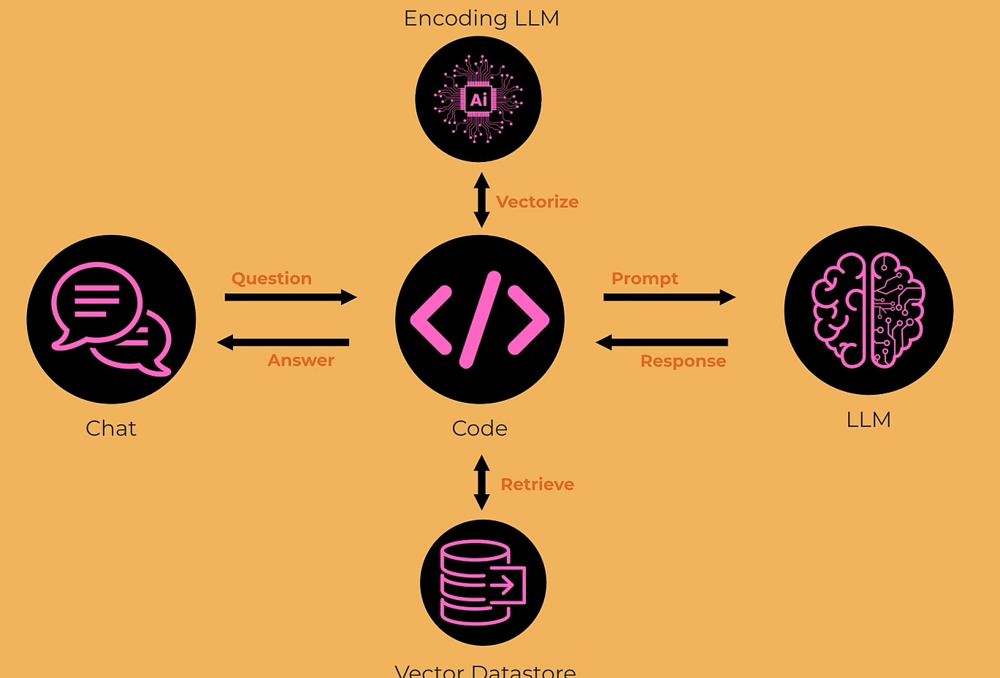

### ✨ RAG Evaluations ✨

---



## 1- Curate a Test Set

Example questions set with the right context identified and reference answers provided.

---

## 2- Measure Retrieval

- **MRR** (Mean Reciprocal Rank)  
- **nDCG** (Normalized Discounted Cumulative Gain)  
- **Recall@K** and **Precision@K**

---

## 3- Measure Answers

e.g. Use **LLM-as-a-judge** to score provided answers against criteria like:
- accuracy
- completeness
- relevance

---

## Metric Definitions

- **MRR**  
  Average inverse rank of first hit; **1** if the first chunk always has relevant context.

- **nDCG**  
  Did relevant chunks get ranked higher up?

- **Recall@K**  
  Proportion of tests where relevant context was in the top **K** chunks.

- If you have multiple keywords to look for, **keyword coverage** is a similar recall metric.

- **Precision@K**  
  Proportion of the top **K** chunks that are relevant.

---
### Advanced RAG Techniques!
---
Let's start by digging into ingest:

1. No LangChain! Just native for maximum flexibility
2. Let's use an LLM to divide up chunks in a sensible way
3. Let's use the best chunk size and encoder from yesterday
4. Let's also have the LLM rewrite chunks in a way that's most useful ("document pre-processing")


---
### 10 RAG Advanced Techniques

1. **Chunking R&D**: experiment with chunking strategy  
2. **Encoder R&D**: select the best Encoder model based on a test set  
3. **Improve Prompts**: general content, the current date, relevant context and history  
4. **Document pre-processing**: use an LLM to make the chunks and/or text for encoding  
5. **Query rewriting**: use an LLM to convert the user’s question to a RAG query  
6. **Query expansion**: use an LLM to turn the question into multiple RAG queries  
7. **Re-ranking**: use an LLM to sub-select from RAG results  
8. **Hierarchical**: use an LLM to summarize at multiple levels  
9. **Graph RAG**: retrieve content closely related to similar documents  
10. **Agentic RAG**: use Agents for retrieval, combining with Memory and Tools such as SQL
---
> Note: No need for langchain lib here.
---

```py
from pathlib import Path
from openai import OpenAI
from dotenv import load_dotenv
from pydantic import BaseModel, Field
from chromadb import PersistentClient
from tqdm import tqdm
from litellm import completion
import numpy as np
from sklearn.manifold import TSNE
import plotly.graph_objects as go


load_dotenv(override=True)

MODEL = "gpt-4.1-nano"

DB_NAME = "preprocessed_db"
collection_name = "docs"
embedding_model = "text-embedding-3-large"
KNOWLEDGE_BASE_PATH = Path("knowledge-base")
AVERAGE_CHUNK_SIZE = 500

openai = OpenAI()
```
---
```py
# Inspired by LangChain's Document - let's have something similar

class Result(BaseModel):
    page_content: str
    metadata: dict
```

---
```py
# A class to perfectly represent a chunk

class Chunk(BaseModel):
    headline: str = Field(description="A brief heading for this chunk, typically a few words, that is most likely to be surfaced in a query")
    summary: str = Field(description="A few sentences summarizing the content of this chunk to answer common questions")
    original_text: str = Field(description="The original text of this chunk from the provided document, exactly as is, not changed in any way")

    def as_result(self, document):
        metadata = {"source": document["source"], "type": document["type"]}
        return Result(page_content=self.headline + "\n\n" + self.summary + "\n\n" + self.original_text,metadata=metadata)


class Chunks(BaseModel):
    chunks: list[Chunk]
```


---------
## Three steps:

1. Fetch documents from the knowledge base, like LangChain did
2. Call an LLM to turn documents into Chunks
3. Store the Chunks in Chroma

---------

### Step 1
---
```py
def fetch_documents():
    """A homemade version of the LangChain DirectoryLoader"""

    documents = []

    for folder in KNOWLEDGE_BASE_PATH.iterdir():
        doc_type = folder.name
        for file in folder.rglob("*.md"):
            with open(file, "r", encoding="utf-8") as f:
                documents.append({"type": doc_type, "source": file.as_posix(), "text": f.read()})

    print(f"Loaded {len(documents)} documents")
    return documents


#documents = fetch_documents()
```

---------
### Step 2 - make the chunks

---
```py
def make_prompt(document):
    how_many = (len(document["text"]) // AVERAGE_CHUNK_SIZE) + 1
    return f"""
You take a document and you split the document into overlapping chunks for a KnowledgeBase.

The document is from the shared drive of a company called Insurellm.
The document is of type: {document["type"]}
The document has been retrieved from: {document["source"]}

A chatbot will use these chunks to answer questions about the company.
You should divide up the document as you see fit, being sure that the entire document is returned in the chunks - don't leave anything out.
This document should probably be split into {how_many} chunks, but you can have more or less as appropriate.
There should be overlap between the chunks as appropriate; typically about 25% overlap or about 50 words, so you have the same text in multiple chunks for best retrieval results.

For each chunk, you should provide a headline, a summary, and the original text of the chunk.
Together your chunks should represent the entire document with overlap.

Here is the document:

{document["text"]}

Respond with the chunks.
"""
```
---
```py
#print(make_prompt(documents[0]))
```
---
```py
def make_messages(document):
    return [
        {"role": "user", "content": make_prompt(document)},
    ]
#make_messages(documents[0])
```
---
```py
# this will return a list of chunkAsResult type
def process_document(document):
    messages = make_messages(document)
	#from litellm import completion
    response = completion(model=MODEL, messages=messages, response_format=Chunks)
    reply = response.choices[0].message.content
    doc_as_chunks = Chunks.model_validate_json(reply).chunks
    return [chunk.as_result(document) for chunk in doc_as_chunks]
	
#process_document(documents[0])
```
---
```py
def create_chunks(documents):
    chunks = []
	#tqdm allow the showing of progress bar
    for doc in tqdm(documents):
		#add a list of chunkAsResult per doc to an iterable chunks
        chunks.extend(process_document(doc))
    return chunks

#chunks here is type of chunkAsResult
#chunks = create_chunks(documents)
#print(len(chunks))
```

### create_chunks is a bit slow.
In the python module version, use the multi-processing Pool to run this in parallel, but if a Rate Limit Error appears, turn this off in the code.

-------
### Step 3 - save the embeddings
---
```py
#here chunks is chunksAsResult
def create_embeddings(chunks):
    chroma = PersistentClient(path=DB_NAME)
    if collection_name in [c.name for c in chroma.list_collections()]:
        chroma.delete_collection(collection_name)
    
    

    texts = [chunk.page_content for chunk in chunks]
	#call openAI to turn texts into vectors
    emb = openai.embeddings.create(model=embedding_model, input=texts).data
    vectors = [e.embedding for e in emb]    

    collection = chroma.get_or_create_collection(collection_name)

    ids = [str(i) for i in range(len(chunks))]
    metas = [chunk.metadata for chunk in chunks]

	#add ids, vectors, text and metadata to the collection/chroma
    collection.add(ids=ids, embeddings=vectors, documents=texts, metadatas=metas)
    print(f"Vectorstore created with {collection.count()} documents")
	
#create_embeddings(chunks)
```
---
### t-SNE (t-distributed Stochastic Neighbor Embedding) set up
```py
chroma = PersistentClient(path=DB_NAME)
collection = chroma.get_or_create_collection(collection_name)
result = collection.get(include=['embeddings', 'documents', 'metadatas'])
vectors = np.array(result['embeddings'])
documents = result['documents']
metadatas = result['metadatas']
doc_types = [metadata['type'] for metadata in metadatas]
colors = [['blue', 'green', 'red', 'orange'][['products', 'employees', 'contracts', 'company'].index(t)] for t in doc_types]
```
---
##Create the 2D scatter plot
```py
tsne = TSNE(n_components=2, random_state=42)
reduced_vectors = tsne.fit_transform(vectors)
# Create the 2D scatter plot
fig = go.Figure(data=[go.Scatter(
    x=reduced_vectors[:, 0],
    y=reduced_vectors[:, 1],
    mode='markers',
    marker=dict(size=5, color=colors, opacity=0.8),
    text=[f"Type: {t}<br>Text: {d[:100]}..." for t, d in zip(doc_types, documents)],
    hoverinfo='text'
)])

fig.update_layout(title='2D Chroma Vector Store Visualization',
    scene=dict(xaxis_title='x',yaxis_title='y'),
    width=800,
    height=600,
    margin=dict(r=20, b=10, l=10, t=40)
)

fig.show()
```
---
## OR Create the 3D scatter plot
```py
tsne = TSNE(n_components=3, random_state=42)
reduced_vectors = tsne.fit_transform(vectors)
# Create the 3D scatter plot
fig = go.Figure(data=[go.Scatter3d(
    x=reduced_vectors[:, 0],
    y=reduced_vectors[:, 1],
    z=reduced_vectors[:, 2],
    mode='markers',
    marker=dict(size=5, color=colors, opacity=0.8),
    text=[f"Type: {t}<br>Text: {d[:100]}..." for t, d in zip(doc_types, documents)],
    hoverinfo='text'
)])

fig.update_layout(
    title='3D Chroma Vector Store Visualization',
    scene=dict(xaxis_title='x', yaxis_title='y', zaxis_title='z'),
    width=900,
    height=700,
    margin=dict(r=10, b=10, l=10, t=40)
)

fig.show()
```
------
## build an Advanced RAG!

We will use these techniques:

1. Reranking - reorder the rank results
2. Query re-writing
------
---
```py
class RankOrder(BaseModel):
    order: list[int] = Field(
        description="The order of relevance of chunks, from most relevant to least relevant, by chunk id number"
    )
```
---
```py
def rerank(question, chunks):
    system_prompt = """
You are a document re-ranker.
You are provided with a question and a list of relevant chunks of text from a query of a knowledge base.
The chunks are provided in the order they were retrieved; this should be approximately ordered by relevance, but you may be able to improve on that.
You must rank order the provided chunks by relevance to the question, with the most relevant chunk first.
Reply only with the list of ranked chunk ids, nothing else. Include all the chunk ids you are provided with, reranked.
"""
    user_prompt = f"The user has asked the following question:\n\n{question}\n\nOrder all the chunks of text by relevance to the question, from most relevant to least relevant. Include all the chunk ids you are provided with, reranked.\n\n"
    user_prompt += "Here are the chunks:\n\n"
    for index, chunk in enumerate(chunks):
        user_prompt += f"# CHUNK ID: {index + 1}:\n\n{chunk.page_content}\n\n"
    user_prompt += "Reply only with the list of ranked chunk ids, nothing else."
    messages = [
        {"role": "system", "content": system_prompt},
        {"role": "user", "content": user_prompt},
    ]
	#from litellm import completion
    response = completion(model=MODEL, messages=messages, response_format=RankOrder)
    reply = response.choices[0].message.content
    order = RankOrder.model_validate_json(reply).order
    print(order)
    return [chunks[i - 1] for i in order]
```
---
```py
#keep only RETRIEVAL_K of the top of the list
RETRIEVAL_K = 10

def fetch_context_unranked(question):
	#turn the question into chroma query
    query = openai.embeddings.create(model=embedding_model, input=[question]).data[0].embedding
	
    results = collection.query(query_embeddings=[query], n_results=RETRIEVAL_K)
    chunks = []
    for result in zip(results["documents"][0], results["metadatas"][0]):
        chunks.append(Result(page_content=result[0], metadata=result[1]))
    return chunks
	
```
---
```py
question = "Who won the IIOTY award?"
chunks = fetch_context_unranked(question)
```
---
```py
for chunk in chunks:
    print(chunk.page_content[:15]+"...") 
```
---
```py
reranked = rerank(question, chunks)
```
---
```py
question = "Who went to Manchester University?"
RETRIEVAL_K = 20
chunks = fetch_context_unranked(question)
for index, c in enumerate(chunks):
    if "manchester" in c.page_content.lower():
        print(index)
```
---
```py
reranked = rerank(question, chunks)
```
---
```py
for index, c in enumerate(reranked):
    if "manchester" in c.page_content.lower():
        print(index)
```
---
```py
reranked[0].page_content
```
---
```py
def fetch_context(question):
    chunks = fetch_context_unranked(question)
    return rerank(question, chunks)
```
---
```py
SYSTEM_PROMPT = """
You are a knowledgeable, friendly assistant representing the company Insurellm.
You are chatting with a user about Insurellm.
Your answer will be evaluated for accuracy, relevance and completeness, so make sure it only answers the question and fully answers it.
If you don't know the answer, say so.
For context, here are specific extracts from the Knowledge Base that might be directly relevant to the user's question:
{context}

With this context, please answer the user's question. Be accurate, relevant and complete.
"""
```
---
```py
# In the context, include the source of the chunk

def make_rag_messages(question, history, chunks):
    context = "\n\n".join(f"Extract from {chunk.metadata['source']}:\n{chunk.page_content}" for chunk in chunks)
    system_prompt = SYSTEM_PROMPT.format(context=context)
    return [{"role": "system", "content": system_prompt}] + history + [{"role": "user", "content": question}]
```
---
```py
def rewrite_query(question, history=[]):
    """Rewrite the user's question to be a more specific question that is more likely to surface relevant content in the Knowledge Base."""
    message = f"""
You are in a conversation with a user, answering questions about the company Insurellm.
You are about to look up information in a Knowledge Base to answer the user's question.

This is the history of your conversation so far with the user:
{history}

And this is the user's current question:
{question}

Respond only with a single, refined question that you will use to search the Knowledge Base.
It should be a VERY short specific question most likely to surface content. Focus on the question details.
Don't mention the company name unless it's a general question about the company.
IMPORTANT: Respond ONLY with the knowledgebase query, nothing else.
"""
	#from litellm import completion
    response = completion(model=MODEL, messages=[{"role": "system", "content": message}])
    return response.choices[0].message.content
```
---
```py
rewrite_query("Who won the IIOTY award?", []) #'Who received the IIOTY award?'
```
---
```py
def answer_question(question: str, history: list[dict] = []) -> tuple[str, list]:
    """
    Answer a question using RAG and return the answer and the retrieved context
    """
    query = rewrite_query(question, history)
    print(query)
    chunks = fetch_context(query)
    messages = make_rag_messages(question, history, chunks)
	#from litellm import completion
    response = completion(model=MODEL, messages=messages)
    return response.choices[0].message.content, chunks
```
---
```py
answer_question("Who won the IIOTY award?", [])
answer_question("Who went to Manchester University?", [])
```